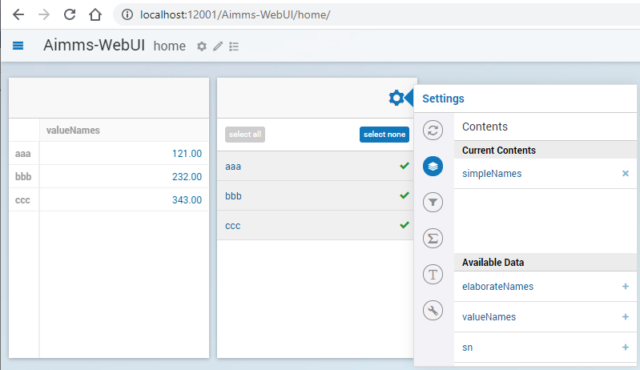
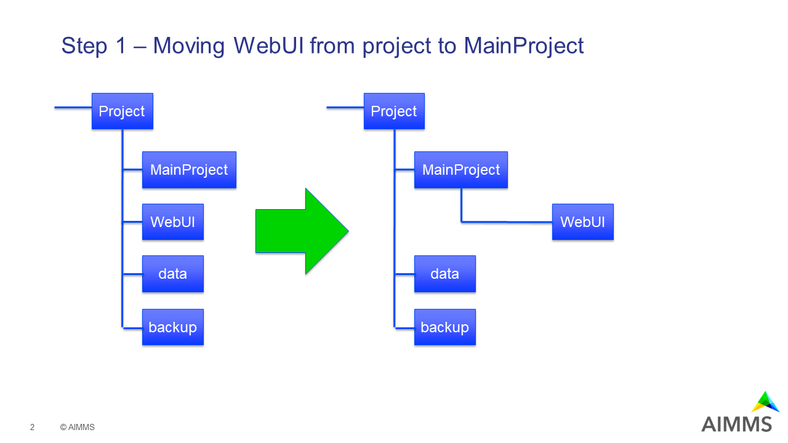
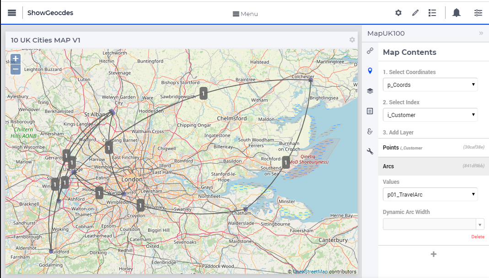
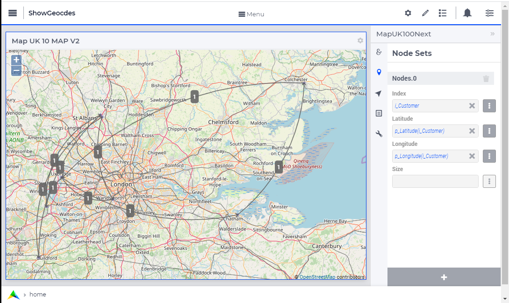
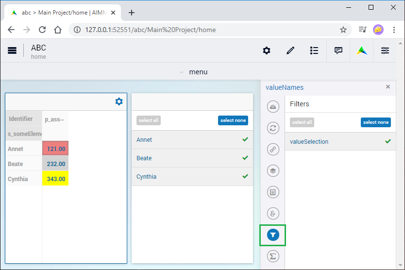
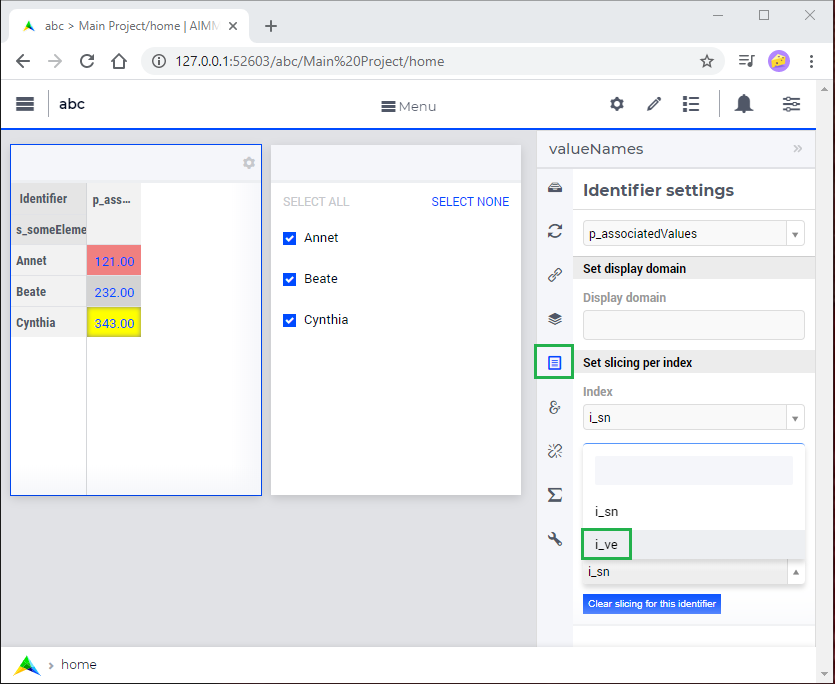
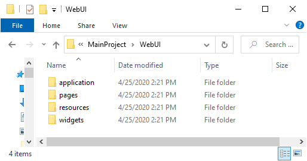
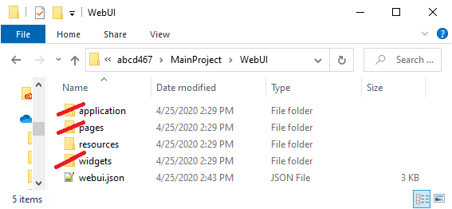
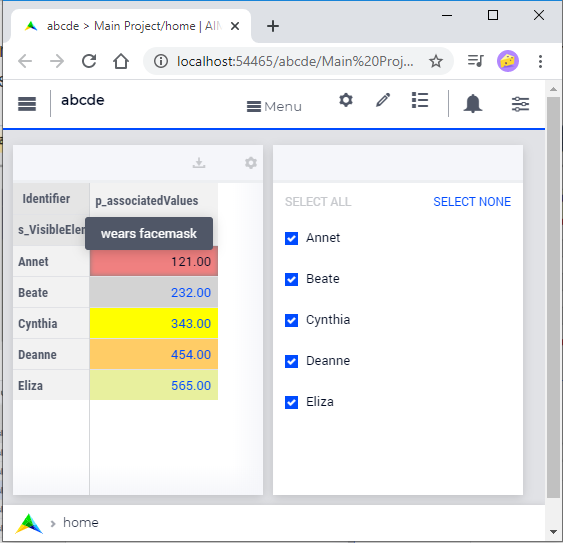
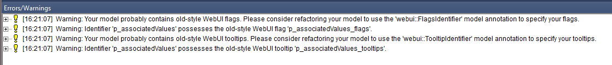

Update WebUI to newer AIMMS version
====================================
.. meta::
    :description: How to adapt an older AIMMS project to changes in WebUI.
    :keywords: convert, adapt, update, webui, version

AIMMS WebUI has evolved over the years based on new insights and customer demands.
As a result, UIs developed using older versions of AIMMS need to be adapted to work with modern versions of AIMMS. 

This article covers changes in functionality of AIMMS WebUI and how to convert your UI to adapt to use these changes in your applications.

Before you start
---------------------------------------

Save a copy of your project before you start upgrading.
A good practice is using a source code management (version control) system.

Determining the version of AIMMS
--------------------------------------------------

To know which changes may affect your project, check which version of AIMMS it is based on.

Every AIMMS 4 project contains a ``.aimms`` file in the root folder.  For example:

.. code-block:: XML
    :linenos:
    :emphasize-lines: 2

    <?xml version="1.0"?>
    <References AIMMS_Version="4.39.2.1069 (x64)">
        <MainProject Path="MainProject" />
        <Library System="true" Path="AimmsPro" />
        <Library System="true" Path="AimmsWebUI" />
    </References>

On line 2, the AIMMS version is refreshed when a change is made to the model text or the WinUI page manager.
When the `AIMMS App Launcher <https://download.aimms.com/aimms/download/data/AIMMSLauncher/AIMMSLauncher-1.0.0.55.exe>`_ is installed, double-click this file to open AIMMS 4.39 (or the latest AIMMS version if it is not installed).

.. note:: Changing the WebUI alone does not update the version for the project. 
          To otherwise trigger this update, you can make a small change to the model text whenever you are upgrading your project UI to a newer version of AIMMS.
          For example, add (or remove) a space to ``MainTermination`` when using a newer version of AIMMS on a project. 

Adapting for WebUI changes
--------------------------------------

Now we will discuss features removed from WebUI, and how to adapt those features when using later AIMMS versions.

The versions listed below are the earliest versions to require the specified adaptation.

* `AIMMS 4.17: Sets in selection widget`_
* `AIMMS 4.20: Starting browser`_
* `AIMMS 4.40: WebUI folder position`_
* `AIMMS 4.46: Element Text`_
* `AIMMS 4.50: Annotations`_
* `AIMMS 4.61: Map V2`_
* `AIMMS 4.66: Widget Filtering`_
* `AIMMS 4.67: Serialize WebUI specification with a single file`_
* `AIMMS 4.71: Identifier based tailoring`_
* `AIMMS 4.72: Data modifications`_

Download examples are available in each section below.

AIMMS 4.17: Sets in selection widget
^^^^^^^^^^^^^^^^^^^^^^^^^^^^^^^^^^^^

AIMMS 4.16 is the last version where selection widget could contain AIMMS sets as contents (and pressing ``select all`` in the selection widget):

With AIMMS 4.17, you will need to add a zero one parameter, for instance something like:

.. code-block:: aimms
    :linenos:

    Parameter p01_Selector {
        IndexDomain: sn;
        Range: binary;
    }

Initializing this parameter in ``MainInitialization`` is advised, for instance as:

.. code-block:: aimms
    :linenos:

    p01_Selector(sn) := 0 ;

And then specifying such a parameter in the contents  (and pressing ``select all`` in the selection widget).

.. image:: images/Aimms417FilteringUsingSetInSelectionWidget.png
    :align: center

**Downloads:**

*   :download:`Before, using AIMMS 4.16 <model/AIMMS-4-16-set-selection-widget/AIMMS-4.16/abc416.zip>`

*   :download:`After, using AIMMS 4.17 <model/AIMMS-4-16-set-selection-widget/AIMMS-4.17/abc417.zip>`

AIMMS 4.20: Starting browser
^^^^^^^^^^^^^^^^^^^^^^^^^^^^

AIMMS 4.19 is the last version of AIMMS where the model developer had to manually start the browser using something like: ``localhost:12001/Aimms-WebUI/home``.

With AIMMS 4.20 onwards, starting the WebUI browser would start the browser directly.

True, no change is made to the project, but it did change the interaction of the model developer.

AIMMS 4.40: WebUI folder position
^^^^^^^^^^^^^^^^^^^^^^^^^^^^^^^^^^^^

AIMMS 4.39 is the last version of AIMMS where the WebUI folder was located as a sub-folder of the project folder.
AIMMS 4.40, the WebUI is a sub-folder of the folder ``MainProject``.

When you are using a source code management system, you will want to 
remove the ``WebUI`` folder from the repository before the upgrade and 
add the folder ``MainProject\WebUI`` afterwards

**Downloads:**

*   :download:`Before, using AIMMS 4.39 <model/AIMMS-4-39-folder-position/AIMMS-4.39/app439.zip>`

*   :download:`After, using AIMMS 4.40 <model/AIMMS-4-39-folder-position/AIMMS-4.40/app440.zip>`

AIMMS 4.46: Element Text
^^^^^^^^^^^^^^^^^^^^^^^^^^

See also `presentation of element names <https://documentation.aimms.com/webui/multi-language.html#element-text>`_

The names of elements in a table can be displayed with more elaborate names; for instance, when initials of people are used in a set, but you want to see in the tables their actual names.

AIMMS 4.45 is the last version of AIMMS that supports the javascript identifier ``ElementTextMap`` often found in files with names such as ``elementText.js`` or  ``element-text-map.js`` in the folder ``.\MainProject\WebUI\resources\javascript\``.

Such a file looks like:

.. code-block:: javascript
    :linenos:
    :emphasize-lines: 2

    ElementTextMap = {
         "i_sn" : "sp_elaborateNames",
    };

For every data line, on the left we see the name of an index, here ``i_sn``, and on the right we see the name of a string parameter, here ``sp_elaborateNames``. To convert such a line, we open the set that is the range of the index, here ``s_someElements``, and specify the string parameter as annotation ``webui::ElementTextIdentifier``.  The declaration of the set becomes:

.. code-block:: aimms
    :linenos:
    :emphasize-lines: 3 

    Set s_someElements {
        Index: i_sn;
        webui::ElementTextIdentifier: sp_elaborateNames;
    }

Once this conversion is complete, I recommend to remove the corresponding ``.js`` from your project; some file transfer mechanisms don't approve of ``.js`` files in folders or ``.zip`` files.

**Downloads:**

*   :download:`Before, using AIMMS 4.45 <model/AIMMS-4-45-element-text/AIMMS-4.45/abc445.zip>`

*   :download:`After, using AIMMS 4.46 <model/AIMMS-4-45-element-text/AIMMS-4.46/abc446.zip>`

AIMMS 4.50: Annotations
^^^^^^^^^^^^^^^^^^^^^^^^^

`Data-dependent styling <https://documentation.aimms.com/webui/css-styling.html#data-dependent-styling>`_ uses annotations identifiers. 

Up  to and including AIMMS 4.49, the annotation identifier associated with identifier ``X``, needed to be called ``X_annotations``.  From AIMMS 4.50 onwards, the annotation identifier associated with identifier ``X`` can be specified using the annotation attribute ``webui::AnnotationsIdentifier``. This permits the reuse of a single annotations identifiers by multiple other identifiers and more freedom in naming identifiers.

In our example, we use in AIMMS 4.49:

.. code-block:: aimms
    :linenos:

    Parameter p_associatedValues {
        IndexDomain: i_sn;
    }
    StringParameter p_associatedValues_annotations {
        IndexDomain: i_sn;
    }

In AIMMS 4.50 we can use:

.. code-block:: aimms
    :linenos:
    :emphasize-lines: 3,5

    Parameter p_associatedValues {
        IndexDomain: i_sn;
        webui::AnnotationsIdentifier: sp_associatedValuesAnnotations;
    }
    StringParameter sp_associatedValuesAnnotations {
        IndexDomain: i_sn;
    }

Not only did we add an annotation to the declaration of ``p_associatedValues``, but we also took the opportunity to change the name of the annotations identifier, such that it could adhere to our naming conventions.

**Downloads:**

*   :download:`Before, using AIMMS 4.49 <model/AIMMS-4-49-annotation/AIMMS-4.49/abc449.zip>`

*   :download:`After, using AIMMS 4.50 <model/AIMMS-4-49-annotation/AIMMS-4.50/abc450.zip>`

AIMMS 4.61: Map V2
^^^^^^^^^^^^^^^^^^

The map widget was replaced with a new map widget in AIMMS 4.61.
The map v1 widget was available up to AIMMS 4.60.

In our example we use the following declarations:

.. code-block:: aimms
    :linenos:

    Set s_Customers {
        Index: i_Customer, i_CustomerFrom, i_CustomerTo;
    }
    Set s_LatLon {
        Index: i_LatLon;
        Definition: data { Latitude, Longitude };
    }
    Parameter p_Coords {
        IndexDomain: (i_Customer,i_LatLon);
    }
    Parameter p01_TravelArc {
        IndexDomain: (i_CustomerFrom, i_CustomerTo);
        Range: binary;
    }

Where the widget looks as follows, including its specification:

To obtain the above image, we:

#.  Specify a two-dimensional parameter, whereby the second dimension is over a set with two elements, ``p_Coords`` in the example.

#.  Specify the first index as the node index, ``i_Customer``.

#.  Add a layer for points.

#.  Add a layer for arcs, with contents: ``p01_TravelArc``.

To obtain an equivalent map v2 arc, we:

Using the following steps:

#.  Create two one-dimensional parameters over the node set for the latitude and longitude respectively, for instance as follows:

    .. code-block:: aimms
        :linenos:

        Parameter p_Latitude {
            IndexDomain: i_Customer;
            Definition: p_Coords(i_Customer, 'Latitude');
        }
        Parameter p_Longitude {
            IndexDomain: i_Customer;
            Definition: p_Coords(i_Customer, 'Longitude');
        }

#.  Create a new widget of the same size, of type map

#.  In this new widget, we add a node set, with specification 

    *   ``index:`` : ``i_Customer``

    *   ``Latitude`` : ``p_Latitude(i_Customer)``

    *   ``Longitude`` : ``p_Longitude(i_Customer)``

#.  Next, we add an arc set as follows:
    
    .. image:: images/mapv2arcset.png
        :align: center

Some advantages of map V2 widgets over map v1 widgets are:

* Support for multiple node sets

* Support for multiple arc sets

* Zooming and center control

**Downloads:**

*   :download:`Before, using AIMMS 4.60 <model/AIMMS-4-60-map-v1/AIMMS-4.60/ShowGeocdes460.zip>`

*   :download:`After, using AIMMS 4.61 <model/AIMMS-4-60-map-v1/AIMMS-4.61/ShowGeocdes461.zip>`

AIMMS 4.66: Widget filtering 
^^^^^^^^^^^^^^^^^^^^^^^^^^^^^^^^^^^^^^^

.. Release note: The filtering of widgets, using the filter tab of a widget, did not always work correctly. Since we introduced slicing on identifiers in the WebUI quite a while ago, which is the preferred way of filtering, we decided to remove the filter tab from th widgets. If you have apps which rely on this functionality, they will continue to run as they did. Only if you want to make changes to the filtering, you should do so by either using the advanced options or by opening the model with an older AIMMS version which still has the filter tabs. We do recommend to consider using slicing on identifiers, though.

Open project in AIMMS 4.66, Open WebUI, and **accept new theme**!

Declare a set for the filtering, including a new index:

.. code-block:: aimms
    :linenos:
    :emphasize-lines: 3

    Set s_VisibleElements {
        SubsetOf: s_someElements;
        Index: i_ve;
        Definition: {
            { i_sn | p01_visibleElements( i_sn ) }
        }
    }

Next, we open the identifier attributes of the identifiers in the table, and filter by specifying the use of ``i_ve`` in the Identifier settings > Set slicing per index:

**Downloads:**

*   :download:`Before, using AIMMS 4.65 <model/AIMMS-4-65-filter-ux/AIMMS-4.65/abc465.zip>`

*   :download:`After, using AIMMS 4.66 <model/AIMMS-4-65-filter-ux/AIMMS-4.66/abc466.zip>`

AIMMS 4.67: Serialize WebUI specification with a single file
^^^^^^^^^^^^^^^^^^^^^^^^^^^^^^^^^^^^^^^^^^^^^^^^^^^^^^^^^^^^^

Up to AIMMS 4.66, the essence of the WebUI is serialized in three folders: 

* application

* pages

* widgets

The resources used by the WebUI are serialized in the folder resources.

A WebUI folder thus had the following structure:

The three folders forming the essence of the WebUI are replaced by a single file, named ``webui.json``
This lead to the following folder structure.

The three folders are no longer used.

.. topic:: When using source code management (version control)

    When you are using a source code management system, you should remove the three folders from your source and add the file ``webui.json``.

**Downloads:**

*   :download:`Before, using AIMMS 4.65 <model/AIMMS-4-66-webui-json/AIMMS-4.66/abcd466.zip>`

*   :download:`After, using AIMMS 4.66 <model/AIMMS-4-66-webui-json/AIMMS-4.67/abcd467.zip>`

AIMMS 4.71: Identifier based tailoring
^^^^^^^^^^^^^^^^^^^^^^^^^^^^^^^^^^^^^^^^

In AIMMS 4.70 Identifier based tailoring of the identifier ``X`` to:

#.  Specify read-only elements, was done via the identifier ``X_flags``.  
    In AIMMS 4.72 the annotation ``webui::FlagsIdentifier`` is used.
    Note that in the example provided, you cannot change the value for Annet, because the read-only flag is set.
    
#.  X_tooltips --> ``webui::TooltipIdentifier``

#.  X_text --> ? ``webui::ItemTextIdentifier``, not demoed here, requires Gantt Chart.

In the following image use is made of a flag and a tooltip identifier. 

The flag identifier sets the data for ``p_associatedValues('a')`` to readonly, and tooltip for ``p_associatedValues('a')`` is ``"wears facemask"``. The difference between AIMMS 4.70 and AIMMS 4.71 is the selection of identifier where this is specified.

#.  In AIMMS 4.70, the flag and tooltip identifier are associated by name: for an identifier named ``p_associatedValues``, the

    #.  Flag identifier must be named ``p_associatedValues_flags``
    
    #.  Tooltip identifier must be named ``p_associatedValues_tooltips``
    
    #.  Text in Gantt Chart bar, the identifier must be named ``p_associatedValues_text``.  
        This is not illustrated here.

#.  In AIMMS 4.71, the flag and tooltip identifier are associated by annotation: for an identifier named ``p_associatedValues``, the

    #.  Flag identifier is specified in the annotation  ``webui::FlagsIdentifier``
    
    #.  Tooltip identifier is specified in the annotation  ``webui::TooltipIdentifier``
    
    #.  Text in Gantt Chart bar, the identifier is specified in the annotation  ``webui::ItemTextIdentifier``.  
        This is not illustrated here.
    
When you open the AIMMS 4.70 project in AIMMS 4.71 you will get warnings like the following:

You can easily adapt your application by specifying the annotations, highlighted below:

.. code-block:: aimms
    :linenos:
    :emphasize-lines: 4,5

    Parameter p_associatedValues {
        IndexDomain: i_sn;
        webui::AnnotationsIdentifier: sp_associatedValuesAnnotations;
        webui::FlagsIdentifier: p_associatedValues_flags;
        webui::TooltipIdentifier: p_associatedValues_tooltips;
    }

After this edit, the behavior of the application does not change; but the warnings disappeared after a restart.

**Downloads:**

*   :download:`Before, using AIMMS 4.70 <model/AIMMS-4-70-identifier-tailoring/AIMMS-4.70/abcde470.zip>`

*   :download:`After, using AIMMS 4.71 <model/AIMMS-4-70-identifier-tailoring/AIMMS-4.71/abcde471.zip>`

AIMMS 4.72: Data modifications
^^^^^^^^^^^^^^^^^^^^^^^^^^^^^^^^^^

In AIMMS 4.71, the procedure associated with changes in the data of ``p_associatedValues`` must be named ``uponchange_p_associatedValues``.  In AIMMS 4.72, you can select a procedure via an annotation.

We use the following simple procedure here that just displays the data in the listing file:

.. code-block:: aimms
    :linenos:

    Procedure uponchange_p_associatedValues {
        Body: {
            display p_associatedValues ;
        }
    }

In AIMMS 4.72, the procedure is linked using the annotation: 

.. code-block:: aimms
    :linenos:
    :emphasize-lines: 6

    Parameter p_associatedValues {
        IndexDomain: i_sn;
        webui::AnnotationsIdentifier: sp_associatedValuesAnnotations;
        webui::FlagsIdentifier: p_associatedValues_flags;
        webui::TooltipIdentifier: p_associatedValues_tooltips;
        webui::UponChangeProcedure: uponchange_p_associatedValues;
    }

**Downloads:**

*   :download:`Before, using AIMMS 4.71 <model/AIMMS-4-71-data-modifications/AIMMS-4.71/abcdef471.zip>`

*   :download:`After, using AIMMS 4.72 <model/AIMMS-4-71-data-modifications/AIMMS-4.72/abcdef472.zip>`

Related topics
--------------

* **AIMMS How-To** :doc:`UI Features articles </C_UI/Sub_UI_Features/index>`
* **AIMMS Documentation** `WebUI App Development <https://documentation.aimms.com/webui/webui-app-development.html>`_

.. spelling::
    settings

