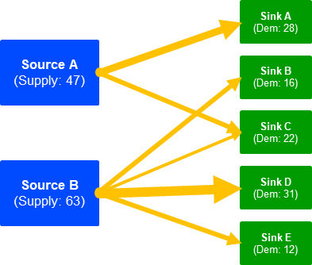
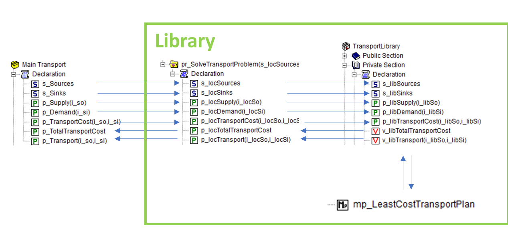
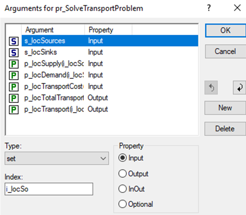

Data for Optimization Libaries
==============================

An AIMMS library can be reused in other projects. To solve an optimization problem in a library we're dealing with two abstraction mechanisms:

* Procedures where sets transferred via the arguments have different meanings.
* Declare global variables and constraints with a fixed index domain within the library, and use subsets of :any:`AllConstraints` and :any:`AllVariables` locally within that library.

These two abstraction mechanisms do not work together naturally.

This article explains how we can bring these two abstraction mechanisms together using element parameters. We'll use an example based on the **Transport Problem**. 

The Transport Problem searches for the best way to transport goods from a couple of sources to sinks. 

Transferring data
-----------------
A Transport Problem can be solved locally inside the library. 

The following **input data** is declared in the main model: 

* ``s_Sources`` 
* ``s_Sinks``
* ``p_Supply`` 
* ``p_Demand`` 
* ``p_TransportCost``  

This data must be transferred into the library to solve the problem. 

Then, the following **output data** must be transferred back to the main model: 
* ``p_TotalTransportCost``
* ``p_Transport``

We'll use the procedure ``pr_SolveTransportProblem`` to complete the transfer in two steps (see image):
 
1. Provide data from ``Main Transport`` to the procedure ``pr_SolveTransportProblem`` inside the library.
2. Transfer data from ``pr_SolveTransportProblem`` to the global ``Declaration`` of the ``Transport Library``.

These steps are explained in more detail below.

Step 1
^^^^^^

Firstly, the procedure ``pr_SolveTransportProblem`` should contain local arguments. They can be added by pressing the wizard next to arguments. It is important to select the correct type and property of the arguments. 
(also something about index)

Now we can call the procedure from the main model. We must provide the input and output arguments in the right order to link them to the local arguments. 

Call the procedure as follows:
	
.. code-block:: aimms

	pl::pr_SolveTransportProblem(s_Sources, s_Sinks, p_Supply, p_Demand, p_TransportCost, 
	p_TotalTransportCost, p_Transport);

Step 2
^^^^^^
Next we'll transfer the data to the global declaration of the library. 

In the main model there is a parameter (``s_Supply``) that describes the supply of the sources (``s_Sources``). When transferring the data, we must link supplies to the correct sources with element mapping:

.. code-block:: aimms
   :linenos:

	For i_locSo do
		SetElementAdd(s_libSources, ep_new1, i_locSo);
		ep_map1(ep_new1) := i_locSo;
	EndFor;
	p_libSupply(i_libSo) := p_locSupply( ep_map1(i_libSo));

- line 1: ``i_locSo`` is the index of ``s_locSources``.
- line 2: Add the elements to ``s_libSources``.
- line 3: Map the local sources set the library sources set.
- line 5: Link supplies to the right sources.

The rest of the input data is transferred in a similar way. 

Then the Transport Problem is calculated and the output data is transferred back like this:

.. code-block:: aimms

	p_locTotalTransportCost := v_libTotalTransportCost;
	p_locTransport(ep_map1(i_libSo), ep_map2(i_libSi)) := 
		v_libTransport(i_libSo,i_libSi);

