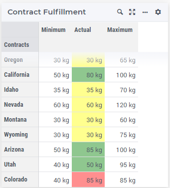

Using Table Background Annotation
======================================

.. meta::
   :keywords: annotation, css, styling, table, widget, aimms, background, property
   :description: This article illustrates how to use annotation feature to change the background color of a cell in the table widget. 

As you already know, you can customize the appearance of widgets in AIMMS WebUI using CSS and `annotations <https://documentation.aimms.com/webui/css-styling.html#data-dependent-styling>`_ . Annotations can be used almost on all widgets in different CSS classes.
This article illustrates how to use annotation feature to change the background color of a cell in the table widget. 
Please use the `Contract Allocation <https://how-to.aimms.com/Articles/383/383-contract-allocation.html>`_ example to experiment with this feature.

Example
--------
On Contract Allocation example, contracts can be decided between a certain range. After the solve, adding the allocated contract values can be hard to be analyzed.
To facilitate the user experience, the minimum and maximum range can be included, also color identification can be very helpful to highlight problems. To add a background color to an identifier per a condition, annotation is used.   

Step 1
~~~~~~~~~

First create the CSS file with the background property. This must be created under ``WebUI\resources\stylesheets``.

.. code-block:: css
    :linenos:

    .annotation-reach-maximum {
        background: rgba(255, 0, 0, 0.438);
    }

    .annotation-reach-minimum {
        background: rgba(255, 255, 0, 0.438);
    }

    .annotation-between {
        background: rgba(0, 128, 0, 0.438);
    }

Step 2
~~~~~~~~~

Next step is to create a string parameter with the annotation logic. Such as:

.. code-block:: aimms

    StringParameter sp_def_bgColorActualContractFulfillment {
        IndexDomain: (i_contract);
        Definition: {
            if p_def_actualContractFulfillment(i_contract) = p_def_maximumContractFulfillment(i_contract) then
                "reach-maximum"
            elseif p_def_actualContractFulfillment(i_contract) = p_def_minimumContractFulfillment(i_contract) then
                "reach-minimum"
            else 
                "between"    
            endif;
        }
    }

As you can see, the logic is:

* if actual equals maximum, then red.
* if actual equals minimum, then yellow.
* if actual in between minimum and maximum, then green.

Step 3
~~~~~~~~~

Add ``sp_def_bgColorActualContractFulfillment`` to the identifier will be used on WebUI.

.. code-block:: aimms
    :emphasize-lines: 6

    Parameter p_def_actualContractFulfillment {
        IndexDomain: (i_contract);
        Range: nonnegative;
        Unit: kg;
        Definition: sum(i_producer, v_generation(i_producer,i_contract));
        webui::AnnotationsIdentifier: sp_def_bgColorActualContractFulfillment;
    }

Results
~~~~~~~

|

.. spelling:word-list::

    css
