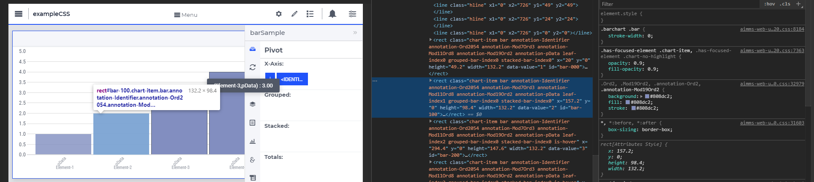

:orphan:

As you already know, you can customize the appearance of widgets in AIMMS WebUI using CSS and `annotations <https://documentation.aimms.com/webui/folder.html#data-dependent-styling>`_ . Let us look at how these annotations are generated for a widget and the modifiers available for you to control your customizations.

Annotations
---------------

The annotations applied to a WebUI object primarily depends on the pivot settings of that widget. If you inspect any widget in your browser (`Right click -> Inspect`), you will notice something like below

.. code-block:: css

    chart-item bar annotation-sSetI annotation-Ord2 annotation-Mod7Ord2 annotation-Mod11Ord2 
    annotation-Mod19Ord2 annotation-Element-2 leaf-index1 grouped-bar-index0 stacked-bar-index0

``annotation-sSetI`` and ``annotation-Element-2`` are of interest to us because ``sSetI`` is the set to which ``index i`` belongs to and ``Element-2`` is the current element that we are inspecting. 

.. image:: images/annotations.png
    :align: center

The pivot settings in the above image shows that ``index i`` is the last index in the `X-Axis` option. So, different colors are applied to different elements/values of ``index i`` and its root set ``sSetI`` appears as an annotation. If you switch this order like in the below image, the annotation will include the identifier name ``annotation-pData`` (and ``annotation-Identifier``) instead of the root set ``sSetI``. As there is only one identifier in this widget, all the bars get the same color.

.. code-block:: css

    chart-item bar annotation-Identifier annotation-Ord2054 annotation-Mod7Ord3 annotation-Mod11Ord8 
    annotation-Mod19Ord2 annotation-pData leaf-index1 grouped-bar-index0 stacked-bar-index0

So, the index appearing last in the pivot settings controls the coloring of the elements and the annotations applied. In general, below rules apply:

    #. If `Pivot Grouped:` is empty, then the last index in `Pivot X-Axis` or `Pivot Stacked:` controls the coloring and annotations. The last index in `Pivot Stacked:` takes precedence over any index in `Pivot X-Axis`.
    #. Otherwise, the last index in `Pivot Grouped:` controls the colors and annotations.

By declaring ``webui::AnnotationsIdentifier``, you can create additional annotations which you can use to control the styling.