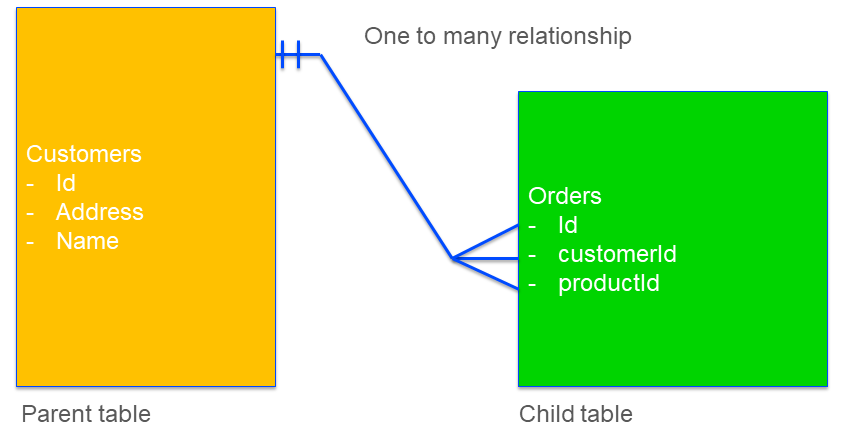

Strategy for write to table
===================================

When AIMMS writes data to a database table, it uses structural information of the database table at hand to determine a safe and efficient available strategy for writing. 

In this article we discuss:

#.  The available strategies, and for each strategy, its consequences.

#.  The metadata obtained to determine the appropriate strategy.

#.  A good practice for application database schema design and providing of metadata information.

Available strategies
--------------------

An AIMMS ``write to table`` statement will delete, update and insert some rows in a database table.
This can be implemented using the SQL statements ``DELETE``, ``UPDATE``, and ``INSERT``. 

A first strategy, we call it strategy ``A`` below, is to:

#.  Determine the rows that are already in the database table:

#.  Delete the existing rows no longer relevant

#.  Update the existing rows still relevant with new data

#.  Insert the new rows together with their data.

A second strategy, we call it strategy ``B`` below is to:

#.  Delete all old rows in the table

#.  Insert rows as there is information

Clearly, strategy ``A`` looks more complicated and time-consuming. 
It can be more time consuming, as it needs to read a potentially large amount of data before the table is actually modified. 
To understand why this strategy is still needed, we need to take a close look at the concept of foreign keys.

Consider a database that maintains the data of customers and their orders:

Here, the table ``Customers``, has a column called ``Id``. 
This ``Id`` serves as a key; based on this key, information regarding the identified customer is easily retrieved. 
There is also a table ``Orders``, which also has a column ``Id`` based on which the order information is easily retrieved. It also has a column ``customerId``.  This column should match an ``Id`` in the table ``Customers``. 

When a customer is removed, the orders associated with that customer become incomplete. 
With incomplete, we mean that given a particular order with a deleted customer, we can no longer create a report for it that fully specifies the details of that order, including where to deliver. 

This is why we place a constraint on the table  ``Orders``, 
specifying that the  ``customerId`` is an existing ``Id`` in the table ``Customers``.

Based on the above example, we now introduce the following existing database terminology:

*   The constraint discussed above is known as a **Foreign Key**. 
    In our example, the table ``Orders`` has a **foreign key**: a value in its column ``customerId`` should match a value in the column ``Id`` of the table ``Customers``.

*   The table ``Customers`` is the **parent table** of the foreign key.

*   The table ``Orders`` is the **child table** of the foreign key.

.. note:: For database schemas it is allowed to use non-key columns as foreign key columns.  
          For instance, instead of using ``CustomerId`` refering to column ``Id`` in table ``Customers``; we could also have used ``CustomerAddress`` refering to column ``Address`` in table ``Customers``.
          In this article, we do not use this 'feature' of database schemas.

Given the above foreign constraint, there are at least two options available to the database when attempting to delete a customer with existing orders:

#.  Forbid that deletion and issue an appropriate error message.

#.  Realize that deletion, and delete the corresponding orders as well. 
    This is known as **cascading** deletes.

The metadata obtained to determine the efficient strategy
---------------------------------------------------------

Let's get back at the strategies introduced at the beginning of the previous section.

As an example, consider the operation to change the address of a customer.

Using strategy ``B``, we first delete that customer and then recreate it using an insert statement.
By doing a delete first in the presence of orders for that customer, depending on the type of foreign constraint, this will either be forbidden or it will lead to cascading deletes of orders. 
Either way, that is **undesired behavior** for an operation like changing the address.

Using strategy ``A``, in the end, just a SQL UPDATE of that customer is executed, and the orders remain intact. Therefore, even though this strategy may be less efficient, it is safe.

To determine whether or not the safe strategy ``A`` is needed in favor of the efficient strategy ``B``, metadata is needed; we need to know whether there is a table that has a foreign key to the table we are modifying.

AIMMS has several methods of obtaining that metadata:

#.  It issues a call to the database, via the ODBC function `SQLForeignKeys <https://docs.microsoft.com/en-us/sql/odbc/reference/syntax/sqlforeignkeys-function>`_.

#.  It ignores the presence of foreign keys because the options ``Database_foreign_key_handling`` and ``Database_string_valued_foreign_keys`` have both been set to ``'Ignore'``. Thus AIMMS will use  efficient strategy ``B``.

#.  It assumes the presence of foreign keys because the options ``Database_foreign_key_handling`` and ``Database_string_valued_foreign_keys`` have both been set to ``'Assume'``. Thus AIMMS will use the safe strategy ``A``.

The default of the options ``Database_foreign_key_handling`` and ``Database_string_valued_foreign_keys`` is ``'Check'``. When an AIMMS application didn't specify other values for these options, AIMMS will use method 1 to obtain the metadata information.

.. note:: Obtaining metadata from a database can be rather time-consuming; depending on database vendor and complexity of the database schema.

Database schema design and providing metadata
----------------------------------------------

In this section, a practice is suggested to safely and efficiently write the data to the application database. To do so, we divide the schema into three layers:

#.  The key data,

#.  The structural data, and 

#.  The massive data.

We will discuss each of these layers:

Key data
^^^^^^^^^

The key data are tables that correspond to the sets and the one-dimensional parameters declared over these sets. Examples are:

*   Assets, a parameter can indicate:

    * Type,

    * Location

*   Periods,

*   Customers

*   Products

These tables typically appear as parent tables in Foreign Keys. 
When these tables have derived columns, they can also appear as child table in a Foreign Key.
In our Customer-Order example, both tables ``Customers`` and ``Orders`` are key tables. 
You may recall that in the Foreign Key of that example, ``Customers`` is the parent table, and ``Orders`` is the child table.

When writing to these tables it is important that the foreign key constraints are adhered to.
As these tables are relatively small, efficiency is less important.  
So these tables are best written to with the options ``Database_foreign_key_handling`` and ``Database_string_valued_foreign_keys`` set to ``'Assume'``, for instance as follows:

.. code-block:: aimms
    :linenos:

    block where database_foreign_key_handling := 'assume',
                database_string_valued_foreign_keys := 'assume' ;

        write to table db_Assets ;

    endblock ;

The following remarks apply to this code;

* By using a block statement, the options are only set in the respective code portion, and the remainder of the application is left untouched.

* By setting the options to ``'Assume'``, we ensure a safe strategy is used, which is essential for grand-father tables.

* Efficiency is not really a concern, as these tables are relatively small. In addition, modifications are not expected too often.

Notes:

#.  The derived columns (non-key) in the keytables may have foreign keys to other keytables.

#.  The derived columns cannot serve as foreign keys. 
    In the Customer-Order example, we do not use the address of the customer as a foreign key for the orders.

Structure data
^^^^^^^^^^^^^^^^

The structure data relates to one or more key data tables.  Examples are:

*   Connections, between two Assets

*   ProductCatalog, between a store and a product

The key of such tables consists of multiple columns. 
These tables are the fathers of the foreign keys, and themselves also children of the grandfathers.
When writing to these tables, safety still prevails over efficiency.

.. code-block:: aimms
    :linenos:

    block where database_foreign_key_handling := 'assume',
                database_string_valued_foreign_keys := 'assume' ;
        
        write to table db_ProductCatalog ;

    endblock ;

Even though these tables are somewhat larger than the key tables, we know that they are used as foreign key parents as well, and therefore better use a safe strategy for writing. 
In addition, the structure of the data that is captured in these tables doesnot change as often as the massive data, see below.

Notes:

#.  The derived columns may have foreign keys to the keys in other keytables and structure tables.

#.  The columns comprising the key may have foreign keys to keys in the keytables.

Massive data
^^^^^^^^^^^^

The actual data, for instance, how much of which product is bought by which customer and when.
When these tables are part of a foreign key, they are only as child tables.
It is, therefore, safe to use efficient strategy ``B`` for writing to these tables.

.. code-block:: aimms
    :linenos:

    block where database_foreign_key_handling := 'ignore',
                database_string_valued_foreign_keys := 'ignore' ;
        
        write to table db_Sales ;

    endblock ;

Notes: 

#.  Like structure tables, the foreign keys of these tables only refer to keys in key tables and keys in structure tables.

Summary
^^^^^^^^^^

With a clear separation in key tables, structure tables and massive tables; it clear which write to table strategy is safe and efficient for each of the tables.

