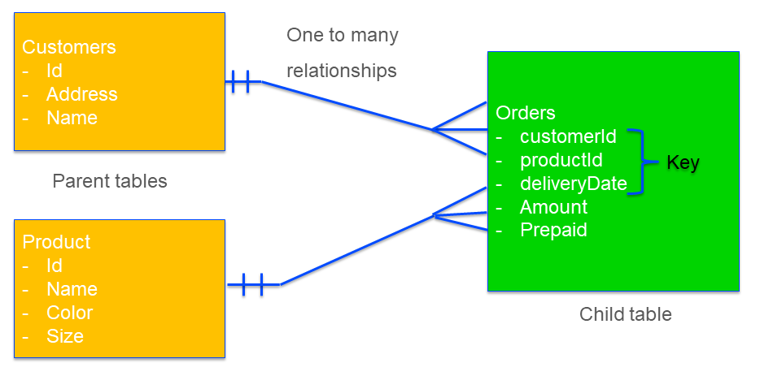

Strategy for write to table
===================================

The purpose of this article is to provide a heuristic for safe and efficient writing when the performance of writing to the database is a concern.

When AIMMS writes data to a database table, it uses structural information of the database table at hand to determine a safe and efficient available strategy for writing. To make it is easy to remember these strategies, we will also discuss the effects of different strategies. However, we need to introduce the concept of *Foreign Key* just to do that.

In this article we discuss:

#.  Running example

#.  Foreign key

#.  The available strategies, and for each strategy, its consequences.

#.  The metadata obtained to determine the appropriate strategy.

#.  A good practice for application database schema design and steering strategy choice.

Running example
------------------------------------

We are maintaining orders to be delivered.  Each order is identified by (the key columns):

*   A customer

*   A product

*   A delivery date

In addition, we maintain the following information:

*   For each customer, its address and name

*   For each product, its name, its color, package size (height, width, depth).

This is represented in the following database schema.

As you can see from this schema, both a customer and a product have an ``Id``.  The table ``Orders`` refers to these ``Id`` s. In mathematics we have the following relations:

*   :math:`\forall {\tt CustomerId}: {\tt CustomerId} \in \{Customers.Id\}` 

    In words: For each ``CustomerId``, it should be in the set of all ``Id`` in the table ``Customers``.

*   :math:`\forall {\tt ProjectId}: {\tt ProjectId} \in \{Project.Id\}` 

    In words: For each ``ProjectId``, it should be in the set of all ``Id`` in the table ``Projects``.

Foreign Keys
-------------

The relations mentioned in the previous section are examples of consistency relations in a database. 

It is important that such relations between tables are maintained; for instance, if there is a ``CustomerId`` or a ``ProductId`` in the table ``Orders`` that is not in the table ``Customers``, respectively, in the table ``Products`` we will not be able to fulfill that order, because we do not know where to deliver, or what to deliver!

These relations can be enforced in a database using **Foreign Keys**. 

When such a Foreign Key relation is specified as a constraint in a database, and we insert an order without a matching Product, we will get an error message like:

.. code-block:: none

    Error writing to database table "db_OrdersNew": ODBC[1452] : HY000 [MySQL][ODBC 8.0(w)
    Driver][mysqld-5.6.44-log]Cannot add or update a child row: a foreign key constraint fails
    (`howto343b`.`orders`, CONSTRAINT `fk_order_product` FOREIGN KEY (`ProductId`) 
    REFERENCES `products` (`Id`)).

Based on the above example, we now introduce the following existing database terminology:

*   The constraint discussed above is known as a **Foreign Key**. 
    In our example, the table ``Orders`` has two foreign keys: 
    
    *   A value in its column ``customerId`` should match a value in the column ``Id`` of the table ``Customers``.
    
    *   A value in its column ``ProductId`` should match a value in the column ``Id`` of the table ``Products``.

*   The tables ``Customers`` and ``Products`` are **parent tables** of these foreign keys.

*   The table ``Orders`` is the **child table** of these foreign keys.

.. note:: Note that the definition of Foreign Keys given in 
          `Wikipedia <https://en.wikipedia.org/wiki/Foreign_key>`_ allows for more complex relations.
          For instance, non-key columns in parent tables can be referenced.
          Also, the key referenced may consist of multiple columns.
          In this article, we restrict ourselves to just a single column, and in the parent table that is the key column.

When a customer is removed from the table ``Customers``, when there are still orders for that customer, we will get an inconsistency as well.

Given the above foreign constraints, there are at least two options available to the database when attempting to delete a customer with existing orders:

#.  Forbid that deletion and issue an appropriate error message.

#.  Realize that deletion, and delete the corresponding orders as well. 
    This is known as **cascading** deletes.

.. tip:: It is generally considered to be good practice to enforce all Foreign Key relations; as it will enhance the quality of the data. Note that by enforcing these constraints in the database, any application that reads and modifies data in that database needs to adhere to these constraints. This is also true for AIMMS applications!

Available strategies
--------------------

An AIMMS ``write to table`` statement will delete, update and insert some rows in a database table.
This can be implemented using the SQL statements ``DELETE``, ``UPDATE``, and ``INSERT``. 

A first strategy, we call it strategy ``A`` below, is to:

#.  Determine the rows that are already in the database table

#.  Delete the existing rows no longer relevant

#.  Update the existing rows still relevant with new data

#.  Insert the new rows together with their data.

A second strategy, we call it strategy ``B`` below, is to:

#.  Delete all old rows in the table

#.  Insert rows as there is information

Clearly, strategy ``A`` looks more complicated and time-consuming. 
It can be more time consuming, as it needs to read a potentially large amount of data before the table is actually modified. 
To understand why this strategy is still needed, we need to take a close look at their behavior in combination with foreign keys.

Choice of strategy and consequences for safety and efficiency
-------------------------------------------------------------

Let's get back to the strategies introduced at the beginning of the previous section.

As an example, consider the operation to change the address of a customer, using the two strategies:

*   Using strategy ``B``, we first delete that customer and then recreate it using an insert statement.
    By doing a delete first in the presence of orders for that customer, depending on the type of foreign constraint, this will either be forbidden or it will lead to cascading deletes of orders. 
    Either way, that is **undesired behavior** for an operation like changing the address.

*   Using strategy ``A``, in the end, the only modification is done is just a SQL UPDATE of that customer. 
    There is no effect on the table ``Orders``, which is desired. 
    Therefore, even though this strategy may be less efficient, it is safe.

When the table at hand is a parent table in a Foreign Key constraint, then the safe strategy ``A`` is preferred. Otherwise, the efficient strategy ``B`` is preferred. AIMMS bases the knowledge of whether Foreign Keys are present on the setting of the two options ``Database_foreign_key_handling`` and ``Database_string_valued_foreign_keys``, according to the following table:

.. csv-table:: Effect options  ``Database_foreign_key_handling`` and ``Database_string_valued_foreign_keys``
    :header: "Setting", "Foreign Key determination", "Strategy", "Pro", "Con"
    :widths: 7, 25, 7, 8, 11

    "Both to ``'check'``", "ODBC function `SQLForeignKeys <https://docs.microsoft.com/en-us/sql/odbc/reference/syntax/sqlforeignkeys-function>`_ is used to determine whether the table is a parent table in a Foreign Key constraint.", "``A`` or ``B``", "Ease of use", "Initial overhead, see note below" 
    "Both to ``'ignore'``", "AIMMS assumes the table at hand is not a parent table in Foreign Keys Constraints", "``B``", "Efficient", "Might lead to data loss" 
    "Both to ``'assume'``", "AIMMS assumes the table at hand is a parent table in Foreign Keys Constraints", "``A``", "Safe", "Less efficient" 

**Pros and cons of the setting 'check'**

The setting ``'check'`` has some clear advantages in terms of ease of use:

    *   It does not require the model builder to dive into the concept of Foreign Keys.  

    *   Nor does it require the model builder to check the schema whether any of the tables at hand 
        are used as a parent table in a Foreign Key constraint.  

On the other hand, obtaining metadata via the ODBC function `SQLForeignKeys <https://docs.microsoft.com/en-us/sql/odbc/reference/syntax/sqlforeignkeys-function>`_ from a database can be rather time-consuming. 
This depends on the database vendor and the complexity of the database schema. 
Thereby this initial overhead can be significant in the overall performance if there are only one or a few rows to be persisted.

Database schema design and providing metadata
----------------------------------------------

In this section, a practice is suggested to safely and efficiently write the data to the application database. 

The good practice of specifying Foreign Keys is assumed but limited to single keys in Parent Tables.
To discuss write strategies in the presence of more complex Foreign Keys is a topic for another article.

To do so, we divide the schema into two layers:

#.  The key data,

#.  The attribute data 

We will discuss each of these layers:

Key data
^^^^^^^^^

The key data are tables that correspond to the sets and the one-dimensional parameters declared over these sets. These tables are present as Parent tables in Foreign Key relations. Examples are:

*   Assets, a parameter can indicate:

    * Type,

    * Location

*   Periods,

*   Customers

*   Products

When these tables have derived columns, they can also appear as child table in a Foreign Key.
In our Customer-Order example, both tables ``Customers`` and ``Orders`` are key tables. 
You may recall that in the Foreign Key of that example, ``Customers`` is the parent table, and ``Orders`` is the child table.

When writing to these tables it is important that the foreign key constraints are adhered to.
As these tables are relatively small, efficiency is less important.  
So these tables are best written to with the options ``Database_foreign_key_handling`` and ``Database_string_valued_foreign_keys`` set to ``'Assume'``, for instance as follows:

.. code-block:: aimms
    :linenos:

    block where database_foreign_key_handling := 'assume',
                database_string_valued_foreign_keys := 'assume' ;

        write to table db_Assets ;

    endblock ;

The following remarks apply to this code;

* By using a block statement, the options are only set in the respective code portion, and the remainder of the application is left untouched.

* By setting the options to ``'Assume'``, we ensure a safe strategy is used, which is essential for grand-father tables.

* Efficiency is not really a concern, as these tables are relatively small. In addition, modifications are not expected too often.

Notes:

#.  The derived columns (non-key) in the keytables may have foreign keys to other keytables.

#.  The derived columns cannot serve as foreign keys. 
    In the Customer-Order example, we do not use the address of the customer as a foreign key for the orders.

Attribute data
^^^^^^^^^^^^^^^^^^^^

The actual data, for instance, how much of which product is bought by which customer and when.
When these tables are part of a foreign key, they are only as child tables.
It is, therefore, safe to use efficient strategy ``B`` for writing to these tables.

.. code-block:: aimms
    :linenos:

    block where database_foreign_key_handling := 'ignore',
                database_string_valued_foreign_keys := 'ignore' ;
        
        write to table db_Sales ;

    endblock ;

Notes: 

#.  Like key tables, the foreign keys of these tables only refer to keys in key tables.

Summary
^^^^^^^^^^

With a clear separation in key tables, structure tables, and massive tables; it clear which write to table strategy is safe and efficient for each of the tables.

