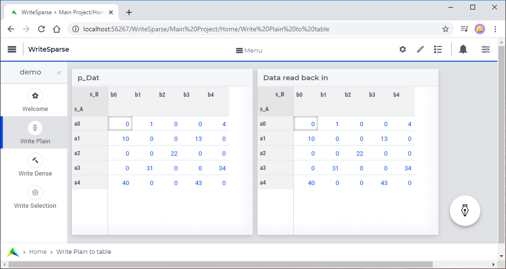
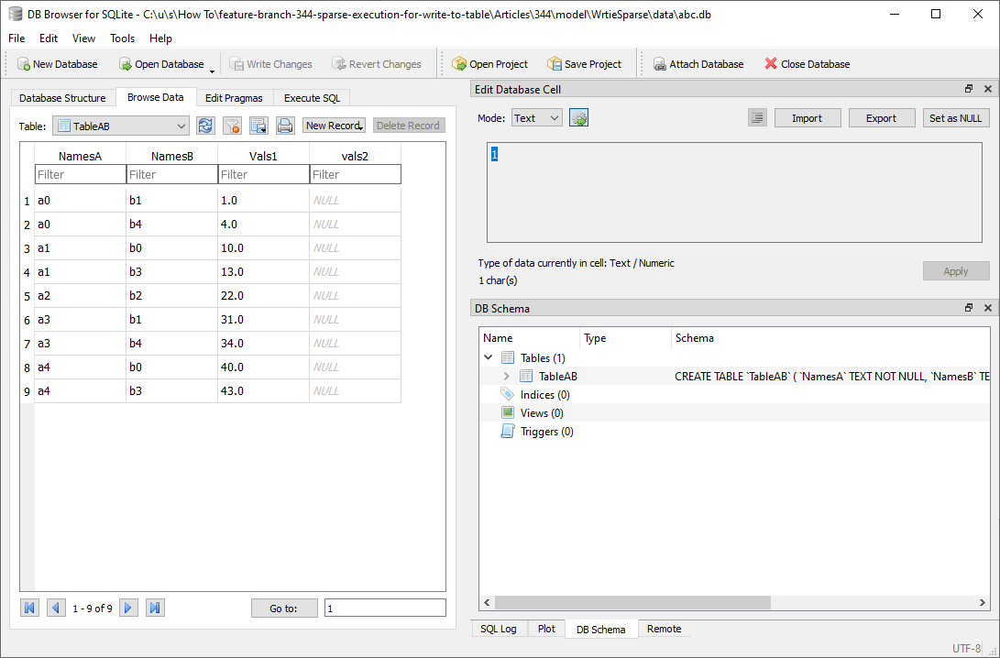
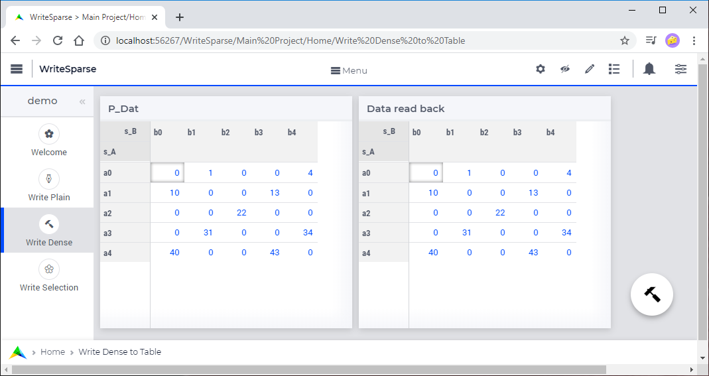
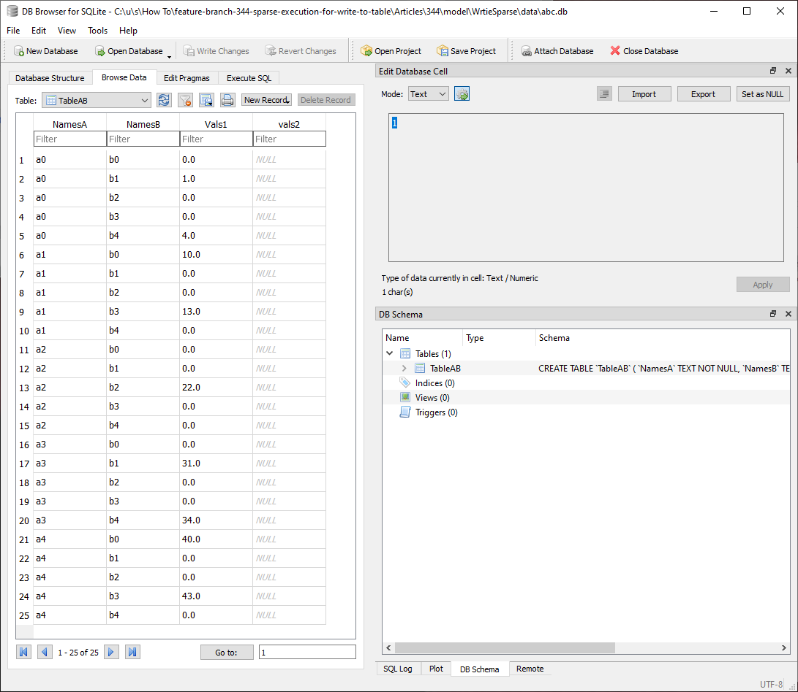
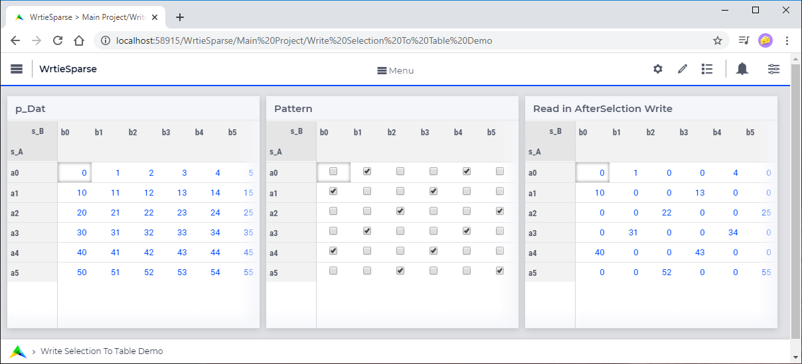
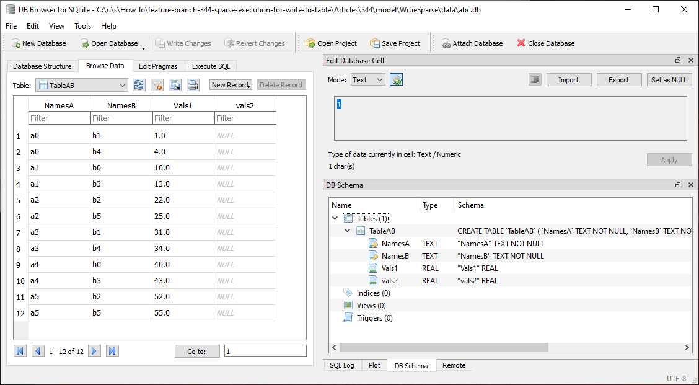
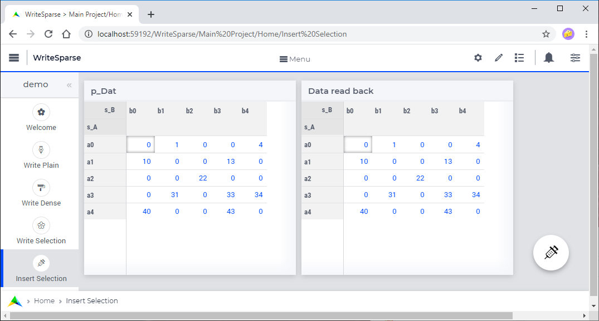
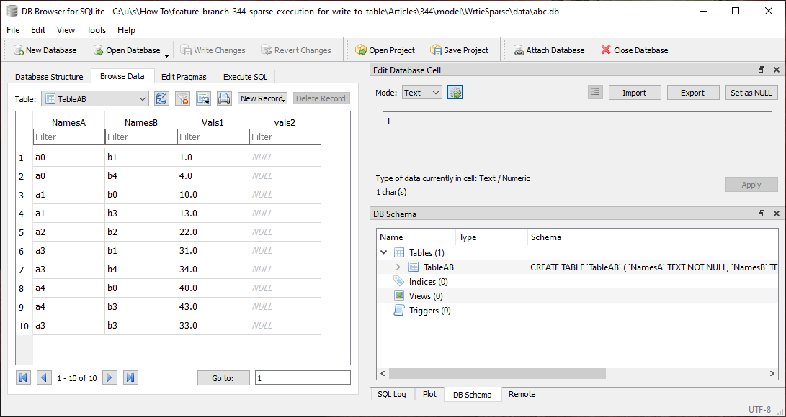

Selected Tactics for Write to Table
======================================

A database table may or may not match the data in the AIMMS model directly. 

In addition, we may want to write all possible elements explicitly, or just a predetermined selection of rows instead of just the non-zeros.

Last but not least, from the context in the application, it may be clear that all of the data is changed, or just one or a few rows. 

This is why there are several tactics available to steer the selection of the rows written.

In this article we discuss the following tactics:

#.  Writing the nonzeros directly to the database table.

#.  Writing all possible elements to the database table.

#.  Writing a selection of rows to the database table.

#.  Insert a single row into a database table.

Running example
----------------

As we are viewing the same data over and over again; and want to focus on the difference between the various tactics, we use an abstract example. 

Two sets with a few elements: ``s_A`` and ``s_B`` with indices ``i_a`` and ``i_b`` respectively.

In addition, there is a parameter ```p_Dat`` declared over these sets; which may or may not be sparse, may or may not be stored sparse in the database, or we may want to store just a modification.

We use SQLite with the following database table declaration:

.. code-block:: sql
    :linenos:

    CREATE TABLE `TableAB` (
        `NamesA`    TEXT NOT NULL,
        `NamesB`    TEXT NOT NULL,
        `Vals1` REAL,
        `vals2` REAL,
        PRIMARY KEY(`NamesA`,`NamesB`)
    )

The AIMMS data is mapped to this SQLite database table as follows:

.. code-block:: aimms
    :linenos:

    DatabaseTable db_AB {
        DataSource: sp_Conn;
        TableName: "TableAB";
        Property: NoImplicitMapping;
        Mapping: {
            "NamesA" -->i_a,
            "NamesB" -->i_b,
            "Vals1"  -->p_dat( i_a, i_b )
        }
    }


The AIMMS project used to illustrate the tactics below can be downloaded :download:`here <model/WriteSparse.zip>`

Write in replace mode
------------------------

The most direct way of writing data is:

.. code-block:: aimms
    :linenos:
    :emphasize-lines: 3

    Procedure pr_Write {
        Body: {
            write p_dat(i_a, i_b) to table db_AB  ;
        }
    }

Given the data in the table on the left of the following WebUI image:



This will result in the following database table.



Remarks:

*   Nine rows are written to this table; only for the non-zeros of ``p_Dat``.

*   Reading back ``p_Dat`` results in the same data, see the table on the right in above WebUI image.


Write in Dense mode
----------------------

When we also want the zeros to be stored in the database table, we can use the "in dense mode" using the following code:

.. code-block:: aimms
    :linenos:
    :emphasize-lines: 4

    Procedure pr_Write {
        Body: {
            write p_dat(i_a, i_b) to table db_AB 
                in dense mode ;
        }
    }

With this procedure, the data written and read back is illustrated in the left and in the right table of the WebUI image below.



This is actually the same as in the previous section. 
The difference is in the number of rows written; now also the 0.0's are written, as can be seen in the following table with 25 rows:




Write Selection
------------------

In the above section, a lot of rows are written. 
To reduce the number of rows written, we can specify a selection as follows:

*   By filtering per index, 

*   Or by filtering over tuples, as illustrated in the following code.

.. code-block:: aimms
    :linenos:
    :emphasize-lines: 4

    Procedure pr_Write {
        Body: {
            write p_dat(i_a, i_b) to table db_AB 
                filtering (i_a, i_b) in rel_flt;
        }
    }
    
When the data is an almost full matrix, as illustrated in the table on the left, and specify a filter pattern, according to the table in the middle and use that pattern to filter the writing.  
Reading the data back results in the table on the right. 
Note that the table on the left and the table on the right are no longer equal!



Note also that the database contains less rows:



Insert Selection
-------------------

When we tracked the rows that are inserted, we can limit ourselves to just inserting those rows as follows:

.. code-block:: aimms
    :linenos:
    :emphasize-lines: 4,5

    Procedure pr_Write {
        Body: {
            write p_dat(i_a, i_b) to table db_AB 
                in insert mode 
                filtering (i_a, i_b) in rel_flt;
        }
    }

When we start with the ``p_Dat`` table in the section "Write in replace mode" and only insert one element ``p_Dat('a3','b3') = 33``, this will result in only one SQL insert statement executed. 
The AIMMS data is shown here:



and the database table data is shown here:



Apparently, SQLite appends the new element to the end.

