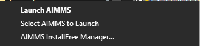
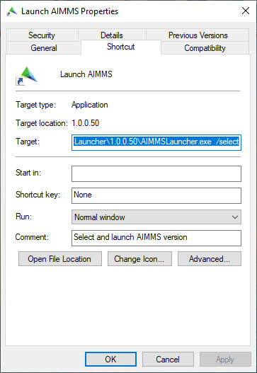
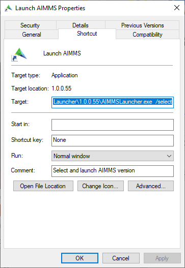

Installing AIMMS 
=================

.. meta::
   :description: Guide to installing AIMMS in a custom location and making it available for all users.
   :keywords: AIMMS, installation, all users, disk drive, custom location

Installing AIMMS Optimization Tooling is straightforward. Simply download your chosen version from the `AIMMS downloads page <https://www.aimms.com/support/downloads>`_ and run the installer, such as ``Aimms-4.73.1.3-x64-VS2017.exe``. This installs AIMMS in the default location: ``%localappdata%\Local\AIMMS\IFA\Aimms``.

We recommend also downloading and installing the `AIMMS Launcher <https://www.aimms.com/support/downloads#aimms-other-download>`_ from the same page. The AIMMS Launcher offers the following features:

* Double-clicking a ``.aimms`` file opens the project with the AIMMS version that last modified it, or, if unavailable, the most recent installed version.
* Right-clicking a ``.aimms`` file shows additional options to select a specific AIMMS version for that project.

|

In most cases, this setup suffices. For custom installation requirements, such as installation for all users or to a non-default location, see the sections below.

Installing in a Custom Location
-------------------------------

You may wish to install AIMMS outside of the default location in these scenarios:

1. **Software Policies**: Your organization may restrict software installation to certain locations, disallowing ``%localappdata%``.
2. **Disk Space**: Limited disk space on the default drive may necessitate installation on a different drive.

Starting with AIMMS 4.38, you can install AIMMS in a shared location, like ``C:\Program Files (x86)\AIMMS\IFA``.

Ensuring AIMMS Launcher is Up-to-Date
~~~~~~~~~~~~~~~~~~~~~~~~~~~~~~~~~~~~~~~

Before proceeding, make sure you have the latest version of AIMMS Launcher. You can check your installed version by viewing its properties. For example, an outdated version might be labeled ``1.0.0.50``:

|

Reinstalling the Launcher from the downloads page will update it:

|

For installations requiring administrative access, install AIMMS Launcher with elevated rights. This will place it in ``C:\Program Files (x86)\AIMMS\IFA\AIMMSLauncher``.

Installing on a Different Drive
~~~~~~~~~~~~~~~~~~~~~~~~~~~~~~~~~~~~~~~

To save disk space, you may want to install AIMMS on a different drive. Although the installer doesn’t support custom drives directly, you can accomplish this using a symbolic link.

1. Create a target folder for AIMMS on the other drive. In this example, use ``D:\Program Files (x86)\AIMMS\IFA\Aimms``.

2. Open a command prompt with administrator rights, and navigate to ``C:\Program Files (x86)\AIMMS\IFA``. If this folder doesn’t exist, create it first.

3. Run the following command to create a symbolic link:

   .. code-block:: none

      mklink /D Aimms "D:\Program Files (x86)\AIMMS\IFA\Aimms"

   This will produce the following output:

   .. code-block:: none

      symbolic link created for Aimms <<===>> D:\Program Files (x86)\AIMMS\IFA\Aimms

For more information on symbolic links, see the `Microsoft documentation <https://docs.microsoft.com/en-us/windows-server/administration/windows-commands/mklink>`_.

With the symbolic link in place, you’re ready to install AIMMS in the new location. Run the installer "as administrator" by right-clicking it and choosing "Run as administrator". AIMMS will install to the new location on the D Drive, making it accessible to all licensed users on the machine.

Installing the License
----------------------

To use AIMMS, you must have a valid license:

* If you don’t have one, request a `free academic license <https://www.aimms.com/support/licensing/academic-license/>`_.
* Learn more about AIMMS licensing on the `AIMMS licensing page <https://www.aimms.com/support/licensing/>`_.
* If managing multiple licenses, the `AIMMS Network License Server <https://www.aimms.com/support/downloads#aimms-other-download>`_ may be useful.
* For additional licensing details, see the licensing `How-Tos <https://how-to.aimms.com/licensing/index.html>`_.
