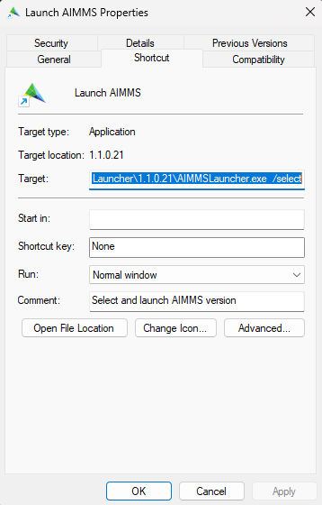

Install AIMMS in another location
=================================

.. meta::
    :description: Installing AIMMS, making it available for all users, and perhaps even on a non-default location.
    :keywords: AIMMS, Installation, all users, disk drive

To install AIMMS on your own laptop is usually easy, just download the version of your choice from `our downloads page <https://www.aimms.com/support/downloads>`_ and run the self-extracting file, for instance ``Aimms-4.73.1.3-x64-VS2017.exe``.
It will extract the actual program in ``%localappdata%\AIMMS\IFA\Aimms\`` and start it.

We also recommended to download and install the `AIMMS launcher <https://www.aimms.com/support/downloads#aimms-other-download>`_. 
The latest version can be downloaded from the same page. 
The functionalities of AIMMS Launcher are:

* Double click on a ``.aimms`` file will open the AIMMS project, with the AIMMS version that was used to last modify that project, or, if that AIMMS release cannot be found, using the most recent AIMMS version available on your computer.

* Add the below options to the context menu when you right click on a ``.aimms`` file. 

.. image:: images/aimms-right-click.png
    :align: center

With these, you can choose from the AIMMS versions on your computer to launch that project and manage those AIMMS versions; to save disk space.
 
The above is sufficient for many people. In the remainder of this article we will discuss how to handle advanced requirements.

Installing elsewhere
----------------------

For the following reasons, the default installation location may not be the preferred one:

#.  Some organizations have a software policy that prohibits their users to install software in ``%localappdata%``.

#.  The available disk space on the drive with the ``users`` folder may be limited.

You can then install AIMMS in a different location, like ``C:\Program Files (x86)\AIMMS\IFA``. 
Installation for all users is available since AIMMS 4.38.

Check version of AIMMS Launcher
^^^^^^^^^^^^^^^^^^^^^^^^^^^^^^^^^^^^^^^^^^

Before you install elsewhere it is strongly recommended to install the most recent version of AIMMS Launcher.
If you have already have AIMMS Launcher installed, check the version in its properties.
For example, here is a version that is quite old: ``1.0.0.50``:

.. image:: images/LauncherTooOld.png
    :align: center

Downloading and installing the AIMMS Launcher again will upgrade the version as:

    
Also, you can install the AIMMS Launcher with elevated rights. 
It will then be installed in ``C:\Program Files (x86)\AIMMS\IFA\AIMMSLauncher``

Installing on a different drive
----------------------------------

For reasons of disk space, you may want to install AIMMS on a different disk. 

The AIMMS installer does not have built in functionality to install on another drive, but using a symbolic link, it is easy to realize.

First create a folder to install AIMMS on the other drive, in the example here drive ``D:``, and we use the folder ``D:\Program Files (x86)\AIMMS\IFA\Aimms``.

Next, using the MS DOS command prompt with elevated (administrator) rights:

Navigate to ``C:\Program Files (x86)\AIMMS\IFA``.  
If this folder does not exist, please create it.

Then create a symbolic link as follows:

.. code-block:: none

    mklink /D Aimms "D:\Program Files (x86)\AIMMS\IFA\Aimms"

which gives the following output:

.. code-block:: none

    symbolic link created for Aimms <<===>> D:\Program Files (x86)\AIMMS\IFA\Aimms

More on symbolic links can be found `on Microsoft docs <https://docs.microsoft.com/en-us/windows-server/administration/windows-commands/mklink>`_.

Actually installing elsewhere
^^^^^^^^^^^^^^^^^^^^^^^^^^^^^^

With the above preparations, you are now ready to install AIMMS in a different location. 
Just launch the installer "as administrator" by right clicking and selecting "as administrator".

It will install AIMMS in the D Drive folder and make AIMMS available to all licensed AIMMS users of that machine.

Installing the license
-----------------------

*  You should have a valid AIMMS license to use AIMMS.  
   If you do not have one yet, you can request a `free license <https://www.aimms.com/support/licensing/academic-license/>`_

*  Read all about `AIMMS licensing here <https://www.aimms.com/support/licensing/>`_  

*  When using multiple licenses, they can be managed using the `AIMMS Network License server <https://www.aimms.com/support/downloads#aimms-other-download>`_

*  Further licensing `How-Tos <https://how-to.aimms.com/C_Getting_Started/Sub_Licensing/index.html>`_

