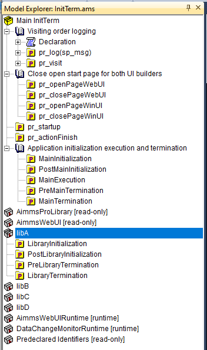

Application initialization and termination with libraries
===========================================================

When an AIMMS application is launched, the initialization procedures are executed before all else. 
Likewise, when the app is shut down the termination procedures are executed. 
See also `this section in the language reference <https://documentation.aimms.com/language-reference/data-communication-components/data-initialization-verification-and-control/model-initialization-and-termination.html#sec-data-init>`_

If you want some action to happen each time you open the app, say reading data from an external file - 
you can refer to the corresponding AIMMS procedure in one of the initialization procedures. 
But which one? What if your read procedure is in a different library?

We use this article to give you a better understanding of the initialization and termination of an AIMMS app
such that you can answer the following questions:

#.  Which are the steps you can use to initialize an application? 

#.  When can you rely on a library to be initialized?

#.  Does the order in which libraries are declared matter to the initialization and termination of an application?

#.  Do initialization and termination depend on the way the application is deployed?

#.  How to stop a running application?

In this article, the above questions are not answered directly, 
but the answer follows by creating a small app and testing with it as presented below.

Example application to do the analysis
---------------------------------------

To investigate initialization and termination in detail, the app ``InitTerm`` is created that can be downloaded :download:`here <model/InitTerm.zip>`. 
The ``InitTerm`` app has the following overall structure:

The visit procedure
^^^^^^^^^^^^^^^^^^^^

The purpose of the procedure ``pr_visit`` is to mark the visiting procedures.

The procedure ``pr_visit`` has the following simple code:

.. code-block:: aimms
    :linenos:

    p_visits += 1 ;
    sp_node := callerNode(1);
    sp_line := formatString("Visit %2i from: %s", p_visits, sp_node);
    pr_log(sp_line);

whereby the procedure ``pr_log`` outputs the line either into the session log or to a file, depending on how the app is called.
 
Subsequently, a call to ``pr_visit`` is placed at every procedure that might be involved in the initialization or termination.
In addition, a case is saved whereby the value of p_visits is set to 50. This case is set to the startup case.

Running the ``InitTerm`` app
-----------------------------

Opening the app in AIMMS developer, and pressing the ``Bye`` button in the opened WinUI page results in the following ``visit.txt`` file:

.. code-block:: none
    :linenos:
    :emphasize-lines: 13

    Visit  1 from: MainInitialization
    Visit  2 from: a::LibraryInitialization
    Visit  3 from: b::LibraryInitialization
    Visit  4 from: c::LibraryInitialization
    Visit  5 from: d::LibraryInitialization
    Visit 51 from: PostMainInitialization
    Visit 52 from: a::PostLibraryInitialization
    Visit 53 from: b::PostLibraryInitialization
    Visit 54 from: c::PostLibraryInitialization
    Visit 55 from: d::PostLibraryInitialization
    Visit 56 from: pr_startup
    Visit 57 from: pr_openPageWinUI
    Visit 58 from: pr_actionFinish
    Visit 59 from: pr_closePageWinUI
    Visit 60 from: d::PreLibraryTermination
    Visit 61 from: c::PreLibraryTermination
    Visit 62 from: b::PreLibraryTermination
    Visit 63 from: a::PreLibraryTermination
    Visit 64 from: PreMainTermination
    Visit 65 from: d::LibraryTermination
    Visit 66 from: c::LibraryTermination
    Visit 67 from: b::LibraryTermination
    Visit 68 from: a::LibraryTermination
    Visit 69 from: MainTermination

There are several remarks to be made about this log:

#.  The order in which the libraries are initialized is top to bottom, and in which they are terminated is bottom to top.

    .. tip::

        Consequently, it is practical to put the system libraries ``AimmsProLibrary`` and ``AimmsWebUI`` at the top of the library list. 
        This permits other libraries to use the functionalities of these libraries even in their ``LibraryInitialization`` and ``LibraryTermination`` procedures.
        
#.  The ``p_visit`` value jumps to 51 on line 6. This implies that the startup case is loaded just before ``PostMainInitialization`` is run.

#.  On line 13 the procedure ``pr_actionFinish`` is visited.  
    This procedure initiates the shutdown of the session (lines 15-24) after closing the only WinUI page of app (line 14).

Deployment dependent actions taken 
------------------------------------

The following lists which actions are taken by application start or application finish:

+----------------------------+-----------+-------+-------+--------+----------+
|                            | Developer | WinUI | WebUI | Solver | AimmsCmd |
+============================+===========+=======+=======+========+==========+
| initialData                |  +        |   +   |  +    |    +   |    +     |
+----------------------------+-----------+-------+-------+--------+----------+
| MainInitialization         |  +        |   +   |  +    |    +   |    +     |
+----------------------------+-----------+-------+-------+--------+----------+
| LibraryInitialization      |  +        |   +   |  +    |    +   |    +     |
+----------------------------+-----------+-------+-------+--------+----------+
| Load of startup case       |  +        |   +   |  +    |    +   |    +     |
+----------------------------+-----------+-------+-------+--------+----------+
| PostMainInitialization     |  +        |   +   |  +    |    +   |    +     |
+----------------------------+-----------+-------+-------+--------+----------+
| PostLibraryInitialization  |  +        |   +   |  +    |    +   |    +     |
+----------------------------+-----------+-------+-------+--------+----------+
| Startup procedure          |  +        |   +   |  +    |    +   |    +     |
+----------------------------+-----------+-------+-------+--------+----------+
| Page open  of WinUI page   |  +        |   +   |       |        |          |
+----------------------------+-----------+-------+-------+--------+----------+
| Page close of WinUI page   |  +        |   +   |       |        |          |
+----------------------------+-----------+-------+-------+--------+----------+
| Page open  of WebUI page   |           |       |  +    |        |          |
+----------------------------+-----------+-------+-------+--------+----------+
| Page close  of WebUI page  |           |       |       |        |          |
+----------------------------+-----------+-------+-------+--------+----------+
| Read input case            |           |       |       |    +   |          |
+----------------------------+-----------+-------+-------+--------+----------+
| Write output case          |           |       |       |    +   |          |
+----------------------------+-----------+-------+-------+--------+----------+
| PreLibraryTermination      |  +        |   +   |  +    |    +   |    +     |
+----------------------------+-----------+-------+-------+--------+----------+
| PreMainTermination         |  +        |   +   |  +    |    +   |    +     |
+----------------------------+-----------+-------+-------+--------+----------+
| LibraryTermination         |  +        |   +   |  +    |    +   |    +     |
+----------------------------+-----------+-------+-------+--------+----------+
| MainTermination            |  +        |   +   |  +    |    +   |    +     |
+----------------------------+-----------+-------+-------+--------+----------+

The columns of the above table are:

#.  AIMMS Developer: the actions taken by AIMMS Developer by opening and closing the ``InitTerm`` application.

#.  WinUI: the actions taken by a WinUI application published on AIMMS PRO by opening and closing the ``InitTerm`` application.

    .. note:: A published WinUI app can be closed in two ways:

        #.  By running the procedure ``ExitAimms``

        #.  By closing the window.

#.  WebUI: the actions taken by a WebUI application published on AIMMS PRO by opening and closing the ``InitTerm`` application.

    .. note:: A published WebUI app can be closed in two ways:

        #.  By running the procedure ``pro::sessionmanager::FinishSession()``

        #.  By closing all browser tabs, and waiting a minute.

#.  Solver: A solver session submitted by ``pro::delegateToServer``.

    #.  The input case is the case constructed by the data session (WinUI or WebUI) to provide input to the solver session.

    #.  The output case is the case constructed by the solver session to pass the results to the data session.

#.  AimmsCmd: Running the ``InitTerm`` application via AimmsCmd and just opening and closing it.

References and further reading
----------------------------------

#.  `Language reference: Model Initialization and Termination <https://documentation.aimms.com/language-reference/data-communication-components/data-initialization-verification-and-control/model-initialization-and-termination.html#sec-data-init>`_

#.  The Help on the options in the category Project > Startup & authorization:

    #.  startup case

    #.  startup procedure

    #.  startup page

#.  AIMMS The User's guide, Chapter 18:

    #.  Section 1: AIMMS Command line options

    #.  Section 3: The AIMMS command-line options

