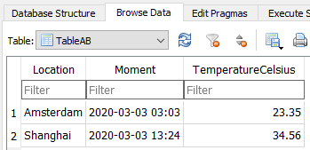
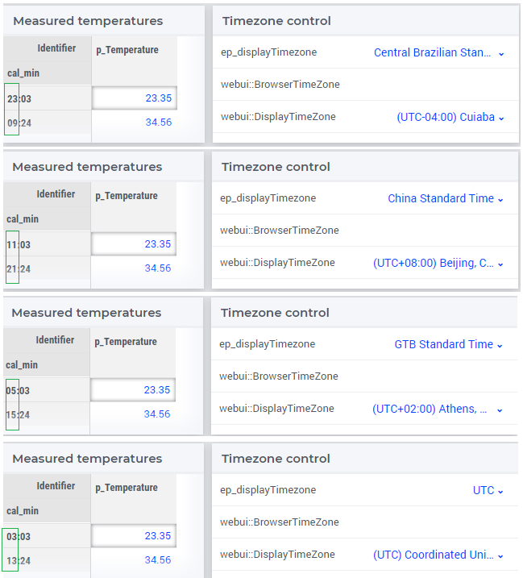

:orphan:

Internationalized time referencing
=====================================

The world is a global village; people around the world work together in teams.
The timezone plays a key role in various ways:

#.  Working together whilst situated in different timezones, viewing/editing data it is convenient to have a common timezone to represent data.

#.  Working together whilst situated in the same timezone, to view/edit data, it feels natural to switch to that timezone.

#.  Exchanging data with a data source, the timezone of that data source should be used.

Running example
----------------

Consider a global team managing the flows of gasses in an international network. 
The team is based in Brasilia, Athens, and Shanghai. 
Part of their job is to register temperatures measured and plan future heatings of the system at hand. 
The database uses UTC as reference time zone. It has the following contents:

When team members from different locations communicate with each other about various events, they use the timezone UTC. 
When team members within one location communicate with each other, they use the local timezone, including daylight saving time.

The model used to create the images shown can be :download:`downloaded here <model/time-ref.zip>` 

.. Model representation of time
.. ----------------------------------
.. 
.. When exchanging data with various data sources, it is good practice to:
.. 
.. * choose one representation of time that is used inside the model, and 
.. 
.. * convert time format and time zone as needed when communicating with data sources.
.. 
.. In this example we choose UTC as the reference time zone, and "%c%y-%m-%d %H:%M%TZ('UTC')" as the reference format.

Reading data from the database
-----------------------------------

The team understands, that the database has one location, and thus one timezone.
First, we formalize that the data is stored with respect to a single timezone in the convention attribute of the database:

.. code-block:: aimms
    :linenos:
    :emphasize-lines: 4

    DatabaseTable db_Celsius {
        DataSource: "data/abc.dsn";
        TableName: "TableAB";
        Convention: cnv_Database;
        Property: NoImplicitMapping;
        Mapping: {
            "Moment"             --> i_Min,
            "TemperatureCelsius" --> p_Temperature( i_Min )
        }
    }

Where `cnv_Database` is declared as:

.. code-block:: aimms
    :linenos:

    Convention cnv_Database {
        TimeslotFormat: cal_min : "%c%y-%m-%d %H:%M%TZ('UTC')";
    }

Note here that the timezone is fixed to ``'UTC'`` and that we adhere to the timeslot format chosen in the database.

Without further ado, the data is read in using:

.. code-block:: aimms

    read from table db_Celsius ;

Displaying the data
--------------------

There are four timezones according to which the data is displayed:

*   ``'UTC'`` when team members from different locations are working together, and 
*   the timezones ``'Central Brazilian Standard Time'``, ``'GTB Standard Time'``, and ``'China Standard Time'`` when team members within one location work together.

In addition, as all timeslots are within a single day, we just want to see the hour and minute of that timeslot.
This is why the timeslot format ``"%H:%M%TZ(webui::DisplayTimeZone)"`` is to be used, which is covered in the convention ``cnv_displayTime``, declared as:

.. code-block:: aimms

    Convention cnv_displayTime {
        TimeslotFormat: cal_min : "%H:%M%TZ(webui::DisplayTimeZone)";
    }

In the example model, the `webui::DisplayTimeZone` is set via the annotation ``webui::UponChangeProcedure`` at ``ep_displayTimezone``.  This allows the end user to override the preferred timezone, for instance when the ``webui::BrowserTimeZone`` cannot be obtained, or when the data is to be presented in ``'UTC'``.

The relevant views of time for the team can be seen below:

Further reading
----------------

*   Language Reference, Chapter "Time-Based Modeling"

*   In this article, time referencing is discussed when you create an application using AIMMS 4.74 or newer.  
    To convert an application created using AIMMS 4.73 or older, please check out :doc:`../362/362-evolving-time-referencing`.

