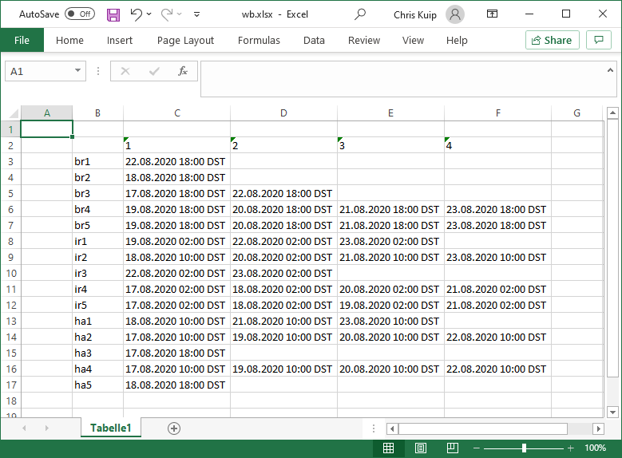
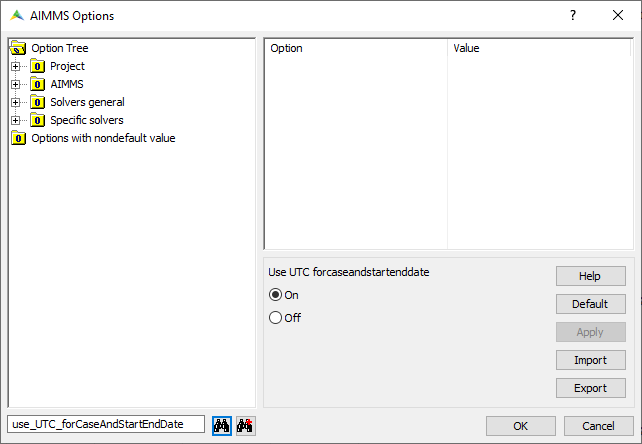
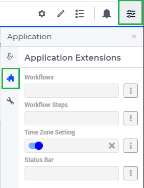
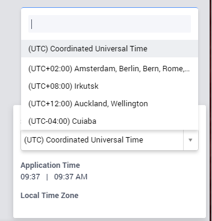
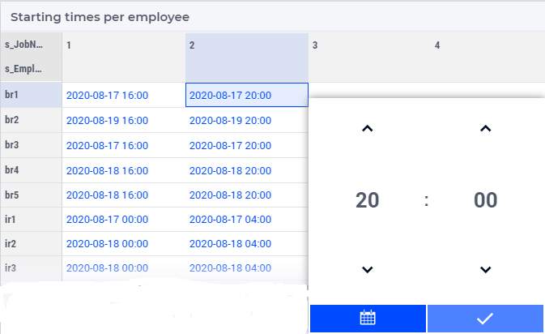
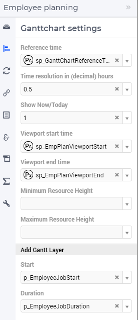
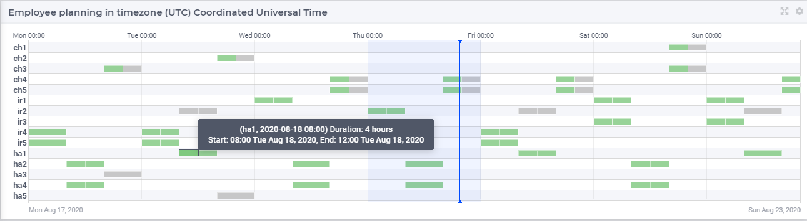
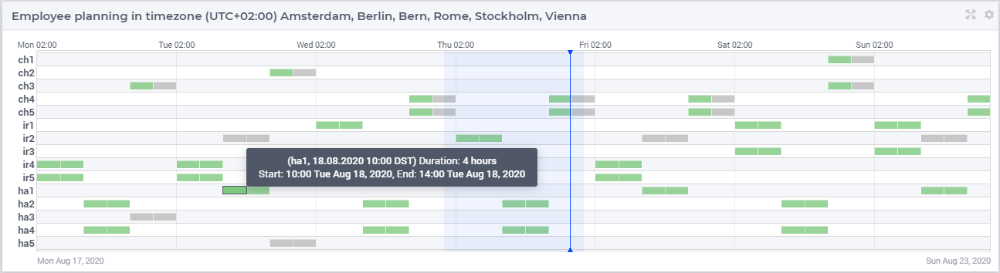

Multi timezone applications 
============================

.. meta::
   :description: Creating multi timezone applications illustrated and good practice motivated.
   :keywords: timezone, operations research, date conversion, datetime, visualization

International organizations have offices around the world. 
Staff from multiple offices may be cooperating to create operational plans.
Such a plan may include the time of day information (timestamp) to start certain tasks.

Clearly, the timezone for each timestamp needs to be clear. 
But which timezone to use, that of the planner, that of the executor, that of some manager or director?

An application that supports a global team to manage and use an operational plan 
is an example of a multi timezone application.

AIMMS offers a variety of features for implementing multi timezone applications.
In this article, an overview of these features is presented together 
with a practical approach of using these features.

The running example of this article is an application whereby the multi timezone aspect surfaces 
in each pillar of application building. 

Definition
-----------

A multi timezone application is an application whereby 

#.  users and/or data sources are located in different timezones, and 

#.  the time of day is relevant to the information handled by the application.

The multi timezone aspect of such an application plays a role in one or more of the following 
pillars of that application:

#.  The modeling 

#.  The data management  

#.  The user interface

The use case of this running example is described as follows:

The running example
----------------------

To provide 24/7 expert support on (near) incidents of expensive equipment, 
there are three offices where support is organized: 

#. Irkutsk, Russia (no daylight saving),

#. Hamburg, Germany (daylight saving roughly during March-October), and 

#. Santiago, Chile (daylight saving roughly during September-April).  

At each location, there are some experts available willing to answer questions on this expensive equipment.
The certification of an expert determines which questions that the expert can handle.
There are five certifications, lettered 'a' to 'e'; and each expert has one or more of these certifications.

Note that when two employees are working at the same moment, but located at different places on the globe, 
one might be on a day shift, while the other might be on a night shift. 
To reduce work pressure and cost, the number of evening and night shifts for these experts is minimized. 

Modeling
^^^^^^^^^^^^

The schedule meets the following requirements:

#.  There is always an expert available for each certification.

#.  Each expert is scheduled at most once a day, at least once a week, and at most five times a week.

#.  The number of experts scheduled for a particular hour, 
    is at least the number of simultaneous calls expected for that hour.

The number of evening and night shifts of these experts is minimized.

Data management
^^^^^^^^^^^^^^^^

Data is managed in a variety of ways:

#.  The expected demand per hour is stored in a database with respect
    to the timezone ``'New Zealand Standard Time'``.

#.  Cases are used to hot start a session

#.  In Hamburg, an existing EXCEL application is used by the administration department, 
    registering the worked hours.

User interface
^^^^^^^^^^^^^^^^^^^^

When multiple users discuss the planning created, 
the Gantt Chart is shown and shared, using the timezone ``'UTC'``. 
However, when a particular user or a team within one timezone discusses the planning, 
this is done with respect to the local timezone including daylight saving (if any).

Check out the example
^^^^^^^^^^^^^^^^^^^^^^^^

The example can be experienced by:

*   downloading it :download:`here <model/SupportPlanning.zip>`, or

*   launching the ``SupportPlanning`` application from a cloud environment.

Upon start it looks like:

.. image:: images/SupportPlanningStartup.png
    :align: center

Potential actions:

#.  There is a globe in the far right lower corner marked with an orange rectangle.
    This is the time zone selector, and it allows you to select the time zone for viewing data.

#.  Reading data is activated by the book icon in the green rectangle. 
    When the app is started after downloading, then this requires 
    the :doc:`MS Access ODBC driver<../129/129-MSACCESS-32bit-64bit>` to be installed.  
    
#.  Solving the rostering problem is activated by the two crossing arrows 
    in the green rectangle in the right lower part.

#.  You can load the data of a solved case using the data manager icon 
    as indicated by the blue rectangle in the upper part of the image.

#.  Once the problem is solved, the download button in the yellow rectangle 
    will download an EXCEL workbook containing the schedule.

... and the application pillars
----------------------------------------------

The application is structured in three parts according to the pillars above.
The requirements for timezone handling of each of these parts are different.

#.  For the User Interface, it is necessary that the user interface adapts itself to

    #.  The local timezone of the user, when that user views the data alone, or only with a few colleagues from the same office.

    #.  A commonly agreed upon timezone, when that user views the data together with colleagues from other offices.

    Therefore, multiple timezones will be used in the user interface.

#.  For data management, the handling depends on the type of data source:

    #.  For ODBC data sources, the timezone in which the data is presented is usually defined externally.
        Therefore, there may be zero, one, or more timezones relevant here as well.

    #.  The ``library AimmsXLLibrary``, providing direct access to EXCEL workbooks, listens to the 
        convention of the main model. Therefore, some flexibility is in this convention.

    #.  Cases, as binary dumps of the identifier in AIMMS memory, are best saved and restored using UTC.
        This avoids ambiguity.

#.  The model is the component that communicates with both the user interface and with data sources.
    The collection of timezones may change over time as the users, and perhaps also the data sources, 
    will vary over time. 

    When the data of the model is stored using multiple timezones, 
    data management and communication with user interface and data sources become complicated. 
    A good practice is therefore to choose one timezone as a reference and store all data with respect to this timezone. 
    In the following, we will call this the model timezone.

    As all timezones are defined in terms of UTC, it is good practice to use UTC as the model timezone.

Modeling
-----------

In this section, at the implementation level, the multi timezone aspects of the AIMMS model are described.

The modeling timezone
^^^^^^^^^^^^^^^^^^^^^^^^^^^^^^^^^^^^

As described above, we choose one timezone in the model, and name the parameter containing it ``ep_modelTimezone``.
In addition, we initialize the choice: UTC.

.. code-block:: aimms
    :linenos:

    ElementParameter ep_modelTimezone {
        Range: AllTimeZones;
        Definition: 'UTC';
    }

To specify that all time related data is using the UTC timezone and using the standard AIMMS time format, 
the following convention is used:

.. code-block:: aimms
    :linenos:

    Convention cnv_model {
        TimeslotFormat: {
            cal_Slots      : sp_datetimeFormatModel,
            cal_workBlocks : sp_datetimeFormatModel
        }
    }

where

.. code-block:: aimms
    :linenos:

    StringParameter sp_datetimeFormatModel {
        Definition: sp_datetimeFormatsModel(ep_modelTimezone);
    }

And specify the use of ``cnv_model`` that in the main model as follows:

.. code-block:: aimms
    :linenos:
    :emphasize-lines: 2

    Model Main_SupportPlanning {
        Convention: cnv_model;
        ...
    }

The WebUI is notified of the model timezone as follows in ``PostMainInitialization``:

.. code-block:: aimms

    webui::ModelTimeZone := ep_modelTimezone ;

The mathematical programming problem
^^^^^^^^^^^^^^^^^^^^^^^^^^^^^^^^^^^^^^^^^^^^^^^^^^^^^^^^^^^^^^^^^^^^^^^^^^^^

The mathematical programming problem to be solved in this example is a rostering problem, 
and constraints similar to rostering apply, 
see :doc:`rostering using constraint programming article<../137/137-Small-Rostering>` and 
`wikipedia <https://en.wikipedia.org/wiki/Nurse_scheduling_problem>`_. 
The actual rostering problem is not discussed here.

The multi timezone aspect of the mathematical programming problems surfaces in 
the definition of the cost coefficients.
Different costs are associated with different employees executing a particular shift.
In the running example, this cost computation is handled in the section ``determining_cost_coefficients``.

The procedure ``pr_determineCostCoefficients`` computes the cost ``p_cost(i_Employee,i_workBlock)`` in four steps:

#.  First compute the shift of each workblock, depending on the timezone. 
    This again, consists of three sub-steps:

    #.  Determine the starting time using the AIMMS intrinsic function :aimms:func:`TimeSlotToString` as follows:

        .. code-block:: aimms
            :linenos:
            :emphasize-lines: 4,5

            for indexTimeZones do
                ep_TempForTimeZone := indexTimeZones;
                sp_workblockTimezoneToStartHour(i_workBlock, ep_TempForTimeZone) := 
                    TimeSlotToString("%c%y-%m-%d %H:%M%TZ(ep_TempForTimeZone)", 
                        cal_workBlocks, i_workBlock );
            endfor ;

        *   On line 4,5 the call to :aimms:func:`TimeSlotToString` converts the 
            calendar element ``i_workBlock`` to the timezone ``ep_TempForTimeZone``.

        *   Line 2 lets the timezone  ``ep_TempForTimeZone`` vary over all timezones.

    #.  Once, we have this string, extracting the starting hour from that string is straightforward.

        .. code-block:: aimms
            :linenos:

            p_workblockTimezoneToStartHour(i_workBlock, IndexTimeZones)  := 
                val( substring( sp_workblockTimezoneToStartHour(i_workBlock, IndexTimeZones), 12, 13 ) );

    #.  Based on the starting hour of each timezone, we determine the shift:

        .. code-block:: aimms
            :linenos:

            ep_workBlockTimezoneToShift(i_workBlock, IndexTimeZones) := 
                if p_workblockTimezoneToStartHour(i_workBlock, IndexTimeZones) < 8 then
                    'night'
                elseif p_workblockTimezoneToStartHour(i_workBlock, IndexTimeZones) < 16 then
                    'day'
                else
                    'evening'
                endif ;

#.  Second, determine the number of certifications; the more certifications, the more expensive the employee, 
    but also the better the employee is able to create new instructive content or execute more advanced analysis.

    .. code-block:: aimms
        :linenos:

        p_noCertifications(i_Employee) := 
            count( i_certification, p01_certified(i_certification, i_Employee) );

#.  Combine the previous two steps to compute the actual costs for an employee to be on standby during that shift.

    .. code-block:: aimms
        :linenos:

        p_cost(i_Employee, i_workBlock) :=
            ( 3 + p_noCertifications(i_Employee) ) * 
            p_CostPerShift(
                ep_workBlockTimezoneToShift(i_workBlock, 
                    ep_TimezoneEmployee(i_Employee) ) );

    * Line 2: The number of certifications of the employee is weighted

    * Line 3: The cost per shift is used

    * Line 4: Computed in the first part of this procedure

    * Line 5: The timezone of an employee is input data

    Where the cost per shift is specified as:

    .. code-block:: aimms
        :linenos:

        Parameter p_CostPerShift {
            IndexDomain: i_shift;
            Definition: data { day : 1, evening : 1.25, night: 1.4 };
        }

Data management
------------------

ODBC data exchange
^^^^^^^^^^^^^^^^^^^^^^

The data is stored in New Zealand, according to timezone ``'New Zealand Standard Time'``: 
So, we first specify the timezone:

.. code-block:: aimms
    :linenos:

    ElementParameter ep_databaseTimezone {
        Range: AllTimeZones;
        Definition: 'New Zealand Standard Time';
    }

Next, the convention to be used for this timezone is easily defined as follows:

.. code-block:: aimms
    :linenos:

    Convention cnv_database {
        TimeslotFormat: {
            cal_Slots      : "%c%y-%m-%d %H:%M%TZ(ep_databaseTimezone)",
            cal_workBlocks : "%c%y-%m-%d %H:%M%TZ(ep_databaseTimezone)"
        }
    }

Once the convention is defined, all tables with time of day information can use this convention as follows:

.. code-block:: aimms
    :linenos:
    :emphasize-lines: 4

    DatabaseTable db_demandData {
        DataSource: sp_connStr;
        TableName: "expected-demand-in-new-zealand-standard-time";
        Convention: cnv_database;
        Mapping: {
            "workblock"     -->i_workBlock,
            "demand"        -->p_demand( i_workBlock )
        }
    }
    
Excel writing
^^^^^^^^^^^^^^^^^^^^^^

The task of procedure ``pr_writeExcel`` is to set the proper context, 
including convention and timezone, for all procedures that actually write to the EXCEL workbook.

.. code-block:: aimms
    :linenos:
    :emphasize-lines: 8

    Procedure pr_writeExcel {
        Arguments: (sp_fn);
        Body: {
            block
                ep_stashModelTimezone := ep_modelTimezone ;
                ep_modelTimezone := 'W. Europe Standard Time' ;

                pr_writeExcelJobTable(sp_fn);

                ep_modelTimezone := ep_stashModelTimezone ;
            onerror ep_err do
                if errh::Severity( ep_err ) <> 'warning' then
                    ep_modelTimezone := ep_stashModelTimezone ;
                endif ;
                ! Note the absence of a call to errh::markAsHandled; 
                ! Stack unwinding continues after restoring ep_modelTimezone.
            endblock ;
        }
        ElementParameter ep_err {
            Range: errh::PendingErrors;
        }
        ElementParameter ep_stashModelTimezone {
            Range: AllTimeZones;
        }
        StringParameter sp_fn {
            Property: Input;
        }
    }

The AimmsXLLibrary listens to the model convention.  
The timezone conversion of this convention is controlled by the element parameter ``ep_modelTimezone``.
By temporarily switching this element parameter to ``'W. Europe Standard Time'``, 
the dates will be formatted and converted according to the locale of Hamburg.

It is essential that the parameter ``ep_modelTimezone`` is reset to its original value, 
even in the context of errors. The error handling on line 12-14 makes sure of this.

The procedure ``pr_writeExcelJobTable`` writes the job table in ``ep_Job`` to 
an Excel workbook. Note that this procedure is coded agnostic of the chosen convention and timezone.

.. code-block:: aimms
    :linenos:

    Procedure pr_writeExcelJobTable {
        Arguments: (sp_fn);
        Body: {
            FileCopy(  ! copy template file.
                source      :  "data/wb.xlsx", 
                destination :  sp_fn, 
                confirm     :  0);

            ! Actually write to Excel file.
            axll::KeepExistingCellFormats:=1;
            axll::OpenWorkBook(sp_fn);
            axll::SelectSheet("Tabelle1");
            axll::ColumnName(2+card(s_JobNos), sp_rightColName);
            axll::WriteTable(
                IdentifierReference     :  ep_Job,  
                RowHeaderRange          :  formatString("B3:B%i",
                                               2+card(s_Employees)),
                ColumnHeaderRange       :  formatString("C2:%s2", 
                                               sp_rightColName ), 
                DataRange               :  formatString("C3:%s%i",
                                               sp_rightColName,
                                               2+card(s_Employees)));
            axll::CloseWorkBook(sp_fn);
        }
        StringParameter sp_rightColName;
        StringParameter sp_fn {
            Property: Input;
        }
    }

This code breaks down as follows:

#.  Lines 3 - 6: A template file is used. This template file contains EXCEL cell formatting.

#.  Lines 14 - 22: One call to the AimmsXLLibrary to write the entire table ;-).

After running this procedure on August 20, 2020, the Excel workbook looks like:

Case management
^^^^^^^^^^^^^^^^^^^^^^

Cases contain timeslots and may be created by a user in one timezone and opened by a user in another timezone.
To avoid confusion, the timeslots in cases should be saved with respect to the timezone UTC and 
read back using this timezone.

To enforce this, the option 'use UTC forCaseAndStartEndDate' should be set to 'on'.

As this option is not present in the option tree of the project options, 
you will need to search for it in the project option setting dialog:

User Interface
--------------

The user interface is the pillar of the application that is most impacted by the multi timezone aspect
of such applications.   
The WebUI offers several features to support the development of multi timezone user interfaces.
Central to this support are a few sets and parameters defined in the WebUI library. 
Let's discuss these sets and parameters first.

WebUI sets and parameters for handling multi timezone applications
^^^^^^^^^^^^^^^^^^^^^^^^^^^^^^^^^^^^^^^^^^^^^^^^^^^^^^^^^^^^^^^^^^^^^^

The element parameter ``webui::DisplayTimeZone``
""""""""""""""""""""""""""""""""""""""""""""""""""""

The timezone according to which data is displayed in the browser is the ``webui::DisplayTimeZone``.  
In the running example, this parameter is initialized to the timezone ``'UTC'``, 
because the application is designed to enable discussion between experts around the globe.

The set ``webui::DisplayTimeZones``
""""""""""""""""""""""""""""""""""""""

The range of the element parameter ``webui::DisplayTimeZone`` is the set ``webui::DisplayTimeZones``. 
In the running example, the good practice is followed to limit the choices 
of the user to the relevant ones by limiting this set to:

#.  The timezones where the experts are located

#.  The model timezone

#.  The database timezone

After reading the timezones of the employees in the input in ``PostMainInitialization`` 
the set ``webui::DisplayTimeZones`` is assigned as follows:

.. code-block:: aimms
    :linenos:

    webui::DisplayTimeZones := 
        { indexTimeZones | exists( i_employee | ep_TimezoneEmployee(i_Employee) = indexTimeZones ) } 
        + ep_modelTimezone + ep_databaseTimezone ;

The element parameter ``webui::TimeZoneChangeHook``
"""""""""""""""""""""""""""""""""""""""""""""""""""""""""""

The uponchange procedure for this element parameter can be modified via ``webui::TimeZoneChangeHook``.
In the example, the procedure ``pr_uponChangeDisplayTimeZone`` is used, 
which just updates the string parameter ``sp_datetimeFormatWebUI`` 
(see below) after a change of timezone to the local date-time formatting.

The element parameter ``webui::ApplicationConvention``
""""""""""""""""""""""""""""""""""""""""""""""""""""""""""""

The dates are formatted using the ``webui::ApplicationConvention``. 
In the running example, this parameter is initialized to ``'cnv_WebUI'``. 
This convention uses a string parameter to avoid having to define a separate 
convention for every timezone relevant to the application.

.. code-block:: aimms
    :linenos:

    Convention cnv_WebUI {
        TimeslotFormat: {
            cal_Slots      : sp_datetimeFormatWebUI,
            cal_workBlocks : sp_datetimeFormatWebUI
        }
    }

where 

.. code-block:: aimms
    :linenos:

    StringParameter sp_datetimeFormatWebUI {
        Definition: sp_datetimeFormatsWebUI(webui::DisplayTimeZone);
    }

The data for ``sp_datetimeFormatsWebUI`` is read in from ``"data/config.inp"`` 
by the procedure ``MainInitialization``.

Consider the following example string from this file:

.. code-block:: aimms
    :linenos:

    "%d.%m.%c%y %H:%M%TZ(webui::DisplayTimeZone)|\"\"|\" DST\"|"

which breaks down as follows:

#.  ``"%d.%m.%c%y %H:%M"`` This is the German preferred way of writing timestamps when using numbers only.

#.  ``webui::DisplayTimeZone`` The value of this element parameter is the selected timezone.

#.  ``%TZ( <tz> )|\"\"|\" DST\"|`` 
    This specifies that the timezone conversion should be applied to the timeslot at hand, 
    and that ``DST`` should be appended when daylight saving is in effect.

Timezone selector 
^^^^^^^^^^^^^^^^^^^^^^

The timezone selector is a predefined widget manipulating the element parameter ``webui::DisplayTimeZone``.
You can enable this widget via the Application settings / Application Extensions panel:

By enabling the ``Time Zone Setting`` a small globe appears in the right lower corner of the entire browser window.  
Clicking this globe shows the timezone currently selected.

The shown timezone is actually a drop up that permits to select another timezone:

Note that the choices offered is controlled by the set ``webui::DisplayTimeZones`` which we limited above.

Clicking the globe a second time makes its dialog disappear.

Tables
^^^^^^^^^^^^^^

The first data widget is a table containing, per employee, a sequence of start moments of tasks.

    #.  Using timezone UTC:

        .. image:: images/TableContainingTimeslots.png
            :align: center
            
        The second job of 'ha1' starts on ``2020-08-21 08:00`` in timezone ``'UTC'``.

    #.  Using timezone ``'W. Europe Standard Time'``:

        .. image:: images/TableContainingTimeslotsHamburg.png
            :align: center

        The employee is german, and his local timezone is ``'W. Europe Standard Time'``.
        According to that timezone, his second job starts on ``21.08.2020 10:00 DST``.

Thus there are changes in:

    #.  The specific values, for instance, the hour number changes from 08 to 10.
        This is due to the change in timezone, see ``'webui::DisplayTimeZone'``.

    #.  The formatting, the date changes from YMD order to DMY order and there is a daylight saving indicator.
        This is due to the change in date formatting, see ``'sp_datetimeFormatWebUI'``.

Date time picker for calendar elements
""""""""""""""""""""""""""""""""""""""""

Clicking a date in this table pops up a date time picker. 

.. image:: images/dateTimePickerDate.png
    :align: center

Clicking the clock icon in the right lower of this dialog gives a time selector:

Not all timezones are an integral number of hours apart from UTC.
Thus, to select a particular timeslot, access to the minutes is needed.
To enable minutes to be handled, the calendars are defined in 
blocks of 240 minutes instead of 4 hours making the granularity of 
the timeslots shown minute instead of hour. 
The date time picker thus shows both hours and minutes, instead of 
just hours when clicking the clock in the lower right corner.

To get back to the date selector, click the calendar icon in the lower left of this dialog.

Further information about the date time picker can be found .... (ref to documentation).

Gantt charts
^^^^^^^^^^^^^^

Using the following Gantt Chart specification

Here the reference time is defined as follows:

.. code-block:: aimms
    :linenos:

    StringParameter sp_GanttChartReferenceTime {
        Definition: {
            ConvertReferenceDate(
                ReferenceDate :  formatString("%e",first(cal_Slots)), 
                FromTZ        :  ep_modelTimezone, 
                ToTZ          :  webui::WebApplicationTimeZone, 
                IgnoreDST     :  0)
        }
    }

The begin and end of the viewport have similar definitions.

The Gantt Chart looks as follows when selecting timezone UTC:

and when selecting timezone ``'W. Europe Standard Time'`` it looks as follows:

Observe from the above images: 

#.  The timeline on top of the Gantt Chart adapts itself to the selected timezone.

#.  The blue Now line, indicating the current moment, does not move.

#.  The blue shaded Now area, indicating today, moves a little; 
    the day start and end are influenced by the timezone. 

#.  Default tooltips adapt themselves according to the selected timezone. 
    This is achieved similarly as the adaptation to the timezone of 
    the elements shown in the table as presented in the above subsection.

Summary
-------

In this article, a detailed presentation is given on creating a multi timezone application, 
which is useful for prescriptive AIMMS applications with an operational use case.
The presentation is comprehensive, as each of the three pillars of 
application building is supported.

Further reading
------------------

* `Timezones per country <https://en.wikipedia.org/wiki/List_of_time_zones_by_country>`_

* `Date format by country <https://en.wikipedia.org/wiki/Date_format_by_country>`_

* `Another date time formatting source <https://calendars.wikia.org/wiki/Date_format_by_country>`_

