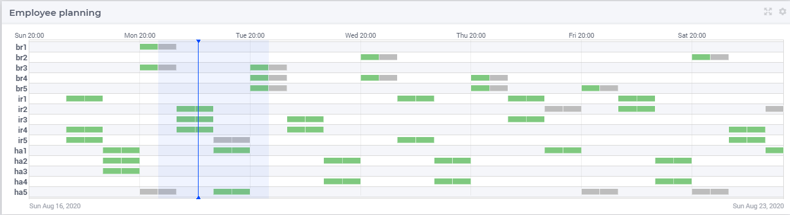

Multi-timezone applications 
============================

A multi-timezone application is an application whereby 

#.  users and/or data sources are located in different timezones, and 

#.  the time of day is relevant to the information handled by the application.

The multi-timezone aspect of such applications may play a role in the following pillars of that application:

#.  The modeling 

#.  The data exchange  

#.  The user interface

AIMMS offers a variety of features for handling multi-timezone applications.
In this article, an overview of these features is presented together with a practical approach of using these features.

The running example of this article is an application whereby the multi-timezone aspect surfaces in each of the three pillars of application building. The use case of this running example is described as follows:

The running example
----------------------

To provide 24/7 expert support on (near) incidents of expensive equipment, there are three support locations: 

#. Irkutsk, Russia,

#. Hamburg, Germany, and 

#. Sao Paolo, Brazil.  

At each location, there are some experts available willing to answer questions on this expensive equipment.
The certification of an expert determines which questions that expert can handle.
There are five certifications, lettered 'a' to 'e'; and each expert has one or more of these certifications.

Note that when two employees are working at the same moment, but located at different places on the globe, one might be in a day shift, while the other might be in a night shift. 
To reduce work pressure and cost, the number of evening and night shifts for these experts is minimized. 

Modeling
^^^^^^^^^^^^

The schedule should meet the following requirements:

#.  There is always an expert available for each certification.

#.  Each expert is scheduled at most once a day, at least once a week, and at most five times a week.

#.  The number of experts scheduled for a particular hour, is at least the number of simultaneous calls expected for that hour.

The number of evening and night shifts of these experts is minimized.

Database
^^^^^^^^^^^^^^^^

The expected demand per hour is stored with respect to the timezone ``'New Zealand Standard Time'``.

User interface
^^^^^^^^^^^^^^^^^^^^

When multiple users discuss the planning created, the Gantt Chart is shown and shared, using the timezone ``'UTC'``. However, when a particular user, or a team within one timezone discusses the planning, this is done with respect to the local timezone including daylight saving (if any).

To play around with this example, you can download it :download:`here <model/SupportPlanning.zip>` 

Timezone usage in the application pillars
----------------------------------------------

The application is structured in three parts according to the pillars above.
The requirements for timezone handling of each of these parts are different.

#.  For the User Interface, it is necessary that the user interface adapts itself to

    #.  The local timezone of the user, when that user views the data alone, or only with a few colleagues from the same office.

    #.  A commonly agreed upon timezone, when that user views the data together with colleagues from other offices.

    Therefore, multiple timezones will be used in the user interface.

#.  For the data sources, the timezone in which the data is presented is usually defined externally.
    Therefore, there may be zero, one or more timezones relevant here as well.

#.  The model is the component that communicates with both the user interface and with data sources.
    The collection of timezones may change over time as the users, and perhaps also the data sources, will vary over time. 

    When the data of the model is stored using multiple timezones, data management and communication with user interface and data sources becomes complicated. 
    A good practice is therefore to choose one timezone as a reference timezone, and store all data with respect to this timezone. 

    As all timezones are defined in terms of UTC, it is good practice to use UTC as the model timezone.

Modeling
-----------

In this section, at the implementation level, the multi-timezone aspects of the AIMMS model are described.

Formalizing the modeling timezone
^^^^^^^^^^^^^^^^^^^^^^^^^^^^^^^^^^^^

As described above, we choose one timezone in the model, and name it ``ep_modelTimezone``.

.. code-block:: aimms
    :linenos:

    ElementParameter ep_modelTimezone {
        Range: AllTimeZones;
        Definition: 'UTC';
    }

To specify that all time related data is using the UTC timezone and using the standard AIMMS time format, the following convention is used:

.. code-block:: aimms
    :linenos:

    Convention cnv_model {
        TimeslotFormat: {
            cal_Slots      : "%c%y-%m-%d %H:%M%TZ(ep_modelTimezone)",
            cal_workBlocks : "%c%y-%m-%d %H:%M%TZ(ep_modelTimezone)"
        }
    }

And specify that in the main model as follows:

.. code-block:: aimms
    :linenos:

    Model Main_SupportPlanning {
        Convention: cnv_model;
        ...
    }

The WebUI is notified of the model timezone as follows in ``PostMainInitialization``:

.. code-block:: aimms

    webui::ModelTimeZone := ep_modelTimezone ;

The mathematical programming problem
^^^^^^^^^^^^^^^^^^^^^^^^^^^^^^^^^^^^^^^^^^^^^^^^^^^^^^^^^^^^^^^^^^^^^^^^^^^^

This is a rostering problem, and constraints similar to rostering apply, see :doc:`rostering using constraint programming article<../137/137-Small-Rostering>` and `wikipedia <https://en.wikipedia.org/wiki/Nurse_scheduling_problem>`_ and are not discussed here.

The multi-timezone aspect of the mathematical programming problems surfaces in the definition of the cost coefficients.
Different costs are associated with different employees executing a particular shift.
In the running example, this cost computation is handled in the section ``determining_cost_coefficients``.

The procedure ``pr_determineCostCoefficients`` computes the cost ``p_cost(i_Employee,i_workBlock)`` in four steps:

#.  First compute the shift of each workblock, depending on the timezone. 
    This again, consists of three sub-steps:

    #.  Determine the starting time using the AIMMS intrinsic function :aimms:func:`TimeSlotToString` as follows:

        .. code-block:: aimms
            :linenos:
            :emphasize-lines: 4,5

            for indexTimeZones do
                ep_TempForTimeZone := indexTimeZones;
                sp_workblockTimezoneToStartHour(i_workBlock, ep_TempForTimeZone) := 
                    TimeSlotToString("%c%y-%m-%d %H:%M%TZ(ep_TempForTimeZone)", 
                        cal_workBlocks, i_workBlock );
            endfor ;

        * On line 4,5 the call to :aimms:func:`TimeSlotToString` converts the calendar element ``i_workBlock`` to the timezone ``ep_TempForTimeZone``.

        * Line 2 lets the timezone  ``ep_TempForTimeZone`` vary over all timezones.

    #.  Once, we have this string, extracting the starting hour from that string is straightforward.

        .. code-block:: aimms
            :linenos:

            p_workblockTimezoneToStartHour(i_workBlock, IndexTimeZones)  := 
                val( substring( sp_workblockTimezoneToStartHour(i_workBlock, IndexTimeZones), 12, 13 ) );

    #.  Based on the starting hour of each timezone, we determine the shift:

        .. code-block:: aimms
            :linenos:

            ep_workBlockTimezoneToShift(i_workBlock, IndexTimeZones) := 
                if p_workblockTimezoneToStartHour(i_workBlock, IndexTimeZones) < 8 then
                    'night'
                elseif p_workblockTimezoneToStartHour(i_workBlock, IndexTimeZones) < 16 then
                    'day'
                else
                    'evening'
                endif ;

#.  Second, determine the number of certifications; the more certifications, the more expensive the employee, 
    but also the better the employee is able to create new instructive content or execute more advanced analysis.

    .. code-block:: aimms
        :linenos:

        p_noCertifications(i_Employee) := 
            count( i_certification, p01_certified(i_certification, i_Employee) );

#.  Combine the previous two steps to compute the actual costs for an employee to be on standby during that shift.

    .. code-block:: aimms
        :linenos:

        p_cost(i_Employee, i_workBlock) :=
            ( 3 + p_noCertifications(i_Employee) ) * 
            p_CostPerShift(
                ep_workBlockTimezoneToShift(i_workBlock, 
                    ep_TimezoneEmployee(i_Employee) ) );

    * On line 2: The number of certifications of the employee is weighted

    * On line 3: The cost per shift is used

    * On line 4: Computed in the first part of cost coeff proc

    * On line 5: The timezone of an employee is input data

    Where the cost per shift is specified as:

    .. code-block:: aimms
        :linenos:

        Parameter p_CostPerShift {
            IndexDomain: i_shift;
            Definition: data { day : 1, evening : 1.25, night: 1.4 };
        }

Data exchange
--------------

ODBC data exchange
^^^^^^^^^^^^^^^^^^^^^^

The data is stored in New Zealand, according to timezone ``'New Zealand Standard Time'``: 
So, we first specify the timezone:

.. code-block:: aimms
    :linenos:

    ElementParameter ep_databaseTimezone {
        Range: AllTimeZones;
        Definition: 'New Zealand Standard Time';
    }

Next, the convention to be used for this timezone is easily defined as follows:

.. code-block:: aimms
    :linenos:

    Convention cnv_database {
        TimeslotFormat: {
            cal_Slots      : "%c%y-%m-%d %H:%M%TZ(ep_databaseTimezone)",
            cal_workBlocks : "%c%y-%m-%d %H:%M%TZ(ep_databaseTimezone)"
        }
    }

Once the convention is defined, all tables with time of day information can use this convention as follows:

.. code-block:: aimms
    :linenos:
    :emphasize-lines: 4

    DatabaseTable db_demandData {
        DataSource: sp_connStr;
        TableName: "expected-demand-in-new-zealand-standard-time";
        Convention: cnv_database;
        Mapping: {
            "workblock"     -->i_workBlock,
            "demand"        -->p_demand( i_workBlock )
        }
    }

.. todo:: sub section on cases.

.. todo:: sub section on Excel (axll).

.. todo:: sub section on Data exchange library (json).

User Interface
--------------

The user interface is the pillar of the application that is most impacted by the multi-timezone aspect
of such applications.   
The WebUI offers several features to support the development of multi-timezone user interfaces.
Central to this support are a few sets and parameters defined in the WebUI library. Let's discuss these sets and parameters first.

WebUI sets and parameters for handling multi-timezone applications
^^^^^^^^^^^^^^^^^^^^^^^^^^^^^^^^^^^^^^^^^^^^^^^^^^^^^^^^^^^^^^^^^^^^^^

The element parameter ``webui::DisplayTimeZone``
""""""""""""""""""""""""""""""""""""""""""""""""""""

The timezone according to which data is displayed in the browser is the ``webui::DisplayTimeZone``.  
In the running example, this parameter is initialized to the timezone ``'UTC'``, because the application is designed to enable discussion between experts around the globe.

The set ``webui::DisplayTimeZones``
""""""""""""""""""""""""""""""""""""""

The range of the element parameter ``webui::DisplayTimeZone`` is the set ``webui::DisplayTimeZones``. 
In the running example, the good practice is followed to limit the choices of the user to the relevant ones by limiting this set to:

#.  The timezones where the experts are located

#.  The model timezone

#.  The database timezone

After reading the timezones of the employees in the input in ``PostMainInitialization`` the set ``webui::DisplayTimeZones`` is assigned as follows:

.. code-block:: aimms
    :linenos:

    webui::DisplayTimeZones := 
        { indexTimeZones | exists( i_employee | ep_TimezoneEmployee(i_Employee) = indexTimeZones ) } 
        + ep_modelTimezone + ep_databaseTimezone ;

The element parameter ``webui::TimeZoneChangeHook``
"""""""""""""""""""""""""""""""""""""""""""""""""""""""""""

The uponchange procedure for this element parameter can be overriden by ``webui::TimeZoneChangeHook``.
In the example, the procedure ``pr_uponChangeDisplayTimeZone`` is used, which just updates the string parameter ``sp_datetimeFormat`` (see below) after a change of timezone to the local date time formatting.

The element parameter ``webui::ApplicationConvention``
""""""""""""""""""""""""""""""""""""""""""""""""""""""""""""

The dates are formatted using the ``webui::ApplicationConvention``. 
In the running example, this parameter is initialized to ``'cnv_WebUI'``. 
This convention uses a string parameter to avoid having to define a separate convention for every timezone relevant to the application.

.. code-block:: aimms
    :linenos:

    Convention cnv_WebUI {
        TimeslotFormat: {
            cal_Slots      : sp_datetimeFormat,
            cal_workBlocks : sp_datetimeFormat
        }
    }

where

.. code-block:: aimms
    :linenos:

    StringParameter sp_datetimeFormat {
        Definition: sp_datetimeFormats(webui::WebApplicationTimeZone);
    }

Here ``webui::WebApplicationTimeZone`` is a convenient helper element parameter that is the same as ``webui::DisplayTimeZone`` except when the latter is empty. In the example, the data for ``sp_datetimeFormats`` is read in together with the data for the certifications.

Timezone selector
^^^^^^^^^^^^^^^^^^^^^^

The timezone selector is a predefined widget manipulating the element parameter ``webui::DisplayTimeZone``.
You can enable this widget via the Application settings / Application Extensions panel:

.. image:: images/EnableTimezoneSelector.png
    :align: center

By enabling the ``Time Zone Setting`` a small globe appears in the right lower corner of the entire browser window .  Clicking this globe, shows the timezone currently selected.

.. image:: images/ExpandedTimezoneSelector.png
    :align: center

The shown timezone is actually a drop up that permits to select another timezone:

.. image:: images/SelectingTimezoneUsingTimezoneSelector.png
    :align: center

Note that the choices offered is controlled by the set ``webui::DisplayTimeZones`` which we limited above.

Clicking the globe a second time makes its dialog disappear.

Tables
^^^^^^^^^^^^^^

The first data widget is a table containing, per employee, a sequence of start moments of tasks.

    #.  Using UTC:

        .. image:: images/TableContainingTimeslots.png
            :align: center

    #.  Using timezone Irkutsk:

        .. image:: images/TableContainingTimeslotsIrkutsk.png
            :align: center

The above two images show that both the

    #.  The specific values

    #.  The formatting of those values

changes by changing the timezone.

Date time picker for calendar elements
""""""""""""""""""""""""""""""""""""""""

Clicking a date in this table, pops up a date time picker. 

.. image:: images/dateTimePickerDate.png
    :align: center

Clicking the clock icon in the right lower of this dialog gives a time selector:

.. image:: images/dateTimePickerTime.png
    :align: center

To enable all timezones to be handled the calendars are defined in blocks of 240 minutes instead of 4 hours making the granularity of the timeslots shown minute instead of hour. 
The date time picker thus shows both hours and minutes, instead of just hours when clicking the clock in the lower left corner.

To get back to the date selector, click the calendar icon in the lower left of this dialog.

Further information about the date time picker can be found .... (ref to documentation).

Gantt charts
^^^^^^^^^^^^^^

Using the following Gantt Chart specification

.. image:: images/GCEmployeePlanningDef.png
    :align: center

It shows in UTC:

.. image:: images/GCEmployeePlanningExample.png
    :align: center

It shows in Brazil timezone

The refernce time is defined as follows:

.. code-block:: aimms
    :linenos:

    StringParameter sp_GanttChartReferenceTime {
        Definition: {
            !TimeSlotToString(
            !   "%c%y-%m-%d %H:%M%TZ(webui::WebApplicationTimeZone)|\"\"|\" DST\"|",
            !   cal_Slots,first(cal_Slots))
            ConvertReferenceDate(
                ReferenceDate :  formatString("%e",first(cal_Slots)), 
                FromTZ        :  ep_modelTimezone, 
                ToTZ          :  webui::WebApplicationTimeZone, 
                IgnoreDST     :  0)
        }
        Comment: "timeslotToString";
    }
    
.. note:: Not sure why TimeSlotToString doesn't work here, it works at other places!

Once we have ``sp_GanttChartReferenceTime`` we can define the start of each job shown as follows:

.. code-block:: aimms
    :linenos:

    Parameter p_EmployeeJobStart {
        IndexDomain: (i_Employee,i_workBlock) | p01_employeeWorking(i_Employee, i_workBlock);
        Unit: hour;
        Definition: {
            ! The Gantt Chart reference time and the start of the job (in UTC)
            
            StringToMoment( 
                "%c%y-%m-%d %H:%M%TZ(webui::DisplayTimeZone)", [hour], sp_GanttChartReferenceTime, 
                TimeslotToString("%c%y-%m-%d %H:%M%TZ('UTC')", cal_workBlocks, i_workBlock))
        }
    }

Further reading
------------------

* `Timezones per country <https://en.wikipedia.org/wiki/List_of_time_zones_by_country>`_

* `Date format by country <https://en.wikipedia.org/wiki/Date_format_by_country>`_

* 
