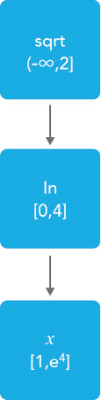
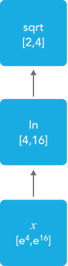
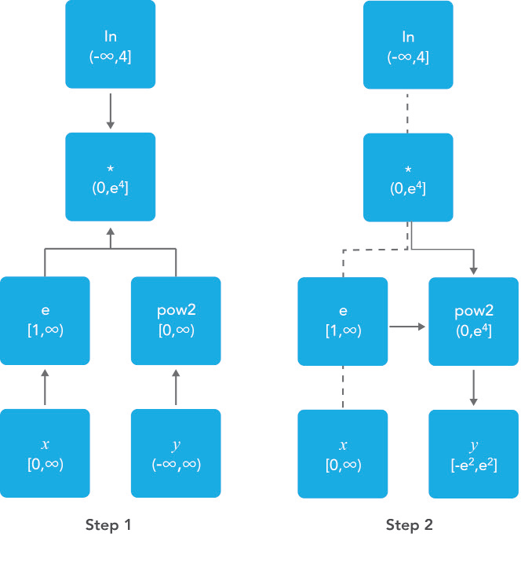
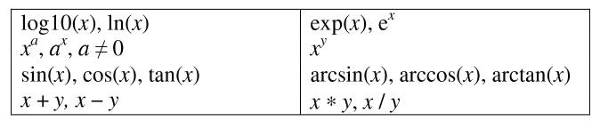

Nonlinear Presolve Algorithm in AIMMS
========================================

**Author:** Marcel Hunting. 

This paper describes the AIMMS presolve algorithm for nonlinear problems. 
This presolve algorithm uses standard techniques like removing singleton rows, deleting fixed variables and redundant constraints, 
and tightening variable bounds by using linear constraints. 
Our algorithm also uses the expression tree of nonlinear constraints to tighten variable bounds.

.. important::
    To use this article as reference, please use the whitepaper PDF: :download:`Nonlinear-Presolve-Algorithm-in-AIMMS.pdf`.

Introduction
------------

The AIMMS modeling language [3] is linked to many first class solvers for solving optimization problems. All
linear solvers in AIMMS (CPLEX, XA, XPRESS, MOSEK) use a presolve algorithm whereby the problem input
is examined for logical reduction opportunities. The goal is to reduce the size of the problem. A reduction in
problem size in general leads to a reduction in total run time (including the time spent in the presolve
algorithm itself).

Of all nonlinear solvers in AIMMS (CONOPT, KNITRO, MINOS, SNOPT, BARON, LGO, AOA) only CONOPT
and BARON use preprocessing techniques. When CONOPT [5] solves a model, it tries to detect recursive
or triangular equations that can be solved before the optimization is started. The equations identified in
this way can be solved independent of the optimization, and they can therefore be removed from the
optimization process. In BARON [14] range reduction is part of the branch and reduce algorithm and used
at every node in the search tree.

Preprocessing for linear problems has been studied extensively; see e.g., [1,4,7,12]. Preprocessing for
quadratic problems is discussed in, e.g., [8,9]. In global optimization, preprocessing mainly focuses on bound
tightening techniques; see [2] and its references. Some of these techniques have been applied to the primal
presolve algorithm for nonlinear problems in the modeling language AMPL [6].

We have developed a nonlinear presolve algorithm in AIMMS with the goal to reduce the size of the problem
and to tighten the variable bounds, which may help the solver to solve the problem faster. Besides BARON,
all nonlinear solvers in AIMMS are local solvers, i.e. the solution found by the solver is a local solution and
cannot be guaranteed to be a global solution. The presolve algorithm may help the solver in finding
a better solution.

A local solver might sometimes fail to find a solution and then it is often not clear whether that is caused by
the problem being infeasible or by the solver failing to find a solution for a feasible problem. The presolve
algorithm may reveal inconsistent constraints and/or variable bounds and hence identify a problem as infeasible.

Presolve Techniques
---------------------

We consider the following constrained nonlinear optimization problem:

+-----+----------------------------------------------------+
| **Minimize:**                                            |
+-----+----------------------------------------------------+
|  1  | :math:`f(x)`                                       |
+-----+----------------------------------------------------+
| **Constraints:**                                         |
+-----+----------------------------------------------------+
|  2  | :math:`g(x) \leq d`                                |
+-----+----------------------------------------------------+
|  3  | :math:`Ax \leq b`                                  |
+-----+----------------------------------------------------+
|  4  | :math:`l \leq x \leq u`                            |
+-----+----------------------------------------------------+

where :math:`x \in \mathbb{R}_{n}`, :math:`f: \mathbb{R}_{n} \rightarrow \mathbb{R}`, :math:`g: \mathbb{R}_{n} \rightarrow \mathbb{R}_{p}`, 
and :math:`d \in \mathbb{R}_{p}`, :math:`b \in \mathbb{R}_{m}`, :math:`A \in \mathbb{R}_{nxm}`. The constraints (2)
represent the nonlinear constraints in the problem and the constraints (3) the linear constraints. The objective function in (1) might be
linear or nonlinear. In this paper we focus on problems that contain only continuous variables, although our presolve algorithm can also be
used for problems that have integer variables.

The nonlinear presolve algorithm will:

-  Remove singleton rows by moving the bounds to the variables;

-  Tighten bounds of (primal) variables using linear and nonlinear constraints;

-  Delete fixed variables;

-  Remove one variable of a doubleton; 

-  Delete redundant constraints.

Singleton Rows
~~~~~~~~~~~~~~~~~

A singleton row is a linear constraint that contains only one variable. An equality singleton row fixes the
variable to the right-hand-side value of the row, and unless this value conflicts with the current bounds of the
variable in which case the problem is infeasible, we can remove both the row and variable from the problem.
An inequality singleton row introduces a new bound on the variable which can be redundant, tighter than 
an existing bound in which case we update the bound, or infeasible. Our presolve algorithm will remove all singleton rows.

If a variable is fixed then sometimes another row becomes a singleton row, and if that row is an equality row
we can fix the remaining variable and remove it from the problem. By repeating this process we can solve
any triangular system of linear equations that is part of the problem.

Bounds Tightening Using Linear Constraints
~~~~~~~~~~~~~~~~~~~~~~~~~~~~~~~~~~~~~~~~~~~~

In the following analysis we use a linear “less than or equal to” constraint. A similar analysis applies to
other constraint types. The technique described here is known in the global optimization literature as
feasibility-based bounds tightening.

Assume we have a linear constraint i that originally has the form:

+-----+-----------------------------------------------------------------------------------+
|  5  | :math:`\sum_{j}a_{ij}x_{j} \leq b_{i}`                                            |
+-----+-----------------------------------------------------------------------------------+

If we assume that all variables in this constraint have finite bounds then we can determine the following lower and upper limits on constraint :math:`i`:

+-----+-----------------------------------------------------------------------------------+
|  6  | :math:`\underline{b_i} = \sum_{j \in P_i}a_{ij}l_j + \sum_{j \in N_i}a_{ij}u_j`   |
+-----+-----------------------------------------------------------------------------------+

and

+-----+-----------------------------------------------------------------------------------+
|  7  | :math:`\overline{b_i} = \sum_{j \in P_i}a_{ij}u_j + \sum_{j \in N_i}a_{ij}l_j`    |
+-----+-----------------------------------------------------------------------------------+

where :math:`P_i = \{j: a_{ij} > 0\}` and :math:`N_i = \{j: a_{ij} < 0\}` define the sets of variables with a positive and a negative
coefficient in constraint :math:`i` respectively. By comparing the lower and upper limits of a constraint with the
right-hand-side value we obtain one of the following situations:

-  :math:`\underline{b_i} > b_i`. Constraint (5) cannot be satisfied and is infeasible.

-  :math:`\underline{b_i} = b_i`. Constraint (5) can only be satisfied if all variables in the constraint are fixed on their lower bound if they have a positive
   coefficient, or fixed on their upper bound if they have a negative coefficient. The constraint and all its variables can be removed from the problem.

-  :math:`\overline{b_i} \leq b_i`. Constraint (5) is redundant, i.e. will always be satisfied, and can be removed from the problem.

-  :math:`\underline{b_i} < b_i < \overline{b_i}`. Constraint (5) cannot be eliminated but can often be used to improve the bounds of one or more variables as we will see below.

If we face the last situation mentioned above, i.e., :math:`\underline{b_i} < b_i < \overline{b_i}`, then combining (5) with (6) gives the following
bounds on a variable :math:`k` in constraint :math:`i`:

+-----+-----------------------------------------------------------------------------------+
|  8  | :math:`x_k \leq l_k +(b_i - \underline{b_i})/a_{ik}`, if :math:`a_{ik} > 0`       |
+-----+-----------------------------------------------------------------------------------+

and 

+-----+-----------------------------------------------------------------------------------+
|  9  | :math:`x_k \geq u_k +(b_i - \underline{b_i})/a_{ik}`, if :math:`a_{ik} < 0`       |
+-----+-----------------------------------------------------------------------------------+

If the upper bound given by (8) is smaller than the current lower bound of variable :math:`k` then the problem is infeasible. If it is smaller then
the current upper bound of variable :math:`k`, we can update the upper bound for variable :math:`k`. A similar procedure can be applied to the lower bound as given by (9).

Note that bounds (8) and (9) can only be derived if all bounds :math:`l_k` and :math:`u_j` in (6) are finite. But also if exactly one of the bounds in
(6) is an infinite bound, we can still find an implied bound for the corresponding variable. Our algorithm also uses this technique but for the details we refer to [7].

Bounds Tightening Using Nonlinear Constraints
~~~~~~~~~~~~~~~~~~~~~~~~~~~~~~~~~~~~~~~~~~~~~~~~

We can rewrite a nonlinear constraint :math:`i` in (2) as

+-----+-----------------------------------------------------------------------------------+
| 10  | :math:`\sum_{j}a_{ij}x_{j} + h_{i}(y) \leq d_{i}`                                 |
+-----+-----------------------------------------------------------------------------------+

separating the linear variables :math:`x` in this constraint from the nonlinear variables :math:`y`. As before, see (6) and (7), we can find lower
and upper limits on the linear part of the constraint, and again we denote them by and respectively. For this constraint we can derive the
following upper bound on the nonlinear term in (10):

+-----+-----------------------------------------------------------------------------------+
| 11  | :math:`h_{i}(y) \leq d_{i} - \underline{b_i}`                                     |
+-----+-----------------------------------------------------------------------------------+

Note that if there are no linear terms in constraint (10) then :math:`\underline{b_i}=0`.

Nonlinear expressions in AIMMS are stored in an expression tree. By going through the expression tree from the top node to the leafs we can
sometimes derive bounds on some of the variables in the expression. For example, assume we have the constraint 

+-----+-----------------------------------------------------------------------------------+
|     | :math:`sqrt(ln(x)) \leq 2`                                                        |
+-----+-----------------------------------------------------------------------------------+

with :math:`x` unbounded. Figure 1 shows that then the :math:`ln(x)` sub-expression should be in the range :math:`[0,4]` since :math:`sqrt(y)` is not
defined for :math:`y \in (-\infty, 0)`, which implies that :math:`x` should be in the range :math:`[1, e^{4}]`.

Figure 1: Bound reduction using expression :math:`sqrt(ln(x))`.

If an expression is defined on a certain range only, then this range can sometimes be used to reduce a bound of a variable. 
For example, the function :math:`sqrt(x-1)` is only defined for :math:`x \geq 1` and therefore the 
presolve algorithm will derive 1 as a lower bound for :math:`x`.

If we reverse the order of going through an expression tree, hence going up starting from the leaf nodes, we can bound the expression. 
Consider for example the constraint:

+-----+-----------------------------------------------------------------------------------+
|     | :math:`y + sqrt(ln(x)) \leq 10`                                                   |
+-----+-----------------------------------------------------------------------------------+

and let :math:`x` have a range of :math:`[e^4, e^16]`. 
Then from Figure 2 it follows that the nonlinear expression has a range of :math:`[2,4]` which implies that :math:`y \leq 8`.

Figure 2: Bounding expression :math:`sqrt(ln(x))`.

If an expression only contains unary operators then we only have to go through the tree from top to bottom once to get the bounds on the variables, 
and back once to get bounds on the expression. For expressions that contain binary operators the bounding procedure is more complicated. 
For example, consider the constraint

+-----+-----------------------------------------------------------------------------------+
|     | :math:`ln(e^x * y^2) \leq 4`                                                      |
+-----+-----------------------------------------------------------------------------------+

and let variable :math:`x` have range :math:`[0,\infty)` and variable :math:`y` be unbounded. 
To process the multiplication operator we first have to bound the :math:`e^x * y^2` sub-expression and the :math:`e^x` and :math:`y^2` sub-expressions
(Step 1 in Figure 3). Since expression :math:`e^x * y^2` has range :math:`(0, e^4]` and expression :math:`e^x` has range :math:`[1,\infty)` we can conclude
that expression :math:`y^2` must have a range of :math:`(0, e^4]` which implies that :math:`y` is in the range :math:`[-e^2, e^2]` (see Step 2 in Figure 3).

If a bound of one of the variables in the nonlinear part of a constraint changes we process that constraint again immediately. We stop if no
bound was changed significantly. Like this we can solve the following constraint in one iteration of the algorithm:

+-----+-----------------------------------------------------------------------------------+
|     | :math:`\sqrt x + x = 6`                                                           |
+-----+-----------------------------------------------------------------------------------+

where :math:`x` is unbounded (free). 
In the first step the algorithm will determine that :math:`x \geq 0` since :math:`\sqrt x` is not defined for :math:`x < 0`. 
In the next step we get that :math:`x = 6 - \sqrt x \leq 6` and in the following step :math:`x = 6 - \sqrt x \geq 6 - \sqrt 6`. 
Then we get :math:`x \leq 6 - \sqrt{6-\sqrt{6}}` and so on. 
Both the upper and lower bound of :math:`x` will converge to 4 but we stop this iterative process if the relative change of one of the bounds is smaller than an epsilon.

Figure 3: Bound reduction using expression :math:`ln(e^x∗y^2).`

The presolve algorithm can handle expressions build up by the operators mentioned in Table 1. If a nonlinear constraint contains an operator
that is not in this table then it will be ignored by the presolve algorithm. A constraint will also be ignored if it contains an external function.

Table 1: Operators used by the presolve algorithm.

Doubletons
~~~~~~~~~~

If a problem contains a constraint of the form :math:`x = a ∗ y`, :math:`a \neq 0`, then the variables :math:`x` and :math:`y` define a doubleton. 
If the presolve algorithm detects a doubleton then it will replace the variable :math:`x` by the term :math:`a*y` in every constraint in which :math:`x` appears, 
and remove the variable :math:`x` from the problem.

For some problems good initial values are given to the variables. In case the initial value given to :math:`x` does not match the initial value of
:math:`y` according to the relationship :math:`x = a ∗ y`, it is unclear which initial value we should assign to :math:`y`. Preliminary test results showed
that in such a case it is better not to remove the doubleton, and pass both variables to the solver with their own initial value. This has
become the default behavior of our presolve algorithm regarding doubletons.

The Algorithm
~~~~~~~~~~~~~~~

Below we present our presolve algorithm in pseudo-code. We denote by :math:`C` the set of all constraints in the problem, and by :math:`V` the set of
variables that changed during the bound reduction step for some constraint :math:`c \in C`.

.. code-block:: text 

    RemoveDoubletons
    for (c in C) do
        OutOfDate(c) := true;
    endfor;

    Iter := 1;
    SomeConstraintOutOfData := true;
    
    while ( Iter ≤ MaxIter and SomeConstraintOutOfData ) do
        SomeConstraintOutOfDate := false;
        for ( c | OutOfDate(c) ) do
            BoundChanged := DoBoundReduction( c, V );
            if ( not IsLinear(c) ) then

                /* Nonlinear constraint */
                NonlinearBoundChanged := true;
                while ( NonlinearBoundChanged ) do
                    NonlinearBoundChanged := DoBoundReduction( c, V );
                endwhile;
            endif;
        
            OutOfDate(c) := false;
        
            if ( BoundChanged ) then
                SomeConstraintOutOfData := true;
                
                for ( v V ) do
                    /* If the bound of some variable changed then mark all constraints
                    that contain this variable as out of date */
                    MarkConstraintsAsOutOfDate( v )
                endfor;
            endif;
        endfor;
    endwhile;
    RemoveDoubletons;
    DeleteFixedVariables;
    DeleteRedundantConstraints;

Note that the algorithm removes doubletons before and after the loop for bound reductions.

In AIMMS there are several options that can be used to influence which presolve techniques will be used by the algorithm. For instance a user
can choose to only use linear constraints for reducing bounds, or to not remove doubletons.

Possible Improvements
----------------------

Our presolve algorithm currently only uses feasibility-based bounds tightening. Our presolve algorithm could be extended with other bound
tightening procedures. Optimality-based bounds tightening solves two linear programming problems for each variable to tighten bounds [2,13].
Probing is a bound-tightening procedure often applied to mixed integer linear programming [12]. It explores the consequences of restricting a
variable to a subinterval with the goal of tightening its bounds.
Recently it has also been applied to mixed integer nonlinear programming [2,10]. A drawback of both procedures is that they are more time
consuming than the feasibility-based bounds tightening procedure. We consider reduced-cost bound tightening [2,11] as less attractive.

A variable bound tightened during the bound reduction step of a linear constraint is redundant. These redundant bounds make the problem more
degenerate and might result in some solvers taking more iterations to solve the problem. To overcome this problem the presolve algorithm in
AMPL [6] maintains two sets of variable bounds, namely the strongest bounds the algorithm can deduce and bounds that the algorithm does not
know to be redundant with the constraints passed to the solver. In our algorithm we do not attempt to avoid degeneracy; clearly here there is
some room for improvement.

As a consequence of the presolve algorithm, dual information is lost. For the presolve algorithm in AMPL a method is described in [6] to
recover the values of the dual variables for the eliminated constraints. The AMPL presolve algorithm, however, only uses linear constraints to
reduce bounds and using nonlinear constraints makes the recovering of dual information more complicated. Our current algorithm does not
recover dual information.

Infeasibility Analysis
----------------------

In case the nonlinear presolve algorithm detects that a model is infeasible, it can (optionally) display an infeasibility analysis. The
information displayed is the constraint that appeared to be infeasible and all other constraints that the nonlinear presolve algorithm used to
reduce the bounds of the variables in this infeasible constraint. Also the reductions on the variable bounds in these constraints are shown.

For many models the information displayed in the infeasibility analysis will help the modeler to quickly detect an error in the model. But for
some models the amount of information can be large and will not be useful.

Conclusions
----------------------

A nonlinear presolve algorithm is a valuable add-on for any modeling system. It can help to reduce the size of a model and to tighten the
variable bounds, helping the nonlinear solver in finding a good solution. Preliminary test results have shown that for many models the
model was solved faster or a better solution was found if the nonlinear presolve algorithm was used. On the other hand, for many models the
solving time increased although the amount of reductions done was large.
We suspect that this is caused by the models becoming more degenerated.

The nonlinear presolve algorithm offers a tool to quickly detect inconsistencies in an infeasible model. Also this tool makes use of the
expression trees of the nonlinear constraint to reduce variable bounds.

References
-----------

[1] Andersen, E.D., K.D. Andersen, Presolving in linear programming,
*Mathematical Programming* **71**\ (2), 1995, pp. 221-245.

[2] Belotti, P., Lee, J., Liberti, L., Margot, F., Wächter, A.,
Branching and bounds tightening techniques for non-convex MINLP,
*Optimization Methods and Software* **24**\ (4), 2009, pp. 597-634.

[3] Bisschop, J., M. Roelofs, *AIMMS Language reference, Version 3.11*,
Paragon Decision Technology, Haarlem, 2011.

[4] Brearley, A.L., G. Mitra, H.P. Williams, Analysis of mathematical
programming problems prior to applying the simplex algorithm,
*Mathematical Programming* **8**, 1975, pp. 54-83.

[5] Drud, A.S., *CONOPT, A system for large scale nonlinear
optimization, Reference manual for version 3.14*, ARKI Consulting and
Development A/S, 2004.

[6] Fourer, R., D.M. Gay, Experience with a primal presolve algorithm,
in: *Large Scale Optimization: State of the Art*, W.W. Hager, D.W. Hearn
and P.M. Pardalos (eds.), Kluwer Academic Publishers, 1994, pp. 135-154.

[7] Gondzio, J., Presolve analysis of linear programs prior to applying
the interior-point method, *INFORMS Journal on Computing* **9**, 1997,
pp. 73-91.

[8] Gould, N.I.M., Ph.L. Toint, Preprocessing for quadratic programming,
*Mathematical Programming B* **100**\ (1), 2004, pp. 95-132.

[9] Mészáros, C., U.H. Suhl, Advanced preprocessing techniques for
linear and quadratic programming, *OR Spectrum* **25**\ (4), 2003, pp.
575-595.

[10] Nannicini, G., Belotti, P., Lee, J., Linderoth, J., Margot, F.,
Waechter, A, A Probing Algorithm for MINLP with Failure Prediction by
SVM, in: *CPAIOR 2011, LNCS Volume 6697*, T. Achterberg and J.C. Beck
(eds.), 2011, pp. 154-169.

[11] Ryoo, H.S., N.V. Sahinidis, Global optimization of nonconvex NLPs
and MINLPs with applications in process design, *Computers & Chemical
Engineering*, **19**\ (5), 1995, pp. 551-566.

[12] Savelsbergh, M.W.P., Preprocessing and Probing Techniques for Mixed
Integer Programming Problems, *ORSA Journal on Computing*\ **6**\ *,*
1994, pp. 445-454.

[13] Smith E. M., *On the optimal design of continuous processes*, PhD
thesis, Imperial College of Science, Technology and Medicine, University
of London, 1996.

[14] Tawarmalani, M., N.V. Sahinidis, Global optimization of
mixed-integer nonlinear programs: A theoretical and computational study,
*Mathematical Programming* **99**\ (3), 2004, pp. 563-591.

.. spelling:word-list::
    doubleton
    nonconvex
    unary
    subinterval
    doubletons
    whitepaper