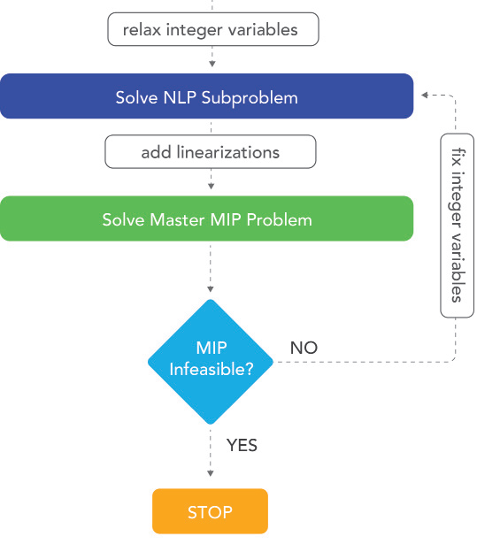
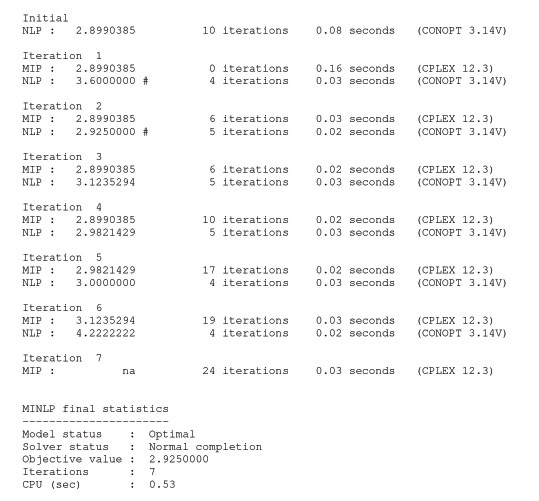

AIMMS Outer Approximation Algorithm for MINLP (using GMP functionality)
==========================================================================

**Author:** Marcel Hunting. 

This document describes how to use the GMP variant of the AIMMS Outer Approximation (AOA) algorithm for solving MINLP problems. 
We show how the AOA algorithm can be combined with the nonlinear presolver and the multi-start algorithm.

.. important::
    To use this article as reference, please use the whitepaper PDF: :download:`The-AIMMS-Outer-Approximation-Algorithm-for-MINLP.pdf`.

Introduction
------------

The AIMMS Outer Approximation (AOA) algorithm can be used to solve Mixed
Integer Nonlinear Programming (MINLP) problems. The algorithm solves an
alternating sequence of nonlinear (NLP) models and mixed-integer linear
(MIP) models. The first version of AOA was introduced in AIMMS 3.3.
After the introduction of the GMP library in AIMMS 3.5, the AOA
algorithm was rewritten using the GMP functionality; this GMP version of
AOA was released in AIMMS 3.6.

**The New GMP Version of AOA:** 
Unlike the old version of AOA, the GMP version of AOA can be combined
with the nonlinear presolver and the multi-start algorithm which make
the GMP version of AOA more powerful. In this document we focus on the
GMP version of AOA.

We start with a brief description of the Outer Approximation algorithm.
Next we show how the GMP version of AOA (GMP-AOA for short) is used in
AIMMS and we briefly discuss the nonlinear presolver that is used by
GMP-AOA. We provide tips in the troubleshooting section for the case
that GMP-AOA seems to experience difficulties solving the model. Next we
explain how GMP-AOA can be combined with the multi-start algorithm. And
last but not least we discuss the other solvers available in AIMMS for
solving MINLP problems.

The Outer Approximation Algorithm
-----------------------------------

The Outer Approximation algorithm was introduced by Duran and Grossmann
in 1986 [3] (see also [7]). The basic Outer Approximation algorithm can
be described in words as follows.

1. First, the problem is solved as a NLP with all the integer variables
   relaxed as continuous variables between their bounds.

2. Then a linearization is carried out around the optimal solution, and
   the resulting constraints are added to the linear constraints that
   are already present. This new linear model is referred to as the
   master MIP problem.

3. The master MIP problem is solved.

4. The integer part of the resulting optimal solution is then
   temporarily fixed, and the original MINLP problem with fixed integer
   variables is solved as a nonlinear problem.

5. Again, a linearization around the optimal solution is constructed and
   the new linear constraints are added to the master MIP problem. To
   prevent cycling, one or more constraints are added to cut off the
   previously found integer solution.

6. Steps 3-5 are repeated until the master MIP problem becomes
   infeasible or one of the termination criteria (e.g., iteration limit)
   is satisfied.

A flow diagram of the algorithm is displayed in :numref:`figure-366-01`.

.. _figure-366-01:

    The Outer Approximation algorithm.

The AIMMS Outer Approximation algorithm is described in more detail on 
`AIMMS Language Reference [1] <https://documentation.aimms.com/language-reference/optimization-modeling-components/mixed-complementarity-problems/index.html#chap-compl>`_.

The Outer Approximation algorithm only guarantees to find a global
optimal solution if the MINLP problem is convex. Note that AIMMS cannot
detect whether a model is convex; the user has to tell it to the
algorithm (using parameter ``IsConvex``; see below).

Using AOA
--------------

The old version of AOA is available as a solver in the solver
configuration. It uses the system module ``OuterApproximation`` to call
several procedures implemented in the module. To solve a mathematical
program ``myMP`` you have to add the following code:

.. code-block:: text 

    myMP.CallbackAOA := 'OuterApprox::BasicAlgorithm';
    solve myMP;

Here ``OuterApprox`` is the prefix of the ``OuterApproximation`` module.

GMP-AOA is not a solver but an algorithm that is programmed in the AIMMS
language using GMP functions. The algorithm is available in the system
module ``GMPOuterApproximation``. To use GMP-AOA you have to create an
element parameter ``myGMP`` with range ``AllGeneratedMathematicalPrograms``, and add the following code:

.. code-block:: text 

    myGMP := GMP::Instance::Generate( myMP ) ;
    GMPOuterApprox::DoOuterApproximation( myGMP );

where ``GMPOuterApprox`` is the prefix of the ``GMPOuterApproximation`` module.

The GMP-AOA module contains a section ``OA Control Declarations`` with
several parameters that can be used to control GMP-AOA. The most
important control parameters (in AIMMS 3.12) are:

-  **IterationMax** (default 20) controls the maximum number of
   iterations to be considered when the iteration termination criterion
   is active (which it is by default).

-  **CreateStatusFile** (default 0) controls whether a status file
   should be created.

-  **UseNonlinearPresolver** (default 1) controls whether the algorithm
   should start with a call to the nonlinear presolver.

-  **IsConvex** (default 0) can be used to indicate that the model is
   convex in which case a different termination criterion is used to
   guarantee global optimality.

-  **TerminateAfterFirstNLPIsInteger** (default 1) indicates whether the
   algorithm should be terminated if the initial NLP solution is
   integer.

-  **DeviationsPermitted** (default 1) indicates whether linearizations
   do allow for deviations by using a penalty term. Typically,
   deviations are not needed for convex problems but are needed for
   non-convex problems.

-  **NLPUseInitialValues** (default 1) determines the starting point
   strategy for solving the NLP problems. The algorithm will either pass
   the initial level values of the variables (value 1) or the level
   values as returned by the previous MIP problem that was solved (value
   0) as a starting point to the NLP solver.

To set the maximum number of iterations to 10 and create a status file
you should add the following statements before the ``GMPOuterApprox::DoOuterApproximation`` call:

.. code-block:: text 

    GMPOuterApprox::IterationMax := 10;
    GMPOuterApprox::CreateStatusFile := 1;

Nonlinear Presolver
~~~~~~~~~~~~~~~~~~~~~~~~~~

From AIMMS 3.12 (FR3) onwards GMP-AOA by default calls the nonlinear
presolver of AIMMS [4]. (In previous AIMMS versions GMP-AOA could also
be combined with the nonlinear presolver but the user had to take care
of this.) The presolver can reduce the size of a model and tighten the
variable bounds which likely help the AOA algorithm to find a better
solution or improve its performance. Furthermore, the presolver can
often quickly detect inconsistencies in an infeasible model. By
switching on the general solvers option ‘display infeasibility analysis’
AIMMS will print the conflicting constraints and bounds in the listing
file to help you identify the cause of the infeasibility. Note that the
presolver cannot detect inconsistencies in many infeasible models.

Status File
~~~~~~~~~~~~~

The status file shows information about the individual NLP and MIP solves, e.g., the objective value and the
solution time. :numref:`figure-366-02` shows an example of the status file output.

A ‘#’ behind the objective value of a NLP problem indicates that a new best integer solution has been found.
In the example the algorithm finds an integer solution with objective value 3.6 at the first iteration, and a
better integer solution with objective value of 2.925 at the second iteration which turns out to be the final
(best) solution.

.. _figure-366-02:

    Example of status file output (minimization problem).

The status file will be printed as the file ``gmp_oa.put`` in the ``log`` subdirectory. The status file is especially
useful in case GMP-AOA seems to experience difficulties when solving your model; we will discuss this in the
next section. As mentioned before, AIMMS cannot detect whether a model is convex. However, if the status
file shows that the MIP objective value becomes higher than the NLP objective value (in case of minimization)
in the first iterations then this indicates that the model is non-convex. Unfortunately, the opposite is not true.
If the MIP objective value stays below the NLP objective value then there is no guarantee that the model is convex.

Troubleshooting
----------------------

If GMP-AOA seems to experience difficulties when solving your model, you
might first check how the NLP and master MIP sub problems are handled by
the NLP and MIP solver respectively. For that purpose you should create
the status file as discussed in the previous section, rerun your
program, and check the status file to see which sub problems are
infeasible or unbounded.

If you use CPLEX or GUROBI to solve the master MIP problems and the
first master MIP problem is declared as ``InfeasibleOrUnbounded`` then you
should rerun your program with the CPLEX/GUROBI presolver turned off to
find out whether the master MIP problem is actually infeasible or
unbounded.

AOA Returns Infeasible
~~~~~~~~~~~~~~~~~~~~~~~~~

AOA will declare a model as infeasible if the algorithm does not find an
integer feasible solution. This will occur in the following situations:

-  The first master MIP problem is infeasible.

-  The first master MIP problem is unbounded.

-  All NLP sub problems with fixed integer variables (i.e., all NLP sub
   problems besides the initial NLP) are infeasible.

First Master MIP Problem is Infeasible
^^^^^^^^^^^^^^^^^^^^^^^^^^^^^^^^^^^^^^^

If the first master MIP problem is infeasible then this implies that the
original MINLP problem is infeasible (unless the value of the parameter
``DeviationsPermitted`` has been changed to 0 and the MINLP problem is
non-convex). In fact, the linear problem that you obtain by removing all
nonlinear constraints is infeasible. AIMMS offers several tools to
detect infeasibilities in linear models, e.g., the math program
inspector and the possibility to find an irreducible infeasible set (IIS).

First Master MIP Problem is Unbounded
^^^^^^^^^^^^^^^^^^^^^^^^^^^^^^^^^^^^^^^

If the first master MIP problem is unbounded then you could add a finite
upper and lower bound to the variable that makes the problem unbounded.
By (temporary) removing the nonlinear constraints from the MINLP problem
you obtain a MIP problem; if you can make that MIP problem bounded then
all master MIP problems will also be bounded.

All NLP Sub Problems are Infeasible
^^^^^^^^^^^^^^^^^^^^^^^^^^^^^^^^^^^^^^^

(The suggestions in this subsection also apply if many (but not all) NLP
sub problems are infeasible.)

If all NLP sub problems in which the integer variables have been fixed
are infeasible then you can try increasing the iteration limit using
parameter ``IterationMax``.

The AOA algorithm uses a local NLP solver (e.g., CONOPT, IPOPT, KNITRO,
MINOS and SNOPT) to solve the NLP sub problems and that solver can
sometimes not find a feasible solution for a feasible NLP problem (i.e.,
it might converge to an infeasible point). You might consider changing
the setting of the parameter ``NLPUseInitialValues``. Local NLP solvers
often need a good starting point to successfully solve a model. One step
further is to solve each NLP sub problem using the multi-start
algorithm; in the next section we will explain how multi-start can be
incorporated into the AOA algorithm.

Note: If the NLP solver cannot solve the initial NLP problem (i.e., the
NLP solver returns ‘infeasible’) then the AOA algorithm might sometimes
still be able to find a feasible solution for the MINLP problem.

If none of the above suggestions work then that is a sign that AOA is
not suitable for solving your MINLP problem. You might want to try one
of the other solvers available in AIMMS for solving MINLP problems;
these solvers will be discussed in the last section.

Master MIP Problems Take a Long Time
~~~~~~~~~~~~~~~~~~~~~~~~~~~~~~~~~~~~~

If solving one of the master MIP problems takes very long then you might
consider increasing the value of the general solvers option **‘MIP
Relative Optimality Tolerance’** (to for instance 0.1). It is often
sufficient to find a good solution of the master MIP problem.

Solution Far from Optimum
~~~~~~~~~~~~~~~~~~~~~~~~~~~~~~

If you think that the solution returned by AOA is not close to the
optimal solution, you might consider calling AOA twice. The first solve
with AOA is then used to find a solution which will be used as a good
starting point for the second solve. For example:

.. code-block:: text 

    myGMP := GMP::Instance::Generate( myMP ) ;

    GMPOuterApprox::IterationMax := 20;
    GMPOuterApprox::DoOuterApproximation( myGMP );

    GMPOuterApprox::IterationMax := 10;
    GMPOuterApprox::DoOuterApproximation( myGMP ); 

This approach is especially useful if the NLP solver returns
'infeasible' for the initial NLP and AOA still manages to find a
solution for the MINLP problem.

Combining AOA with Multi-Start
--------------------------------------------

Replacing the NLP solves of the AOA algorithm by multi-start solves will
increase the chance of ending up with a (good) feasible solution.
Because you have to modify the GMP-AOA algorithm it is best is to copy
the ``GMPOuterApproximation.aim`` file from the Modules folder of the
AIMMS installation to your project folder, make the file writable, and
include it in your project.

Then in the procedure ``SolveNLPSubProblem`` of the GMP-AOA module replace
the

.. code-block:: text 

    GMP::SolverSession::Execute( ssNLP ) ;
    GMP::Solution::RetrieveFromSolverSession( ssNLP, SolNumb ) ;
    GMP::Solution::SendToModel( GNLP, SolNumb ) ;

part by:

.. code-block:: text 

    MulStart::DoMultiStart( GNLP, 10, 5 );   ! You can play with the input values
    GMP::Solution::RetrieveFromModel( GNLP, SolNumb ) ;
    GMP::Solution::SendToSolverSession( ssNLP, SolNumb ) ;

Finally, add

.. code-block:: text 

    GMPOuterApprox::NLPUseInitialValues := 0;

before you call

.. code-block:: text 

    GMPOuterApprox::DoOuterApproximation( myGMP );

Note that you have to include the ``MultiStart`` module in your project.

Other MINLP Solvers
----------------------

Other solvers available in AIMMS for solving MINLP problems are KNITRO
and BARON. KNITRO [2] offers a nonlinear branch-and-bound method for
solving MINLP problems. The branch-and-bound cannot guarantee to find a
global optimum for non-convex problems. KNITRO also implements the
hybrid Quesada-Grossman [5] method for convex MINLP. The
Quesada-Grossman method has also been implemented in the GMP-AOA module,
namely in the ‘AOA Convex Algorithm‘ section.

BARON [6] uses a branch-and-reduce algorithm to find a global optimal
solution for MINLP problems. The approach relies on constraint
propagation, interval analysis, and duality to draw inferences regarding
ranges of integer and continuous variables in an effort to expedite the
traditional branch-and-bound algorithm for global optimization problems.
Because considerable emphasis is placed on the reduction of variable
bounds, the overall methodology is referred to as branch-and-reduce.

Because finding a global optimum (and proving that it is indeed a global
optimum) is much more difficult than finding a local optimum, the
solving time used by BARON will often be larger than the solving time
needed by local solvers as AOA and KNITRO. A restriction of BARON is
that it cannot handle constraints containing goniometric functions.

Finally, the linear solvers CPLEX and MOSEK are capable of solving mixed
integer quadratically constrained programming (MIQCP) problems and mixed
integer second-order cone programming (MISOCP) problems.

References
-----------

[1] Bisschop, J., M. Roelofs, *AIMMS Language Reference, Version 3.12*,
Paragon Decision Technology, Haarlem, 2011.

[2] Byrd, R.H., J. Nocedal, R.A. Waltz, KNITRO: An Integrated Package
for Nonlinear Optimization, in: *Large-Scale Nonlinear Optimization*, G.
di Pillo and M. Roma (eds), Springer-Verlag, 2006, pp. 35-59.

[3] Duran, M.A., I.E. Grossmann, *An outer-approximation algorithm for a
class of mixed-integer nonlinear programs*, Mathematical Programming
**36** (1986), pp. 307-339.

[4] Hunting, M., *A nonlinear presolve algorithm in AIMMS*, An AIMMS
white paper, Paragon Decision Technology BV, 2011.

[5] Quesada, I., I.E. Grossmann, *An LP/NLP Based Branch and Bound
Algorithm for Convex MINLP Optimization Problems*, Computers and
Chemical Engineering **16** (1992), pp. 937-947.

[6] Tawarmalani, M., N.V. Sahinidis, Global optimization of
mixed-integer nonlinear programs: A theoretical and computational study,
*Mathematical Programming* **99**\ (3) (2004), pp. 563-591.

[7] Viswanathan, J., I.E. Grossmann, *A combined penalty function and
outer-approximation method for MINLP optimization*, Computers and
Chemical Engineering **14** (1990), pp. 769-778.

.. spelling:word-list::
    di
    goniometric
    linearizations
    whitepaper
    linearization