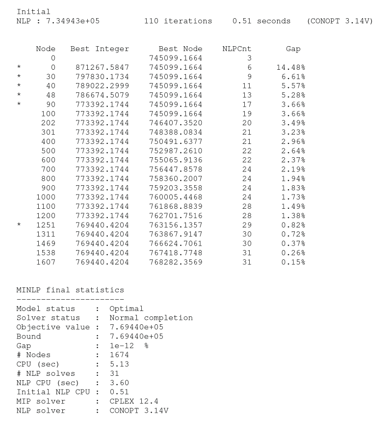
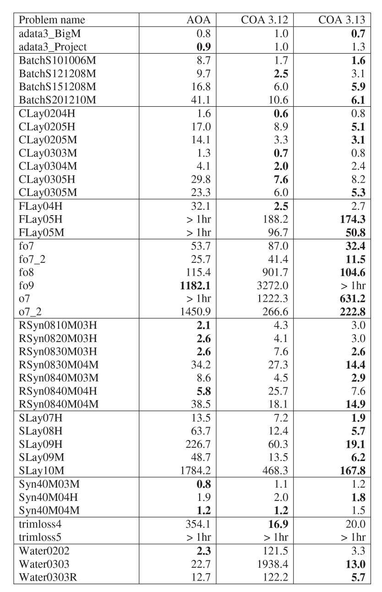
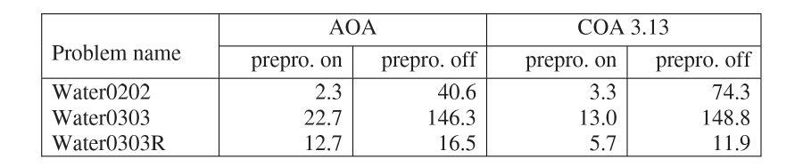
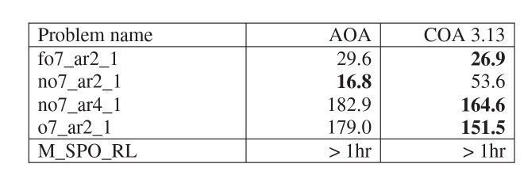

Solving convex MINLP problems with AIMMS
==========================================

**Author:** Marcel Hunting. 

This document describes the Quesada and Grossman algorithm that is implemented in AIMMS to solve
convex MINLP problems. We benchmark this algorithm against AOA which implements the classic outer
approximation algorithm.

.. important::
    To use this article as reference, please use the whitepaper PDF: :download:`Solving-Convex-MINLP-Problems-with-AIMMS.pdf`.

Introduction
------------

Convex Mixed Integer Nonlinear Programming (MINLP) problems are MINLP
minimization problems in which the objective function and all constraint
functions are convex. We assume that the feasible region is convex if
the integrality condition is relaxed. Convex MINLP problems can be
solved more efficiently than non-convex MINLP problems.

The outer approximation algorithm was introduced by Duran and Grossmann
in 1986 [8] to solve convex MINLP problems. The algorithm solves an
alternating sequence of nonlinear (NLP) problems and mixed-integer
linear (MIP) problems. It was shown that the algorithm finds a global
optimum solution in a finite number of steps. Later the outer
approximation algorithm was modified by Viswanathan and Grossmann [14]
to also handle non-convex MINLP problems but in that case the algorithm
cannot guarantee to find a global optimal.

The outer approximation algorithm of Duran and Grossmann was implemented
in AIMMS [2] as the AIMMS Outer Approximation (AOA) algorithm. The first
version of AOA was introduced in AIMMS 3.3. After the introduction of
the GMP library in AIMMS 3.5, the AOA algorithm was rewritten using the
GMP functionality; this GMP version of AOA was released in AIMMS 3.6.
The GMP version of AOA is described in [10]. In the remainder of this
paper we let AOA refer to the GMP version.

AOA by default assumes that the MINLP problem is non-convex and uses an
iteration limit as stopping criterion. For AOA the user can flag that
the problem is convex in which case AOA will terminate if the objective
of the MIP problem becomes larger than the objective of the NLP problem
(in case of minimization).

Quesada and Grossmann [12] noticed that the classic outer approximation
algorithm often spends a large amount of time in solving the MIP
problems in which a significant amount of rework is done. They proposed
an algorithm (sometimes called the LP/NLP-Based Branch-and-Bound
algorithm) in which only one MIP problem is solved. The
Quesada-Grossmann algorithm was implemented in AIMMS 3.9; we use the
name COA to refer to the AIMMS implementation. (The “C” in COA stands
for “callback”.) Both AOA and COA are “white box” algorithms that allow
modifications of the algorithm by the user.

Other solvers available in AIMMS for solving MINLP problems are BARON
[13] and KNITRO [5].

We start with a brief description of COA. Next we show how COA and AOA
can be used to solve convex MINLP problems. Finally we present results
of AOA and COA on problems that are publicly available and often used
for benchmarking MINLP solvers.

The COA Algorithm
------------------

The main advantage of COA over AOA is that the need of restarting the
branch-and-bound tree search is avoided and only a single
branch-and-bound tree is required. For a technical review of the Quesada
and Grossmann algorithm we refer to [1]. Here we limit ourselves to
describing the algorithm as implemented in COA in words:

1. Solve the MINLP problem as a NLP with all the integer variables
   relaxed as continuous variables between their bounds.

2. Create the master MIP problem by removing all nonlinear constraints.
   Construct linearizations around the optimal solution of the NLP
   (solved in step 1) and add the resulting linear constraints to the
   master MIP problem.

3. Solve the master MIP problem using a branch-and-bound solver.

4. Whenever the branch-and-bound solver finds a new incumbent solution
   do:

   a. Solve the NLP problem by fixing the integer variables to the
      values in the incumbent solution.

   b. Add linearizations around the optimal NLP solution as lazy
      constraints to the master MIP problem.

   c. Continue branch-and-bound enumeration.

5. Terminate MIP solver if the optimality gap is sufficiently small.

Linearizations are linear outer approximations of the feasible set of
the MINLP problem. They are constructed by using the gradient of each
nonlinear function in the NLP problem for a certain (optimal) solution
to the NLP problem.

In the latest version of COA, which is available in AIMMS 3.13, step 4
is implemented using the lazy constraint callback functionality of a MIP
solver. Currently, CPLEX and Gurobi are the only MIP solvers available
in AIMMS that support the lazy constraint callback.

Lazy constraints are constraints that represent one part of the model;
without them the model would be incomplete. In our case the set of
constraints representing a linearization of the nonlinear constraints
form the lazy constraints. There are infinitely many of those
constraints and therefore it is impossible to add them beforehand to the
master MIP problem.

The lazy constraint callback used for step 4 is called whenever the MIP
solver finds an integer feasible solution. The callback then either
accepts the solution as a solution of the original MINLP problem, or
creates one or more lazy constraints (i.e., linearizations) that are
violated by the solution.

The previous version of COA, as used in AIMMS 3.9 – 3.12, did not use
the lazy constraint callback because it was not available in CPLEX and
Gurobi at that time. Instead it used four callbacks, namely the
incumbent, cut, heuristic and branch callback functions of CPLEX; Gurobi
could not be used because it did not support all of these four callback
functions. The new implementation has several advantages:

-  A cleaner and easier implementation; using less “tricks”.

-  It can also be used for problems with general integer variables.

-  It can be used by CPLEX and Gurobi.

-  Improved performance.

The old implementation could only be used for problems with binary
variables because the branch callback does not allow adding new
variables to the existing problem which would be needed when solving a
problem with general integer variables.

Using AOA and COA
-----------------

AOA and COA are not solvers but algorithms that are programmed in the
AIMMS language using GMP functions. To use one of the algorithms you
first have to install the system module ``GMPOuterApproximation``. The AOA
algorithm is implemented in the ``AOA Basic Algorithm`` section of this
module and the COA algorithm in the ``AOA Convex Algorithm`` section.

Next you have to create an element parameter in your AIMMS project, say,
``myGMP`` with range ``AllGeneratedMathematicalPrograms``. To solve a
mathematical program ``myMP`` that models a convex MINLP problem with
AOA you should then call:

.. code-block:: text 

    myGMP := GMP::Instance::Generate( myMP ) ;
    GMPOuterApprox::IsConvex := 1;
    GMPOuterApprox::DoOuterApproximation( myGMP );

where ``GMPOuterApprox`` is the prefix of the ``GMPOuterApproximation``
module. Note that the user has to tell AIMMS that the problem is convex;
AIMMS cannot detect whether a problem is convex. To use COA you should
call:

.. code-block:: text 

    myGMP := GMP::Instance::Generate( myMP ) ;
    GMPOuterApprox:: DoConvexOuterApproximation( myGMP );

From AIMMS 3.13 onwards COA by default calls the nonlinear presolver of
AIMMS [9]. The presolver can reduce the size of a problem and tighten
the variable bounds which likely improve the performance of COA.
Furthermore, the presolver can often quickly detect inconsistencies in
an infeasible problem. Note that the presolver cannot detect
inconsistencies for all infeasible problems.

Both AOA and COA can print out a status file that displays progress
information, e.g., the objective value, as the algorithm solves the
MINLP problem. To print out the status file you should add the following
statement:

.. code-block:: text 

    GMPOuterApprox::CreateStatusFile := 1;

The status file will be printed as the file ``gmp_oa.put`` in the ``log``
subdirectory. The status file is especially useful in case AOA or COA
seems to experience difficulties when solving your problem.

:numref:`figure-367-01` shows an example of the status file output by COA. A ‘*’ in
front of a line indicates that a new best integer solution for the MINLP
problem has been found. In this example the algorithm finds its first
integer solution with objective value 871267.5847 at the root node of
the branch-and-bound tree, a better one with objective value 797830.1734
at node 30 and continuous until it finds the optimal solution with
objective value 769440.4204 at node 1251. Thereafter, the algorithm
continuous to proof that the final solution is optimal.

.. _figure-367-01:

    Example of COA status file output (minimization problem).

Computational Study
--------------------

To compare the performance of COA with AOA we used test instances from
several libraries that are publicly available: the GAMS MINLPLib World
[4], the MacMINLP collection [11], the CMU-IBM Cyber-Infrastructure for
MINLP collaborative site [6], and the CMU-IBM Open source MINLP
Project [7]. A large selection of these instances was used to benchmark
other MINLP solvers, e.g., BONMIN [3] and FilMINT [1], but not the
instances adata3 and M_SPO_RL from [6]. All these test instances were
written for the modeling languages AMPL or GAMS and converted to AIMMS
models.

The machines used in the test is a Dell Precision T1500 with an Intel(R)
Core(TM) i7 2.80GHz CPU, 12 gigabytes of RAM and running Windows 7. The
MIP solver used was CPLEX version 12.4 and the NLP solver was CONOPT
version 3.14V.

We used a thread limit of one for CPLEX although the machine we used
contains 4 cores. The reason for this is that the results with COA
become non-deterministic if callback procedures are installed (as in
COA) because then CPLEX might use a different solution path (with a
different level of performance) if the same problem is solved again. We
used a time limit of 1 hour. We only measure the time used by AOA and
COA, excluding the generation time by AIMMS.

:numref:`figure-367-02` shows the running times of AOA, COA in AIMMS 3.12 (using
incumbent, cut, heuristic and branch callbacks) and COA in AIMMS 3.13
(using lazy constraint callback). The problems in :numref:`figure-367-02` contain no
general integer variables. The best running time for each problem is
given in bold. The results of :numref:`figure-367-02` show that COA 3.13 dominates COA
3.12; the few problems for which COA 3.12 is faster the difference in
running time is small (except for model fo9 which was solved after 5137
seconds by COA 3.13) but for several problem classes (RSyn, SLay and
Water) COA 3.13 clearly performs better than COA 3.12.

For the problem classes Batch, CLay, FLay and SLay, and the problem
trimloss4, COA performs better than AOA. For the other problem classes
there is no clear winner. AOA and COA 3.13 perform much better than COA
3.12 on the Water problems. This is partially caused by the
preprocessing step done by AOA and COA 3.13, and which was not
implemented for COA 3.12. :numref:`figure-367-03` shows the results of AOA and COA 3.13
on the Water problems if preprocessing is switched off. For all the
other problems preprocessing did not have a significant influence on the
running time.

.. _figure-367-02:

    Running times (in seconds) for problems with binary variables.

.. _figure-367-03:

    Effect of preprocessing on running times (in seconds) for Water problems.

:numref:`figure-367-04` shows results for problems with general integer variables using
AOA and COA 3.13. As mentioned before, these kinds of problems cannot be
solved using COA 3.12.

.. _figure-367-04:

    Running times (in seconds) for problems with general integer variables.

Conclusions
------------

AIMMS implements two versions of the outer approximation algorithm,
namely the classic version by Duran and Grossmann (AOA) and the
one-MIP-tree-search version by Quesada and Grossmann (COA).
Computational experiments show that overall COA outperforms AOA.

References
-----------

[1] Abhishek, K., S. Leyffer, J. Linderoth, *FilMINT: And Outer
Approximation-Based Solver for Convex Mixed-Integer Nonlinear Programs*,
INFORMS Jounrnal on Computing **22**\ (4) (2010), pp. 555-567.

[2] Bisschop, J., M. Roelofs, *AIMMS Language Reference, Version 3.12*,
Paragon Decision Technology, Haarlem, 2011.

[3] Bonami, P., A. Wächter, L.T. Biegler, A.R. Conn, G. Cornuéjols,
I.E. Grossmann, C.D. Laird, J. Lee, A. Lodi, F. Margot and N. Sawaya.
*An algorithmic framework for convex mixed integer nonlinear programs*.
Discrete Optimization **5** (2008), pp. 186-204.

[4] Bussieck, M.R., A. S. Drud, and A. Meeraus, *MINLPLib – a collection
of test models for mixed-integer nonlinear programming*, INFORMS Journal
on Computing, 15 (2003). [Internet:
http://www.gamsworld.org/minlp/index.htm].

[5] Byrd, R.H., J. Nocedal, R.A. Waltz, KNITRO: An Integrated Package
for Nonlinear Optimization, in: *Large-Scale Nonlinear Optimization*, G.
di Pillo and M. Roma (eds), Springer-Verlag, 2006, pp. 35-59.

[6] CMU-IBM Cyber-Infrastructure for MINLP collaborative site.
[Internet: http://www.minlp.org/].

[7] **CMU-IBM Open source MINLP Project**. [Internet:
http://egon.cheme.cmu.edu/ibm/page.htm].

[8] Duran, M.A., I.E. Grossmann, *An outer-approximation algorithm for a
class of mixed-integer nonlinear programs*, Mathematical Programming
**36** (1986), pp. 307-339.

[9] Hunting, M., *A nonlinear presolve algorithm in AIMMS*, An AIMMS
white paper, Paragon Decision Technology BV, 2011.

[10] Hunting, M., *The AIMMS Outer Approximation Algorithm for MINLP
(using GMP functionality)*, An AIMMS white paper, Paragon Decision
Technology BV, 2011.

[11] Leyffer, S., *MacMINLP: Test problems for mixed integer nonlinear
programming*, 2003. [Internet:
http://www.mcs.anl.gov/_leyffer/macminlp].

[12] Quesada, I., I.E. Grossmann, *An LP/NLP Based Branch and Bound
Algorithm for Convex MINLP Optimization Problems*, Computers and
Chemical Engineering **16** (1992), pp. 937-947.

[13] Tawarmalani, M., N.V. Sahinidis, *Global optimization of
mixed-integer nonlinear programs: A theoretical and computational
study*, Mathematical Programming **99**\ (3) (2004), pp. 563-591.

[14] Viswanathan, J., I.E. Grossmann, *A combined penalty function and
outer-approximation method for MINLP optimization*, Computers and
Chemical Engineering **14** (1990), pp. 769-778.

.. spelling:word-list::
    whitepaper
    linearizations
    linearization
    adata
    trimloss
    MIP
    di
    fo
    benchmarking