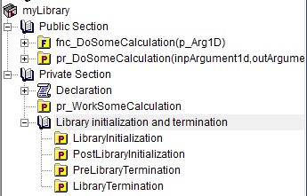
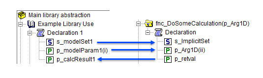
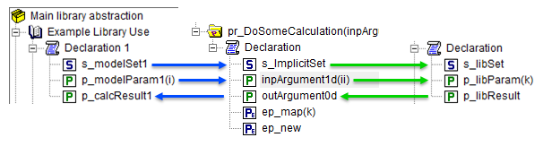

Library of functions and procedures
===================================

Creating libraries to share/reuse functionality in multiple projects is a powerful feature of AIMMS. 
In this article, we present some best practices and tips to create such libraries of functions and procedures.

The following are discussed in detail:

#.  **Library organization** - interfacing with a library is eased by a proper organization into sections.

#.  **Functions** - functions are popular because they can be used in expressions.

#.  **Procedures** - procedures are popular because they can assign new data to global identifiers.

This :download:`AIMMS project <model/library_abstraction.zip>` is used as an example for the below.

Library organization
--------------------

A good way of organizing your library is as follows:

.. code-block:: aimms
    :linenos:
    :emphasize-lines: 3

    LibraryModule myLibrary {
        Prefix: myLib;
        Interface: Public_Section;
    ...
    }

There are three remarks on this organization:

#.  To make all declarations in the section ``Public_Section`` accessible by other libraries and the main model, 
    the interface attribute of the library only contains a reference to ``Public_Section``.

#.  To make it visually clear which parts of the library require coordination before they can be changed, 
    and which parts can be freely changed, 
    the contents ar separated in a ``Public_Section`` and a ``Private_Section``.

#.  The library initialization and termination procedures are executed during application initialization and termination. 
    Many library implementers do not expect such procedures to be called explicitly from the main model, or from other libraries. 
    To enforce this expectation, it is good practice to move the library initialization and termination procedures to a separate section inside the ``Private_Section``.

Functions in the library
-------------------------

Functions provide a neat way of abstracting logic. Consider the following example:

.. _functionExample:

.. code-block:: aimms
    :linenos:

    Function fnc_DoSomeCalculation {
        Arguments: (p_Arg1D);
        Body: {
            ! This function takes any one-dimensional numerical vector and returns a scalar value.
            p_retval := sum(ii, p_Arg1D(ii)) ;
            fnc_DoSomeCalculation := p_retval ;
        }
        Parameter p_Arg1D {
            IndexDomain: ii;
            Property: Input;
        }
        Set s_ImplicitSet {
            Index: ii;
        }
        Parameter p_retval;
    }

The mechanism to realize "any one-dimensional numerical vector" is illustrated in the following call: 

.. code-block:: aimms

    p_calcResult1 := myLib::fnc_DoSomeCalculation(p_modelParam1) ;
    
When this function starts, the **local** set ``s_ImplicitSet`` is instantiated with ``s_modelSet1`` based on the following information:

*  The formal argument ``p_Arg1D`` is instantiated with the actual argument ``p_modelParam1``.

*  This formal argument ``p_Arg1D`` has local index ``ii`` and the actual argument ``p_modelParam1`` has index ``i``.

*  The range of local index ``ii`` is the local set ``s_ImplicitSet`` and the range of index ``i`` is ``s_modelSet1``; thereby the set ``s_ImplicitSet`` is instantiated with ``s_modelSet1``. 
   Note that ``s_ImplicitSet`` needs to be local; sets declared outside functions or procedures cannot be instantiated this way.

Similarly, the below call instantiates the local set ``s_ImplicitSet`` with ``s_modelSet2``.

.. code-block:: aimms

    p_calcResult2 := myLib::fnc_DoSomeCalculation(p_modelParam2) ;

The data flow between formal and actual arguments is summarized below:

    
Side effects are not allowed for functions. 
    
Avoid side effects
^^^^^^^^^^^^^^^^^^

A side effect is when during the computation of identifier ``A``, identifier ``B`` is modified as well.
The AIMMS language limits side effects. Consider the following example:

.. code-block:: aimms

      A(i,j) := fnc1( b(i,j) ) + C(i,j);

When the evaluation of ``fnc1`` in the above expression, modifies ``C``, there is a side effect.
The reason to avoid such side effects is that it becomes hard to understand what the outcome should be, because it is not specified in the AIMMS execution engine which identifier is to be evaluated first: ``C(i,j)`` or ``fnc1( b(i,j) )``.
A nice consequence of this design choice is that the sparse execution system can make more strict assumptions on the behavior of the data structures it reads and thus execute faster.

Statements allowed in function bodies
^^^^^^^^^^^^^^^^^^^^^^^^^^^^^^^^^^^^^^

AIMMS Functions are designed to be used in expressions, including indexed expressions, and in definitions of parameters. 
To avoid side effects, the following restrictions are placed on the body of a function:

#.  Identifiers declared outside the function cannot be assigned to.

    For example, the body of ``fnc_DoSomeCalculation`` from :ref:`the previous example <functionExample>` cannot be declared as below because ``p_calcResult`` is not declared locally to the function.

    .. code-block:: aimms
        :linenos:
        :emphasize-lines: 6

        Parameter p_calcResult;
        Function fnc_DoSomeCalculation {
            Arguments: (p_Arg1D);
            Body: {
                ! This function takes any one-dimensional numerical vector and returns a scalar value.
                p_calcResult := sum(ii, p_Arg1D(ii)) ; ! Not allowed: assigning to global.
                fnc_DoSomeCalculation := p_calcResult ;
            }
            Parameter p_Arg1D {
                IndexDomain: ii;
                Property: Input;
            }
            Set s_ImplicitSet {
                Index: ii;
            }
            Parameter p_retval;
        }

#.  Solve statements are not allowed.

#.  Procedure calls are not allowed, but calls to other functions are allowed.

.. note:: AIMMS Functions cannot be used in the expressions of constraints definitions and variable definitions.

Procedures in the library
-------------------------

Relative to functions, there are much fewer restrictions placed on the statements that can be executed in a procedure. 
This allows you to model much more complicated data flow using procedures.

To illustrate, the above example will be extended to copy data to a set and parameter in the private section of the library.

Consider the following identifiers private to the library interface we are developing:

.. code-block:: aimms

    Set s_libSet {
        Index: k;
        Parameter: ep_libSet;
    }
    Parameter p_libParam {
        IndexDomain: k;
    }
    Parameter p_libResult;

These identifiers are used by a procedure private to the library interface:

.. code-block:: aimms

    Procedure pr_WorkSomeCalculation {
        Body: {
            display p_libParam ;
            
            ! In this procedure we can use the private sets and parameters of library 'myLibrary'.
            p_libResult := sum( k, p_libParam(k));
        }
    }

To facilitate this mechanism, the procedure that can be used outside the library as follows:

.. code-block:: aimms
    :linenos:

    Procedure pr_DoSomeCalculation {
        Arguments: (inpArgument1d,outArgument0d);
        Body: {
            block ! Copy input data to the private sets and parameters of this library.
                For ii do
                    SetElementAdd(s_libSet, ep_new, ii);
                    ep_map(ep_new) := ii;
                EndFor;
                p_libParam(k) := inpArgument1d( ep_map(k));
            endblock ;
            
            ! Let the workhorse procedures inside the private section of the library do the actual work.
            pr_WorkSomeCalculation();
            
            block ! Copy the results in the private sets and parameters to the output arguments of this procedure.
                outArgument0d := p_libResult ;
            endblock ;
            
            block ! Cleanup
                empty private_section ;
            endblock ;
        }
        Parameter inpArgument1d {
            IndexDomain: ii;
            Property: Input;
        }
        Parameter outArgument0d {
            Property: Output;
        }
        Set s_ImplicitSet {
            Index: ii;
        }
        ElementParameter ep_map {
            IndexDomain: k;
            Range: s_ImplicitSet;
        }
        ElementParameter ep_new {
            Range: s_libSet;
        }
    }

The instantiation of the arguments is done in a similar way as with functions and not discussed here.
More interesting is the copying of the arguments to the sets and parameters private to the library as illustrated in lines 5-9 above:

*   Line 5: For every element in the implicit argument set ``s_ImplicitSet`` 

*   Line 6: Explicitly add the element to set ``s_libSet``.

*   Line 7: We need to map the data associated with the element in ``s_ImplicitSet`` to the corresponding element in  ``s_libSet``.

*   Line 9: Actually map the data of the parameter argument to the parameter in the private section of the library.

.. .. tip:: 
..      You can replace Line 7 and Line 9 with this statement (in Line 7): ``p_libParam(ep_new) := inpArgument1d(ii);``
.. Yes, that can be done, but should be avoided, as it leads to additional execution of individual statements, and when output identifiers are to be used, 
.. we need the element parameter ep_map again.

The data flow is now summarized in the following picture:

    
* Blue arrows: The argument passing mechanism of AIMMS takes care.

* Green arrows: To be implemented inside the procedure body.

The above mechanism is used in :doc:`Data for optimization libraries<../334/334-data-optimization-libraries>`. That article also illustrates the use of indexed output arguments.

Procedures in expressions
^^^^^^^^^^^^^^^^^^^^^^^^^^^^^^^^

The use of procedures inside expressions is limited to scalar evaluation. 
Typical examples are:

.. code-block:: aimms
    :linenos:

    p_RetCode := pr_someProc();
    
    if pr_otherProc() then
        ...
    endif ;

Both line 1 and line 3-5, are use cases of old-style error handling. 

Line 1 is the allowed exception for side effects. It is allowed if the assignment doesn't bind any indices.

A better way of :doc:`error handling is introduced here <../191/191-handle-errors-and-warnings>`.

The use of procedures in expressions is not needed, as status information can be passed in output arguments.

A good practice is to avoid the use of procedures in expressions; this permits the reader of a body of a procedure or function to easily distinguish between procedure calls and function calls; procedure calls are not part of an expression and avoid side effects altogether.

