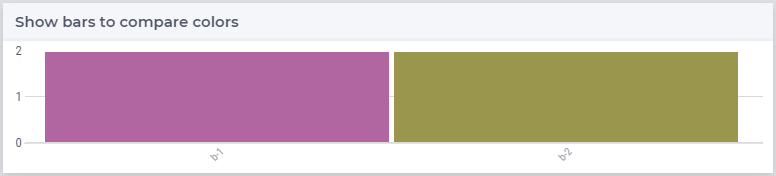
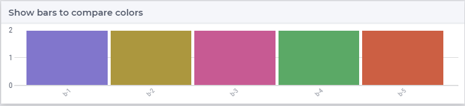

Add Qualitative Color Palettes
================================

A practical aspect of data visualization is the choice of colors for the 

* bars in a bar chart, 

* lines in a line chart, and

* other items in other charts.

For instance a color palette for two colors may provide the following bar chart:

|

and a color palette for five colors may provide the following bar chart:

|

There are several sites, see references below, that provide the hex codes for a color palette.
However, to color data items in AIMMS WebUI, annotations activating selected CSS rules are to be used.
The next section focuses on translating hex codes in JSON to CSS rules that can be used in an AIMMS WebUI application.

Converting JSON Color Palette to CSS Rules for an AIMMS WebUI Application
-----------------------------------------------------------------------------

The hex codes for color palettes using in this article are obtained via `I want hue <https://medialab.github.io/iwanthue/>`_.
This site provides these palettes in JSON format; for instance a palette for 2 colors looks like:

.. code-block:: json

    ["#b166a2",
    "#9b964d"]
    
This, and other sites, provide the hex codes in the browser. You will need to copy/paste the contents to a file manually. 
Larger palettes can also be created.  

`AIMMS documentation on data dependent styling <https://documentation.aimms.com/webui/css-styling.html#data-dependent-styling>`_ uses annotations 
to select colors for items in the widgets.
These annotations are matched against CSS rules.
The CSS file that matches annotations with the colors from the above JSON file is as follows:

.. code-block:: css
    :linenos:

    /*
        CSS file generated by genColorCSS.aimms
        Purpose: add a color palette for data coloring

        Section 1, giving the colors in the color palette a (numbered) name
        Note: this kind of .CSS file is not supported by IE11
    */

    :root {
        --i-want-hue-normal-2-color-0: #fffff4 ;
        --i-want-hue-normal-2-color-1: #b166a2 ;
        --i-want-hue-normal-2-color-2: #9b964d ;
    }

    /*
        Section 2: Associating the annotations with color names for bar, bubble, and Gantt Charts.
    */
    .annotation-i-want-hue-normal-2-0{
        fill: var(--i-want-hue-normal-2-color-0);
    }
    .annotation-i-want-hue-normal-2-1{
        fill: var(--i-want-hue-normal-2-color-1);
    }
    .annotation-i-want-hue-normal-2-2{
        fill: var(--i-want-hue-normal-2-color-2);
    }

    /*
        Section 3: Associating the annotations with colors for legend widget.
    */
    .aimms-widget.tag-legend-widget .annotation-i-want-hue-normal-2-0{
        background: var(--i-want-hue-normal-2-color-0);
    }
    .aimms-widget.tag-legend-widget .annotation-i-want-hue-normal-2-1{
        background: var(--i-want-hue-normal-2-color-1);
    }
    .aimms-widget.tag-legend-widget .annotation-i-want-hue-normal-2-2{
        background: var(--i-want-hue-normal-2-color-2);
    }

    /*
        and similar sections for table widget and linechart widget.
    */

As you can see, it contains of several sections.  Some remarks:

#.  This is a generated file.  Even in generated files, a bit of internal documentation doesn't hurt.

    In this (first) section, the colors are given names.  As an aside, IE11 does not support this CSS syntax.
    
    Note that an additional color is introduced; this is to be used if a given item cannot be matched to a color number.
    
#.  In Section 2, the color numbers are mapped to the property "fill" for bar charts, bubble charts and Gantt charts.

#.  In Section 3, for the legend widget, the property "background" is used.

Steps to Translate JSON to CSS
^^^^^^^^^^^^^^^^^^^^^^^^^^^^^^

#.  Reading the JSON using `Data Exchange library <https://documentation.aimms.com/dataexchange/index.html>`_

#.  Write the CSS using the `AIMMS PUT statement <https://documentation.aimms.com/language-reference/data-communication-components/text-reports-and-output-listing/the-put-statement.html>`_

The :download:`genColorCSS application <model/genColorCSS.zip>` is a small app that translates a collection of JSON files to corresponding CSS files.
 
.. note:: 

    Only AIMMS developer works with dynamic collections of `.js` and `.css` files in the subfolder `resources` of `MainProject/WebUI`. 
    Therefore `genColorCSS` does not work when published on AIMMS PRO.

Suggested Reading
-----------------

There is a lot of literature and automated support on selecting and creating nice qualitative color palettes. To name a few:

#.  This `Datawrapper blog <https://blog.datawrapper.de/colorguide/>`_ 
    titled "Your Friendly Guide to Colors in Data Visualisation" 
    Gives a nice introduction and overview for data scientists.

#.  `ColorBrewer <https://colorbrewer2.org>`_ is **the classic site** to go to for creating color palettes.

#.  `I want Hue <https://medialab.github.io/iwanthue/>`_ is an advanced site for creating color palettes; 
    it comes with a lot of bells and whistles - and the tutorial to let you create palettes.
    It is fun to play around with the color space and see what kind of palettes are created.
    
The :download:`barlegend <model/barlegend.zip>` let's you play around with the color palettes discussed here.

