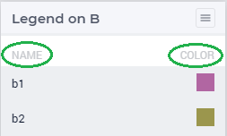
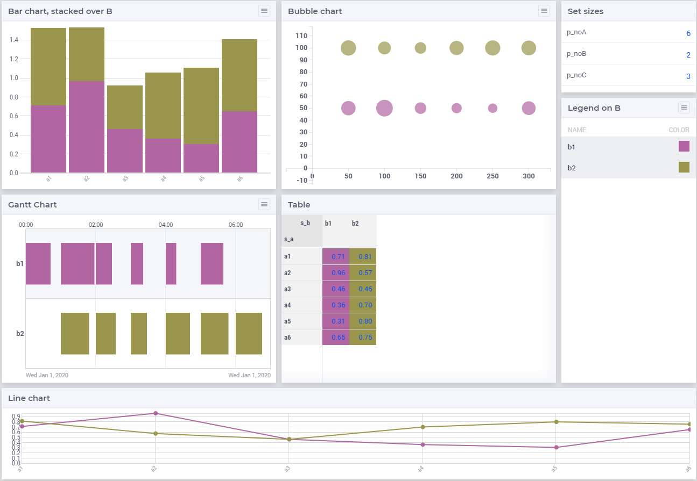
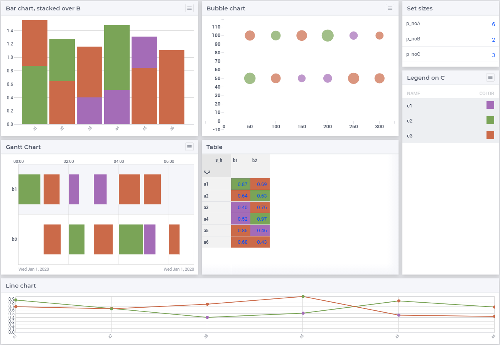

Consistent data coloring on an AIMMS WebUI page
==================================================

.. Topsites:
.. https://colorbrewer2.org/#type=sequential&scheme=BuGn&n=3 The classic site for creating color schemes.
.. https://medialab.github.io/iwanthue/ Generates anything you want, but make sure you know what you want ;-)

.. https://blog.datawrapper.de/colorguide/#9 Provides a good overview
.. https://medium.com/nightingale/how-to-create-brand-colors-for-data-visualization-style-guidelines-dbd69c586dd9

.. https://colorspace.r-forge.r-project.org/articles/hcl_palettes.html
.. http://tsitsul.in/blog/coloropt/
.. https://seaborn.pydata.org/tutorial/color_palettes.html 
.. https://carto.com/carto-colors/ (premium)
.. https://lisacharlotterost.de/2016/04/22/Colors-for-DataVis/ nice overview of various color palette sites.

The legend widget links names to colors.  

The intent of a legend is that whenever a data item on a page is seen with a color in that legend, that data item is to be associated with that name.
We can color the data items simply via their index, for instance in the following page all data items are indexed on index `i_b`:

    
So, whenever on that page, we see a green data item, we're supposed to associate that with element 'b2'.

Generalizing a bit, data items can be categorized, say according to the elements in set `s_C`. Based on this data we can color as well.
The same page will now look as follows:

    
So whenever on that page, we see a green data item, we're supposed to associate that with category 'c2'

The remainder of this article shows how such consistent coloring is obtained in the WebUI.

The running example
---------------------

The example used is just an abstract example with no relation to a reality and :download:`can be downloaded here <model/barlegend.zip>`

In this example there are three indices: ``i_a``, ``i_b`` and ``i_c``.
There are also three legend widgets, corresponding to each of the indices, but only one of these three is visible.
The menu in each widget let's you choose between the index / category used for coloring.

#.  Using legend A. With this legend we focus on the aspect ``A`` of the data for visual differentiation.

    .. image:: images/color-on-index-i-a.png
        :align: center

#.  Using legend B. With this legend we focus on the aspect ``B`` of the data for visual differentiation.

    .. image:: images/color-on-index-i-b.png
        :align: center
        
    As you can see, index ``i_b`` is used as the stacking index in the bar chart.

#.  Using legend C

    .. image:: images/color-on-index-i-c.png
        :align: center
        
    As you can see, index ``i_c`` covers some aspect of a bubble or a job in the Gantt chart.
    
In the right upper widget, you can select the size of each of the three sets involved.
Experience teaches us that a legend with a lot of colors; it becomes hard to find the name associated with a color of a data item.
As experience is an excellent teacher; I prefer to let him do his job. Hence, the barlegend app allows up to 89 elements per set.

Selecting color per data item
-----------------------------

To color an item according to some index, there are several steps:

#.  The app ``genColorCSS``, discussed in :doc:`genColorCSS article<../377/377-add-color-palettes>` 
    is used to generate CSS color files in the "i-want-hue" subfolder of `barlegend/MainProject/WebUI/resources/css`.

#.  In each css file in this "i-want-hue" sub folder, a palette is defined. 
    A palette contains several colors. 
    Each color is linked to various CSS rules, a rule for each type of widget.
    For details see also the `genColorCSS article` .

#.  In the AIMMS model, several steps are taken:

    #.  A palette family is chosen. Here we have the option to choose between a normal palette, and a color blind friendly palette.
    
    #.  A palette size is chosen, this size depends on the number of elements in the sets A, B, and C.
        The generated files provided with the apps come in the sizes: 2, 3, 5, 8, 13, 21, 34, 55, and 89 colors (the start of the Fibonacci sequence).
        The smallest palette is chosen that covers the elements in that set.
        
    #.  The color in the palette is chosen.  
        This is simply the color number offset.

.. spelling:word-list::

    barlegend
