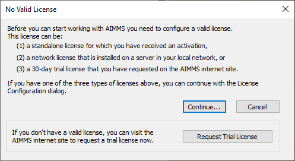
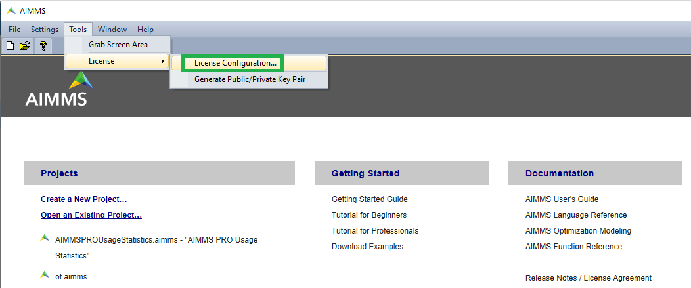
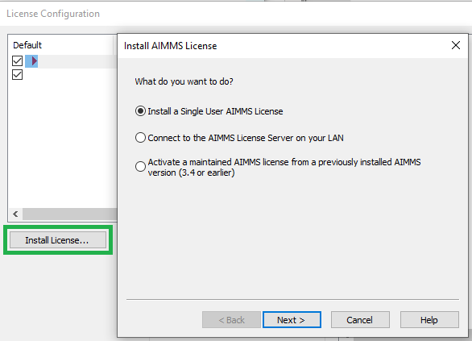
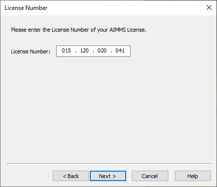
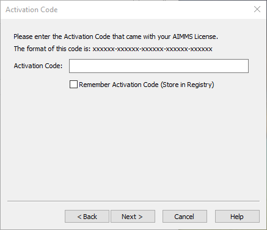
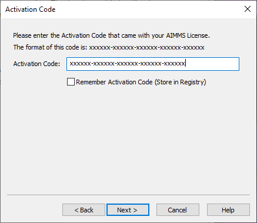
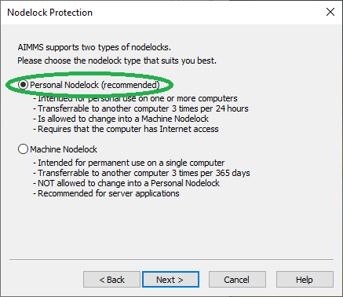

Install Single-User License
============================================

.. meta::
   :description: This article explains how to install an AIMMS Developer license for a single user.
   :keywords: license, activation, install, developer

When you received a license number, activation code, and optionally license files; 
you can follow the instructions below to install this license. To install the license:

1.  Start AIMMS.

2.  If no license is installed, a dialog will open automatically. 

| 

If you previously installed a license, use the menu :menuselection:`Tools > License > License Configuration...`.

|

Click :menuselection:`Install License...`.

|

3.  Select :menuselection:`Install a Single User AIMMS License` and click :menuselection:`Next`.

.. image:: images/2-InstallAIMMSLicnese.png
    :align: center

|

4.  Enter your License Number (given in the email you received from AIMMS Licensing) and click :menuselection:`Next`.

|

5.  Select :menuselection:`I Have Received an Activation Code` and click :menuselection:`Next`.

|

6.  Copy and paste your Activation Code (given in the email you received from AIMMS Licensing) and click :menuselection:`Next`.

|
 
7.  Select :menuselection:`Personal Nodelock` and click :menuselection:`Next`.

|

8.  Click :menuselection:`Finish`.

.. image:: images/6-Success.png
    :align: center

|

Your new license is installed.

If you previously installed another license, move the **new license** to the top with the :menuselection:`Move Up` button and tick the checkbox. The next time you start up AIMMS this license will be used.

In case of any problems during installation, activation, or running of AIMMS, please contact `AIMMS Support <mailto:support@aimms.com>`_.