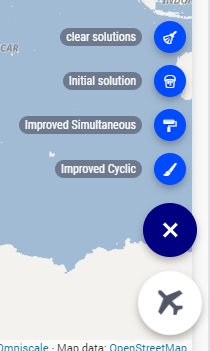

Traveling Salesman
======================

.. meta::
   :description: This example illustrates some of AIMMS control flow statements by means of the traveling salesman 2-opt heuristic.
   :keywords: Algorithm, 2-opt heuristic, traveling salesman problem, GMP, Lazy constraint callback, subtour elimination constraints.

.. image:: https://img.shields.io/badge/AIMMS_24.5-ZIP:_Traveling_Salesman-blue
   :target: https://github.com/aimms/traveling-salesman/archive/refs/heads/main.zip

.. image:: https://img.shields.io/badge/AIMMS_24.5-Github:_Traveling_Salesman-blue
   :target: https://github.com/aimms/traveling-salesman

.. image:: https://img.shields.io/badge/AIMMS_Community-Forum-yellow
   :target: https://community.aimms.com/aimms-webui-44/updated-traveling-salesman-example-1433

.. image:: images/project.gif
    :align: center

|
    
Story
-----

The Traveling Salesman Problem (TSP) is the problem of finding the best route given a set of locations and distances between those locations.

It is widely researched for `several reasons <https://en.wikipedia.org/wiki/Travelling_salesman_problem>`_ including:

#.  They are notoriously hard to solve to proven optimality. 

#.  There is a wide range of practical applications.

#.  There are various ways of solving TSP problems.

The purpose of this example application is to illustrate some ways of solving a TSP. 

Mathematical Model
------------------

In this example you will find both heuristic and MIP model for comparison. 

Heuristic
^^^^^^^^^^^^

This example illustrates some of AIMMS control flow statements by means of the traveling salesman 2-opt heuristic. In the model tree, you will find some declarations to define the problem. 
In addition, you will find:

- A procedure and some declarations to compute and visualize an initial tour constructed by starting at some city and successively selecting the next city as the closest city not yet part of the tour.

- A procedure and some declarations to compute and visualize an improved tour constructed by repetitively swapping those two arcs in the tour by means of the 2-opt heuristic that give the largest overall distance improvement, until no further improvement is possible or the iteration limit is reached.

- A procedure and some declarations to compute and visualize an improved tour constructed by repetitively swapping the next arc in the (modified) tour with that neighbor arc which gives the largest distance improvement, until the iteration limit is reached or a full cycle over the tour gives no further improvement.

MIP
^^^^

This AIMMS project illustrates the use of a binary variables. 
In this example the (symmetric) Traveling Salesman Problem (TSP) is formulated using subtour elimination constraints. 
The amount of subtour elimination constraints is exponential, and therefore they are added using a lazy constraint callback. 
Lazy constraints are constraints that should be satisfied by any solution to the problem, but they are not generated upfront. 
The lazy constraint callback checks whether the incumbent solution found by the solver contains subtours. 
If yes, then subtour elimination constraints are added that forbid these subtours. If not, then the incumbent solution forms a true solution of the TSP problem, as it contains only one tour.

+-----+------------------------------------------------------+-------------------------------------------+
|       Traveling Salesman Problem                                                                       |
+=====+======================================================+===========================================+
+ **Sets and indices:**                                                                                  |
+-----+------------------------------------------------------+-------------------------------------------+
+     | :math:`S`, :math:`i,j \in S`                         | Cities                                    |
+-----+------------------------------------------------------+-------------------------------------------+
| **Parameters:**                                                                                        |
+-----+------------------------------------------------------+-------------------------------------------+
|     | :math:`C_{i,j} \in \mathbb{R_{+}}`                   | Distance between cities                   |
+-----+------------------------------------------------------+-------------------------------------------+
| **Variables:**                                                                                         |
+-----+------------------------------------------------------+-------------------------------------------+
|     | :math:`X_{i,j} \in \{0..1\} \forall i,j: i>j`        | Travel from i to j, or visa versa         |
+-----+------------------------------------------------------+-------------------------------------------+
| **Constraints:**                                                                                       |
+-----+------------------------------------------------------+-------------------------------------------+
|  1  | :math:`\forall j: \sum_i X_{i,j} + X_{i,j} = 1`      |                                           |
+-----+------------------------------------------------------+-------------------------------------------+
| **Minimize:**                                                                                          |
+-----+------------------------------------------------------+-------------------------------------------+
|     | :math:`\sum_{i,j} C_{i,j} * X_{i,j}`                 | Total distance traveled                   |
+-----+------------------------------------------------------+-------------------------------------------+

Language 
--------

Rest API
^^^^^^^^^^^^^

In this example we make use of an external Rest API to retrieve the relevant location data. 
We use the `AIMMS Data Exchange Library (DEX) <https://documentation.aimms.com/dataexchange/index.html>`_ for sending out the requests and receiving and parsing the responses.

API Key
~~~~~~~~~~ 

`PositionStack <https://positionstack.com/>`_ is used on this example and you can sign up for a free api key. 
So the first step required when using this project is adding your key on ``sp_apiKey``.

API Request
~~~~~~~~~~~~

You can use the 'forward geocoding' functionality from the PositionStack API to retrieve geo location data. 
Their `documentation <https://positionstack.com/documentation>`_ describes which parameters are required (and optional), 
allowing you to build the request using the :aimms:procedure:`dex::client::NewRequest` method of DEX. 
You will send the API key for authentication and as the query you will request the geo location based on a city name. 
To make the query more specific, you can also send the country in which the city is located, and maximize the result to 1.
To prevent unwanted errors replace any spaces in city names with the URL-friendly character '%20', as seen below:

.. code-block:: aimms
   :linenos:

   sp_loc_requestId := "fetch" + sp_in_city;

   sp_in_city := FindReplaceStrings(sp_in_city, " ", "%20");

   sp_loc_urlCall 
   :=   "http://api.positionstack.com/v1/forward?access_key=" + sp_def_apiKey 
         + "&query=" + sp_in_city 
         + "&limit=1"
         + "&country=" + sp_countryAcronym(ep_in_cityCountry);

   dex::client::NewRequest(
         sp_loc_requestId,
         sp_loc_urlCall,
         'dex::client::EmptyCallback',
         responsefile:"out/Output.json",
         tracefile:"Trace.xml");

   dex::client::PerformRequest(sp_loc_requestId);
   dex::client::WaitForResponses(2000); 

The DEX method :aimms:procedure:`dex::client::PerformRequest` will send out the actual request (as defined in :aimms:procedure:`dex::client::NewRequest` by ``requestId``) and the :aimms:procedure:`dex::client::WaitForResponses` forces the callback to be called synchronously.
The fourth argument of :aimms:procedure:`dex::client::NewRequest` saves he ``responsefile`` in the folder 'out' and the fifth one saves a ``tracefile`` in case something goes wrong and you want to investigate.

Mapping the Results
~~~~~~~~~~~~~~~~~~~~~~

After a successful request the geo location data will be in the file 'Output.json' in the out folder. It looks like this:

.. code-block:: json

   {
   "data": {
      "results": [
         {
            "latitude": 38.897675,
            "longitude": -77.036547,
            "label": "1600 Pennsylvania Avenue NW, Washington, DC, USA",
            "name": "1600 Pennsylvania Avenue NW",
            "type": "address",
            "number": "1600",
            "street": "Pennsylvania Avenue NW",
            "postal_code": "20500",
            "confidence": 1,
            "region": "District of Columbia",
            "region_code": "DC",
            "administrative_area": null,
            "neighbourhood": "White House Grounds",
            "country": "United States",
            "country_code": "US",
            "map_url": "http://map.positionstack.com/38.897675,-77.036547"
         }
      ]
   }}

Now you can use a mapping file to instruct AIMMS how to map the data from the output file onto the data model.
First :aimms:procedure:`dex::AddMapping` should be used to create/add the mapping to AIMMS:

.. code-block:: aimms
   :linenos:

   dex::AddMapping(
	mappingName :  "LatLongMapping", 
	mappingFile :  "Mappings/Generated/LatLongDataset.xml");
	
The ``mappingfile`` (based on the JSON output) looks as follows:

.. code-block:: xml

   <?xml version="1.0"?>
   <AimmsJSONMapping>
	<ObjectMapping>
		<ArrayMapping name="data">
			<ObjectMapping>
				<ValueMapping name="name" binds-to="i_int_city" />
				<ValueMapping name="latitude" maps-to="p_int_latitude(i_int_city)" />
				<ValueMapping name="longitude" maps-to="p_int_longitude(i_int_city)" />
			</ObjectMapping>
		</ArrayMapping>
	</ObjectMapping>
	</AimmsJSONMapping>

You can see that from the JSON array 'data' the 'name', 'latitude' and 'longitude' values are being mapped onto known/existing AIMMS identifiers within the model.

Now that the mapping is defined, the :aimms:procedure:`dex::ReadFromFile` method can be used to actually read in the data of the file:

.. code-block:: aimms
   :linenos:

   dex::ReadFromFile(
         dataFile         :  "out/Output.json", 
         mappingName      :  "LatLongMapping", 
         emptyIdentifiers :  1, 
         emptySets        :  1, 
         resetCounters    :  1);

Done that, the node will appear on the Network page!

Case Management
^^^^^^^^^^^^^^^^^^^^

`Data Manager <https://documentation.aimms.com/webui/data-manager.html>`_ is a native feature in any WebUI application. 
On this example, you will find 4 ready to use scenarios. 

* **100_BR:** 100 nodes on one country: Brazil. 
* **200_BR:** 200 nodes on one country: Brazil.
* **100_ALL:** 100 nodes in the world.
* **200_ALL:** 200 nodes in the world. 

Note that you can create your own case, or adapt an existing case. 

Haversine
^^^^^^^^^^

Input data for this project is the exact latitude and longitude of cities in the world. So, direct distance between the nodes will not provide a good approximate distance. 
So here, is used the `Haversine formula <https://en.wikipedia.org/wiki/Haversine_formula>`_.

Haversine formula is an equation important in navigation, 
giving great-circle distances between two points on a sphere from their longitudes 
and latitudes `Haversine Theory <https://rosettacode.org/wiki/Haversine_formula>`_.  

The parameter that holds its value is: 

.. code-block:: aimms

   Parameter p_def_haversineDistance {
      IndexDomain: (i_node1,i_node2) | i_node1 <> i_node2;
      Text: "Distance from city i to city j";
      Definition: {
         ((6371.0 ) 
         *   arccos(
                     cos(radians(90 - P_latitude(i_node1)))
                     * cos(radians(90 - P_latitude(i_node2))) 
                     + 
                     sin(radians(90 - P_latitude(i_node1)))
                     * sin(radians(90 - P_latitude(i_node2)))
                     * cos(radians(p_longitude(i_node1) - p_longitude(i_node2)))))
      }
   }

.. seealso:: In this :doc:`article<../153/153-external-haversine>` there is another way to use Haversine by calling an external procedure on Visual Code. 

ScheduleAt
^^^^^^^^^^

On Heuristic page, there are a few ways to run the different heuristics. You can find then on the Page Actions:

* **Clear Solutions:** it will clear all heuristic solutions.
* **Initial Solutions:** it will run the initial tour heuristic.
* **Improved Simultaneous:** this will run the improved simultaneous tour with iterations.
* **Improved Cyclic:** this will run the improved cyclic tour with iterations.
* **Run All:** this will run all 3 heuristics without iterations. This run will be important when comparing execution time. 

Both **Improved Simultaneous** and **Improved Cyclic** buttons will run iteratively. 
This means that every iteration of the heuristic will be shown on the map. 
It can take a while, so, if the nodes are orange, the heuristic is still running. Pink means that the run is complete. 

This is possible by using :aimms:procedure:`ScheduleAt` native AIMMS procedure. 
This is precise up to 1 second. Below, there is the procedure used to schedule each iteration.

.. aimms:procedure:: pr_scheduleAgain(p_in_noSecs,ep_in_payLoad)

.. code-block:: aimms
   :linenos:
   :emphasize-lines: 9, 13

   sp_loc_refDate := "2023-01-01 00:00:00" ;

   p_loc_tmpSec := CurrentToMoment([s], sp_loc_refDate) ;
   p_loc_tmpSec += p_in_noSecs ;

   if p_loc_scheduleAtUsesUTC then
      sp_loc_launchDate := MomentToString("%c%y-%m-%d %H:%M:%S%TZ('UTC')", [s], sp_loc_refDate, p_loc_tmpSec);
   else
      sp_loc_launchDate := MomentToString("%c%y-%m-%d %H:%M:%S", [s], sp_loc_refDate, p_loc_tmpSec);
   endif ;

   ! Nb ScheduleAt is precise up to a second.
   if not ScheduleAt(sp_loc_launchDate, ep_in_payLoad) then
      raise error "Error scheduling procedure \'" 
                  + ep_in_payLoad 
                  + "\': " 
                  + CurrentErrorMessage 
            code 'Schedule-at-procedure' ;
   endif;

.. seealso:: On this `article <https://how-to.aimms.com/Articles/572/572-progress-webui.html>`_ you will find how to create an iterative graph using :aimms:procedure:`ScheduleAt`.

Stopwatch Library
^^^^^^^^^^^^^^^^^^

To compare the execution time for each solve, Stopwatch Library was used, 
for more documentation click `here <https://how-to.aimms.com/Articles/574/574-stopwatch-library.html>`_. 

WebUI Features
--------------

This project you will find many 'hidden' and interesting features, for example, by right clicking on any node, you will be able to delete it specifically. 
The status bar here is used to let the user know when the iteration run is in progress. The "Help" side panels document some of those features.   

The following WebUI features are used:

- `Text Widget <https://documentation.aimms.com/webui/text-widget.html>`_

- `Image Widget <https://documentation.aimms.com/webui/image-widget.html>`_

- `Workflow <https://documentation.aimms.com/webui/workflow-panels.html>`_

- `Map Widget <https://documentation.aimms.com/webui/map-widget.html>`_

- `Button Widget <https://documentation.aimms.com/webui/button-widget.html>`_

- `Scalar Widget <https://documentation.aimms.com/webui/scalar-widget.html>`_ 

- `Side Panel <https://documentation.aimms.com/webui/side-panels-grd-pages.html#side-panel-grid-pages>`_

- `Page Actions <https://documentation.aimms.com/webui/page-menu.html>`_ 

- `Item Actions <https://documentation.aimms.com/webui/widget-options.html#item-actions>`_

- `Combination Chart Widget <https://documentation.aimms.com/webui/combination-chart-widget.html>`_

- `Status Bar <https://documentation.aimms.com/webui/status-bar.html>`_

- `CSS Annotations <https://documentation.aimms.com/webui/css-styling.html#data-dependent-styling>`_

UI Styling
----------
Below there are the css files you will find with comments on what they change. 

.. tab-set::
    .. tab-item:: annotations.css

      .. code-block:: css
         :linenos:

         .annotation-node-done{
            fill: var(--secondary);
         }
         .annotation-node-running{
            fill: var(--secondary2);
         }
    
    .. tab-item:: theming.css

      .. code-block:: text
         :linenos:

         :root {
            --primaryLight: #00A0C8;
            --primary: #0082AA;
            --primaryDark: #0A5078;
            --secondaryDarker: #A00028;
            --secondary: #C80A50;
            --secondary2: #DC9600;

            --bg_app-logo: 15px 50% / 50px 50px no-repeat url(/app-resources/resources/images/traveling.png);
            --spacing_app-logo_width: 65px;
            --color_bg_app-canvas: url(/app-resources/resources/images/RightBackground.png) rgb(249, 249, 249) no-repeat left/contain; /*background color*/
            --color_border_app-header-divider: var(--primaryDark); /*line color after header*/

            --color_border-divider_themed: var(--primary);
            --color_text_edit-select-link: var(--primaryDark);
            --color_text_edit-select-link_hover: var(--primaryLight);
            --color_bg_edit-select-link_inverted: var(--secondary);

            --color_bg_button_primary: var(--primaryLight);
            --color_text_button_primary: white;
            --border_button_primary: 1px solid var(--primaryLight);

            --color_bg_button_primary_hover: var(--primaryLight);
            --color_text_button_primary_hover: var(--primaryDark);
            --border_button_primary_hover: 1px solid var(--primaryDark);

            --color_text_button_secondary: var(--secondary);
            --border_button_secondary: 1px solid var(--secondary);
            --color_text_button_secondary_hover: var(--primaryDark);
            --border_button_secondary_hover: 1px solid var(--primaryDark);

            --color_bg_widget-header: var(--primaryDark);
            --border_widget-header: 3px solid var(--primary);
            --color_text_widget-header: white;
            
            --color_bg_workflow_current: var(--primary); /*bg color when step is selected*/
            --color_workflow_active: var(--primary); /*font and icon color when step is active*/

         }

Minimal Requirements
--------------------   

`AIMMS Community license <https://www.aimms.com/platform/aimms-community-edition/>`_ is sufficient to run the Heuristics, call the Rest API and check the available scenarios. 
However, to run the MIP problem, you will need to buy a Developer License (see `LP and MIP Solver Features <https://documentation.aimms.com/platform/solvers/solvers.html#lp-and-mip-solver-features>`_). 

A SQLite is used, to integrate that, you will need "SQLite3 ODBC Driver". 
You will also need an API key from `PositionStack api <https://positionstack.com>`_. 
To receive an free API key to test, please sign up to the `free plan <https://positionstack.com/signup>`_. 

References
-----------

#.  `Haversine Theory <https://rosettacode.org/wiki/Haversine_formula>`_

#.  Generalization of TSP to `Vehicle Routing Problem <https://how-to.aimms.com/C_Developer/Sub_Mathematical_Modeling/Sub_VRP/index.html>`_

#.  `Solve with Lazy Constraints <https://how-to.aimms.com/Articles/126/126-TSP-Lazy-Constraints.html#solve-with-lazy-constraints>`_ - Marcel Hunting. 

#.  Applegate, D.L., R. E. Bixby, V. Chvátal, and W. J. Cook, The Traveling Salesman Problem: A Computational Study, Princeton University Press, Princeton, 2007

.. seealso:: Here you will find several euclidean TSP instances from TSPLIB at: http://comopt.ifi.uni-heidelberg.de/software/TSPLIB95/

Release Notes
--------------------   

`v1.1 <https://github.com/aimms/traveling-salesman/releases/tag/1.1>`_ (30/09/2024)
   Now you can run all types of solve on PRO Portal. Correct driver is set when using the API on Cloud PRO Portal. 

`v1.0 <https://github.com/aimms/traveling-salesman/releases/tag/1.0>`_ (20/09/2024)
   First logged version with new WebUI library.

.. spelling:word-list::

   primaryDark
   haversine
   ddab
   bg
   api
   geocoding
   positionstack
