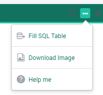
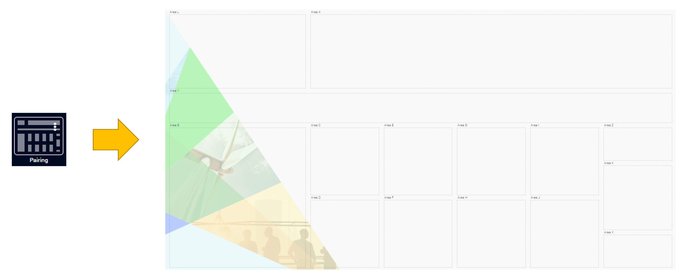
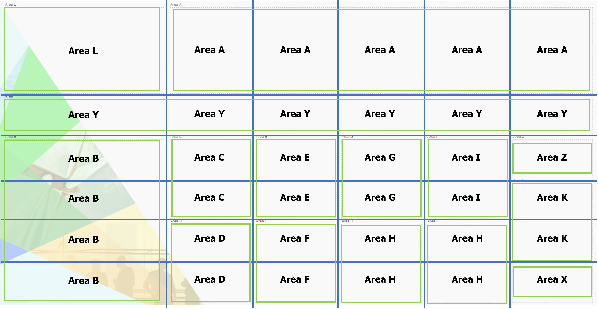
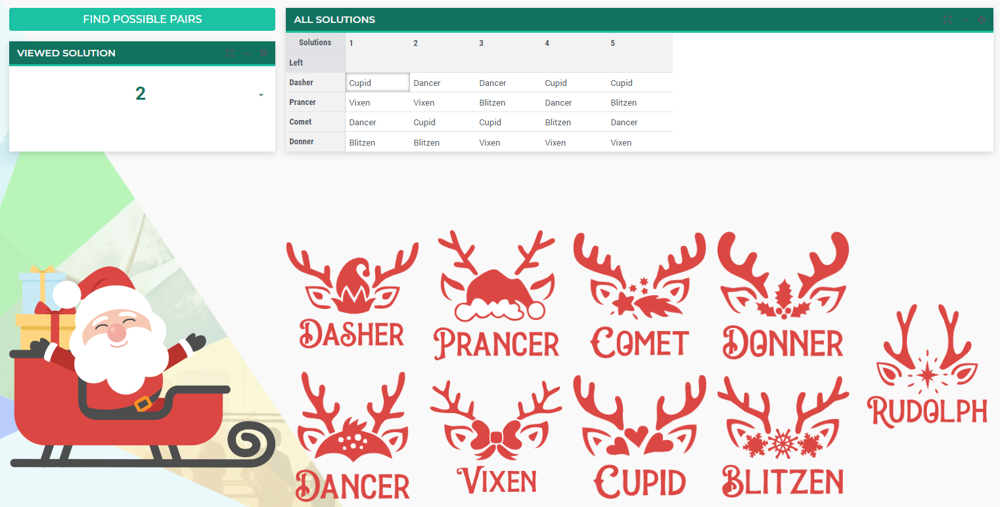

Reindeer Pairing
=================
.. meta::
   :keywords: Stable marriage problem, network object, constraint programming, channel constraint, if-then constraint
   :description: This AIMMS project is an illustration of the stable marriage problem.

.. image:: https://img.shields.io/badge/AIMMS_4.89-ZIP:_Reindeer_Pairing-blue
   :target: https://github.com/aimms/reindeer-pairing/archive/refs/heads/main.zip

.. image:: https://img.shields.io/badge/AIMMS_4.89-Github:_Reindeer_Pairing-blue
   :target: https://github.com/aimms/reindeer-pairing

.. image:: https://img.shields.io/badge/AIMMS_Community-Forum-yellow
   :target: https://community.aimms.com/aimms-webui-44/uptaded-contract-allocation-example-1253

Story
-----

This AIMMS project is an illustration of the stable marriage problem (STEM). 
Every Christmas Santa is as always busy with preparations before his longer-than-7.5-million-kilometer trip around the world. 
One of the many things he has to worry about is how to pair up his reindeer in front of the sleigh. 
We all know that Rudolf goes right in front of everyone else because of his shiny nose, but what about his other eight four-legged friends? 
The traditional Christmas carols tell us that the reindeer are typically arranged in four pairs, front to back, as follows:

#. Dasher, Dancer
#. Prancer, Vixen
#. Comet, Cupid
#. Donner, Blitzen

Therefore, we are going to assume that this is an arrangement that works pretty well (after all it’s been working since 1823). However Santa kept thinking: "Are there other good ways to pair up my reindeers?”. 
Santa was kind enough to provide the following lists of pairing preferences for each of his reindeer. 
The names in each list are sorted in decreasing order of pairing preference. The lefties appear in bold, while the righties appear in italic.

#. **Dasher**: *Dancer, Cupid, Vixen, Blitzen*
#. **Prancer**: *Vixen, Blitzen, Dancer, Cupid*
#. **Comet**: *Cupid, Dancer, Blitzen, Vixen*
#. **Donner**: *Blitzen, Vixen, Dancer, Cupid*
#. *Dancer*: **Prancer, Comet, Dasher, Donner**
#. *Vixen*: **Dasher, Donner, Prancer, Comet**
#. *Cupid*: **Prancer, Dasher, Comet, Donner**
#. *Blitzen*: **Comet, Prancer, Donner, Dasher**

What Santa would like to know is whether or not there are other good pairings in addition to the traditional one. 
If so, he can add some variety to his line-up and the reindeer won’t get so bored by galloping side-by-side with the same companion every year.

.. note::
   The problem formulation is originally stated elegantly at `Tallys Yunes' blog <http://orbythebeach.wordpress.com/2011/12/20/how-should-santa-pair-up-his-reindeer/>`_.
   And more information about the reindeers personalities `here <https://www.santarules.com/2018/10/reindeer-names-personalities/>`_! 

Mathematical Model
------------------

This AIMMS project illustrates the use of a `Contraint Programing <https://en.wikipedia.org/wiki/Constraint_programming>`_ (CP) model. 

+-----+------------------------------------------------------+-------------------------------------------+
|       Reindeer Pairing Problem                                                                         |
+=====+======================================================+===========================================+
+ **Sets and indices:**                                                                                  |
+-----+------------------------------------------------------+-------------------------------------------+
+     | :math:`R`, :math:`r \in R`                           | Rightys Reindeers                         |
+-----+------------------------------------------------------+-------------------------------------------+
+     | :math:`L`, :math:`l \in L`                           | Leftys Reindeers                          |
+-----+------------------------------------------------------+-------------------------------------------+
+     | :math:`D`, :math:`d \in D`                           | Reindeers                                 |
+-----+------------------------------------------------------+-------------------------------------------+
| **Parameters:**                                                                                        |
+-----+------------------------------------------------------+-------------------------------------------+
|     | :math:`Pl_{l,r} \in \mathbb{I}`                      | Leftys preferences                        |
+-----+------------------------------------------------------+-------------------------------------------+
|     | :math:`Pr_{r, l} \in \mathbb{I}`                     | Rightys preferences                       |
+-----+------------------------------------------------------+-------------------------------------------+
| **Variables:**                                                                                         |
+-----+------------------------------------------------------+-------------------------------------------+
|     | :math:`rP_{l} \in R`                                 | Right partner                             |
+-----+------------------------------------------------------+-------------------------------------------+
|     | :math:`lP_{r} \in L`                                 | Left partner                              |
+-----+------------------------------------------------------+-------------------------------------------+

**Contraints:**

1. Match Each Uniquely:

.. code-block:: aimms
   :linenos:

   cp::Channel(
      mapBinding        :  i_left,
      map               :  ev_rightPartner(i_left),
      inverseMapBinding :  i_right,
      inverseMap        :  ev_leftPartner(i_right))

2. Left Stable (i_left,i_right):

.. code-block:: aimms
   :linenos:

   if p_def_preferenceRankLefty( i_left, i_right ) < p_def_preferenceRankLefty( i_left, ev_rightPartner( i_left ) ) then
      p_def_preferenceRankRighty( i_right, ev_leftPartner( i_right ) ) < p_def_preferenceRankRighty( i_right, i_left )
   endif;

3. Right Stable (i_left,i_right):

.. code-block:: aimms
   :linenos:

   if p_def_preferenceRankRighty( i_right, i_left ) < p_def_preferenceRankRighty( i_right, ev_leftPartner( i_right ) ) then
      p_def_preferenceRankLefty( i_left, ev_rightPartner( i_left ) ) < p_def_preferenceRankLefty( i_left, i_right )
   endif;

Remarks:

* *i_left* as *l*;
* *i_right* as *r*;
* *p_def_preferenceRankRighty* as *Pr*;
* *p_def_preferenceRankLefty* as *Pl*;
* *ev_rightPartner* as *rP*;
* *ev_leftPartner* as *lP*;

Language 
--------

DirectSQL
~~~~~~~~~~
This example illustrates how to use :aimms:procedure:`DirectSQL` to export data. 
Read more about `how to generage a DirectSQL procedure <https://how-to.aimms.com/Articles/554/554-direct-sql-example.html>`_. Access this feature per "All Solutions" table. 

Multiple Solutions
~~~~~~~~~~~~~~~~~~~

To ensure the solver will return multiple solutions, the option ``solution_storage_limit`` was set to 1000. 

.. code-block:: aimms
   :linenos:
   :emphasize-lines: 1, 8, 11

   option 'cpoptimizer 22.1'.'solution_storage_limit' := 1000 ;
   solve mp_stableReindeerPairings where solution_limit := 1000, time_limit := 10 ;

   ! Visit each solution in the solution repository of that generated mathematical program
   ! and store these solutions in element parameters.
   ! These element parameters can then be displayed in the GUI.
   ep_loc_generatedModel := 'mp_stableReindeerPairings';
   s_solutionSet := gmp::Solution::GetSolutionsSet(ep_loc_generatedModel);

   for (i_sols) do
      GMP::Solution::SendToModel(ep_loc_generatedModel, i_sols);
      ep_variousLeftPartners(i_sols,i_right)  := ev_leftPartner(i_right);
      ep_variousRightPartners(i_sols,i_left) := ev_rightPartner(i_left);
   endfor;

WebUI Features
--------------

The following WebUI features are used:

- `Text Widget <https://documentation.aimms.com/webui/text-widget.html>`_

- `Image Widget <https://documentation.aimms.com/webui/image-widget.html>`_

- `Workflow <https://documentation.aimms.com/webui/workflow-panels.html>`_

- `Table Widget <https://documentation.aimms.com/webui/table-widget.html>`_

- `Scalar (and Compact) Widget <https://documentation.aimms.com/webui/scalar-widget.html>`_ 

- `Button Widget <https://documentation.aimms.com/webui/button-widget.html>`_

Page Layout
~~~~~~~~~~~~
Even though Page Layout can be a little more restrictive, it is possible to create complex structures such as:

To develop this layout, first was done a draft plan, translated to this image:

|

Then when coding the layout, it was easier to define its structure by code, 

   .. code-block:: aimms
      :linenos:

      "gridTemplateColumns": "2fr 1fr 1fr 1fr 1fr 1fr",
      "gridTemplateRows": "5fr 2fr 2.2fr 2fr 2fr 2.2fr",
      "gridTemplateAreas": "\"area-l area-a area-a area-a area-a area-a\" \"area-y area-y area-y area-y area-y area-y\" \"area-b area-c area-e area-g area-i area-z\" \"area-b area-c area-e area-g area-i area-k\" \"area-b area-d area-f area-h area-j area-k\" \"area-b area-d area-f area-h area-j area-x\""

Resulting to our beautiful Reindeer Pairing page!

|

UI Styling
----------
Below there are the ``css`` files you will find with comments on what they change. 

.. tab-set::
    .. tab-item:: colors.css

      .. code-block:: css
         :linenos:

         :root {
            --primaryLight: #FDFCEF;
            --primary: #C7EDE6;
            --primaryDark: #1DC1A3;
            --primaryDarker: #127260;
            --secondary: #EE3E54;
            --secondary2: #e9818d;

            --bg_app-logo: 15px 50% / 50px 50px no-repeat url(/app-resources/resources/images/santa_logo.png);
            --spacing_app-logo_width: 65px;

            --color_border-divider_themed: var(--primaryDark);
            --color_text_edit-select-link: var(--primaryDarker);
            --color_text_edit-select-link_hover: var(--primary);
            --color_bg_edit-select-link_inverted: var(--secondary);

            --color_bg_button_primary: var(--primaryDark);
            --color_text_button_primary: white;
            --border_button_primary: 1px solid var(--primaryDark);

            --color_bg_button_primary_hover: var(--primary);
            --color_text_button_primary_hover: var(--primaryDarker);
            --border_button_primary_hover: 1px solid var(--primaryDarker);

            --color_text_button_secondary: var(--secondary);
            --border_button_secondary: 1px solid var(--secondary);
            --color_text_button_secondary_hover: var(--primaryDarker);
            --border_button_secondary_hover: 1px solid var(--primaryDarker);

            --color_bg_widget-header: var(--primaryDarker);
            --border_widget-header: 3px solid var(--primaryDark);
         }
    
    .. tab-item:: table.css

      .. code-block:: css
         :linenos:

         .tag-table.focused .cell.focus-cell {
            box-shadow: inset 0 0 0 2px var(--primaryDark);
         }

    .. tab-item:: body.css

      .. code-block:: css
         :linenos:

         /*Add logo on the background*/
         .scroll-wrapper--pagev2 .page-container {
            content: " ";
            background: url(img/RightBackground.png) rgb(249, 249, 249) no-repeat left/contain;
         }

         /*Changing tittle to be uppercase*/
         .title-addon {
            text-transform: uppercase;
            text-shadow: 2px 2px 0px var(--primaryDark);
            color: whitesmoke;
         }
         
         /*Changing button font*/
         .ui-widget, .ui-widget button, .ui-widget input, .ui-widget select, .ui-widget textarea {
            font-family: var(--font_headers),Montserrat,Roboto,Arial,Helvetica,sans-serif; 
         }

    .. tab-item:: textColor.css

      .. code-block:: css
         :linenos:

         /*Link color*/
         .ql-snow a {  
            color: var(--primaryDarker);
         }

         /*Change checkbox color*/
         input.boolean-cell-editor-contents {
            accent-color: var(--primaryDarker);
         }

         .aimms-widget .ui-button {
            text-transform: uppercase;
         }

         /*Changing tittle to be uppercase*/
         .title-addon,
         .ui-dialog .ui-dialog-title,
         .page-container__dialog-header .title{
            text-transform: uppercase;
            text-shadow: 1px 1px 0px var(--primaryDarker);
            color: whitesmoke;
         }

         .tag-table .grid-viewport .cell:not(.flag-readOnly), html:not(.using-touch) .tag-table .grid-viewport .cell:not(.flag-readOnly) {
            color: var(--primaryDarker);
         }

         .widget-menu-container .widget-menu-items-wrapper .widget-menu-item .title {
            color: var(--primaryDarker);
         }

    .. tab-item:: workflow.css

      .. code-block:: css
         :linenos:

         /*Change color of the active step*/
         .workflow-panel .step-item.current,
         .workflow-panel.collapse .step-item.current {
            box-shadow: inset 0.3125rem 0 0 var(--primaryDark);
         }

         /*Change color of the titles*/
         .workflow-panel .step-item.active.complete .title, 
         .workflow-panel .step-item.active.incomplete .title {
            color: var(--primaryDarker);
         }

         /*Change color of the icons*/
         .workflow-panel .step-item.active.complete .icon, 
         .workflow-panel .step-item.active.incomplete .icon {
            color: var(--primaryDarker);
            border: 1px solid var(--primaryDarker);
         }

    .. tab-item:: widgetAction.css

      .. code-block:: css
         :linenos:

         .widgetdiv .awf-dock-button .chrome-button.active, .widgetdiv .awf-dock-button .chrome-button.open {
            background-color: var(--primaryDark);
            color: #fff;
         }

         .widget-menu-container .widget-menu-items-wrapper .widget-menu-item:hover {
            background: var(--primaryDark);
         }
  

Minimal Requirements
--------------------   

`AIMMS Community license <https://www.aimms.com/platform/aimms-community-edition/>`_ is sufficient for working with this example.

.. spelling::
   reindeers
   righties