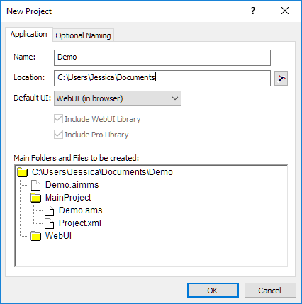

Sharing AIMMS Project Files
===========================

.. meta::
   :keywords: AIMMS, project sharing, folder structure, project files, AIMMS Support
   :description: Guide to AIMMS project folder structure and sharing your project with other developers or AIMMS Support.

This article explains the structure of an AIMMS project folder and provides instructions for sharing your project files with others, such as developers or the AIMMS Support Team.

AIMMS Project Folder Structure
------------------------------

When you create a new AIMMS project, several essential folders and files are generated within the project root folder (named after your project; **Demo** in the example below).

|

The following three files are always created and are essential for opening an AIMMS project:

1. **Demo.aimms**: An executable file that opens the AIMMS IDE when the AIMMS Launcher is installed.
2. **Demo.ams**: The primary model source file containing all identifier declarations in your project. This file is essential for version control to track changes in your model.
3. **Project.xml**: Stores project metadata, including the AIMMS version and links the ``Demo.aimms`` file to the ``Demo.ams`` file. A sample structure is shown below:

   .. code-block:: xml
      :emphasize-lines: 3
      :linenos:

      <?xml version="1.0"?>
      <Project AimmsVersion="24.5.8.5 unicode x64" ProjectUUID="74B0C523-8BD6-4BE1-B50B-66CA17BF886B">
         <ModelFileName>Demo.ams</ModelFileName>
         <AutoSaveAndBackup>
            <DataBackup AtRegularInterval="true" EveryNMinutes="15" NumBackupsDatedToday="3" NumDaysBeforeToday="3" />
         </AutoSaveAndBackup>
      </Project>

   In line 3, ``<ModelFileName>`` should match the ``.ams`` file name. Clicking the ``Demo.aimms`` file loads the corresponding ``Demo.ams`` file in the AIMMS IDE as specified in the ``Project.xml`` file.

If additional libraries are added to the project, they will appear as extra files and folders within the main project folder.

Sharing a Project
-----------------

To share your project with other developers or AIMMS Support, compress the entire project folder (not just the ``.aimms`` file).

1. Right-click the project folder and select :menuselection:`Send to > Compressed (zipped) folder`.
   
   This ZIP file will contain all necessary project files for easy sharing.

   .. note::

      If your project imports data from external sources, like Excel files or databases, consider including a saved data case file. To save a data case, navigate to :menuselection:`Data > Save Case as`.

.. seealso::
      
   * :doc:`../151/151-version-control-aimmspack-backup`
   * :doc:`../145/145-import-export-section`
   * :doc:`../95/95-change-default-ui`
