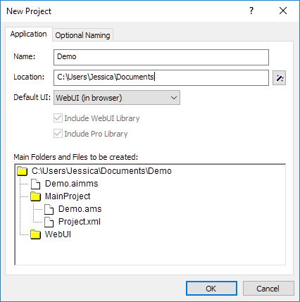

Sharing AIMMS Project Files
===========================

.. meta::
   :keywords: project folder structure, .aimms file, .ams file, Project.xml, version control, project sharing, AIMMS Launcher, AIMMS libraries, Library Manager, collaborative development
   :description: Explains the structure of an AIMMS project folder, the roles of .aimms, .ams, and Project.xml files, how to package and share the project as a ZIP archive, and why libraries are the best way to share model code between developers and projects.

This article explains the structure of an AIMMS project folder and provides instructions for sharing your project files with others, such as developers or the AIMMS Support Team.

AIMMS Project Folder Structure
------------------------------

When you create a new AIMMS project, several essential folders and files are generated within the project root folder (named after your project; **Demo** in the example below).

|

The following three files are always created and are essential for opening an AIMMS project:

1. **Demo.aimms**: An executable file that opens the AIMMS IDE when the AIMMS Launcher is installed.
2. **Demo.ams**: The primary model source file containing all identifier declarations in your project. This file is essential for version control to track changes in your model.
3. **Project.xml**: Stores project metadata, including the AIMMS version and links the ``Demo.aimms`` file to the ``Demo.ams`` file. A sample structure is shown below:

   .. code-block:: xml
      :emphasize-lines: 3
      :linenos:

      <?xml version="1.0"?>
      <Project AimmsVersion="24.5.8.5 unicode x64" ProjectUUID="74B0C523-8BD6-4BE1-B50B-66CA17BF886B">
         <ModelFileName>Demo.ams</ModelFileName>
         <AutoSaveAndBackup>
            <DataBackup AtRegularInterval="true" EveryNMinutes="15" NumBackupsDatedToday="3" NumDaysBeforeToday="3" />
         </AutoSaveAndBackup>
      </Project>

   In line 3, ``<ModelFileName>`` should match the ``.ams`` file name. Clicking the ``Demo.aimms`` file loads the corresponding ``Demo.ams`` file in the AIMMS IDE as specified in the ``Project.xml`` file.

If additional libraries are added to the project, they will appear as extra files and folders within the main project folder.

Sharing a Project
-----------------

To share your project with other developers or AIMMS Support, compress the entire project folder (not just the ``.aimms`` file).

1. Right-click the project folder and select :menuselection:`Send to > Compressed (zipped) folder`.
   
   This ZIP file will contain all necessary project files for easy sharing.

   .. note::

      If your project imports data from external sources, like Excel files or databases, consider including a saved data case file. To save a data case, navigate to :menuselection:`Data > Save Case as`.

A ZIP archive is the right choice for a one-off copy, such as sending a project to AIMMS Support. It is not
the best way to share work between developers on an ongoing basis.

Share Parts of a Project with Libraries
---------------------------------------

The best way to share model code between projects, or between developers working on the same project, is
to use AIMMS libraries.

A library is itself an AIMMS project, kept in its own folder, that you add to other projects through
:menuselection:`File > Library Manager`. Instead of copying files or sending the whole project around, you
share the library folder:

* **Reuse across projects**: functions, procedures and pages placed in a library can be added to any
  project that needs them, and an update to the library reaches every project that uses it.
* **Collaboration**: a large project can be split into several libraries, so that each developer works in
  their own part of the model without editing the same files as everyone else.
* **Clear interfaces**: a library has its own prefix and can expose only a public section, which keeps the
  rest of its contents internal.

Combined with a version control system, libraries are the recommended setup for team development. See
:doc:`../84/84-using-libraries` for how to create and add libraries, and
:doc:`../375/375-library-function-procedure` for how to organize one.

Unpack Before Opening
---------------------

On the receiving end, extract the archive to a real folder before opening anything. Opening the ``.aimms``
file by double-clicking it *inside* Windows Explorer's zip browser produces:

.. code-block:: none

   Main project is not an existing folder.

Explorer's zip browsing makes every file in the archive look directly accessible, but on a double-click it
silently unpacks only that single file to a temporary location and opens it from there. The ``MainProject``
folder and the rest of the project are never unpacked, so when AIMMS looks for them they are not there.

Extracting the whole archive first and opening the ``.aimms`` file from the extracted folder resolves it.

.. seealso::

   * :doc:`../84/84-using-libraries`
   * :doc:`../375/375-library-function-procedure`
   * :doc:`../151/151-version-control-aimmspack-backup`
   * :doc:`../145/145-import-export-section`
   * :doc:`../95/95-change-default-ui`
