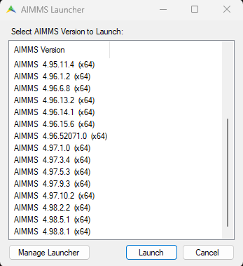
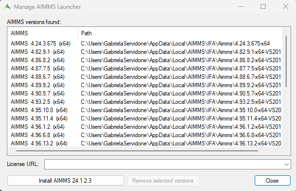

Update the Project's AIMMS Version
====================================
.. meta::
    :description: How to change the AIMMS version of a project.
    :keywords: convert, adapt, update, webui, version, developer, release notes

This article details how to change your project's AIMMS version. In the `Release Notes <https://documentation.aimms.com/release-notes.html>`_ section, 
AIMMS provides details of each change made in each AIMMS version.

Determining the Current AIMMS Version of Project
--------------------------------------------------

Every AIMMS project contains a ``.aimms`` file in the root folder. You can open it as a text file to see its contents. For example:

.. code-block:: XML
    :linenos:
    :emphasize-lines: 2

    <?xml version="1.0"?>
    <References AIMMS_Version="4.96.5.3 (x64)">
        <MainProject Path="MainProject" />
        <Library System="true" Path="AimmsPro" />
        <Library System="true" Path="AimmsWebUI" />
        <RepositoryLibrary UUID="BDF54E1C-AF05-4D77-856C-F3C05F20FFB8" Name="AimmsDEX" Version="2.1.0.7" />
    </References>

On line 2, the AIMMS version of your project is visible. 

Changing to a Newer Version
-----------------------------

First step is to download the `AIMMS Launcher <https://download.aimms.com/aimms/download/data/AIMMSLauncher/AIMMSLauncher-latest.exe>`_. 
With this application, you will be able to manage all AIMMS versions installed on your computer. Once opening it, this pop-up will appear:

|

If you already have the AIMMS version you want to upgrade to, double-click on it. If not, click on ``Manage Launcher``.

| 

Here, you can manage all installed versions or install a new one. 
In this case, `24.1.2.3 <https://documentation.aimms.com/release-notes.html#aimms-24-1-3-release-january-26-2024-build-24-1-3-2>`_ was installed. Click ``Close``. 
Double-click on the newly installed version. 

After selecting the version, AIMMS IDE will open. Select your project and save. Go back to the ``.aimms`` file in the root folder and check if the version is updated. 

.. note::
    If you already have the AIMMS version you would like to update your project to, you can change it directly in the ``.aimms`` file. 

.. spelling:word-list::

    settings

