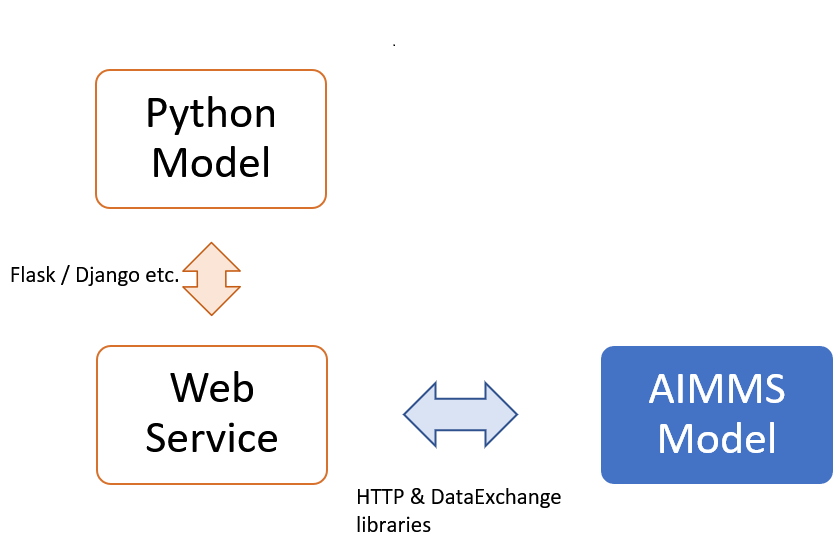
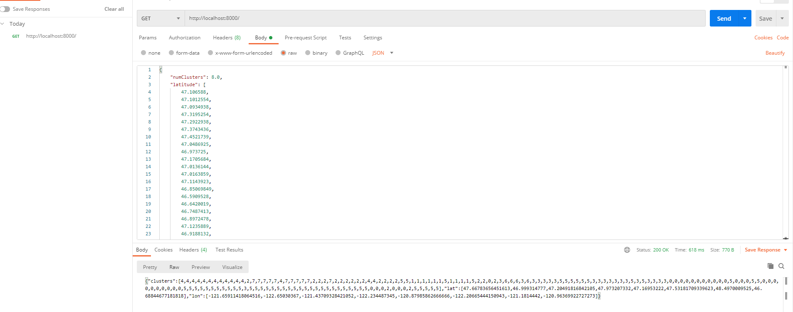

:orphan:

How to connect AIMMS with Python
============================================

.. meta::
   :description: Integrating (data science) models built in Python with your AIMMS applications
   :keywords: python, integration, data science, machine learning, connectivity

The example contains a k-Means clustering model built in Python using scikit-learn which is floated as a REST API using Flask (`app`) and an AIMMS project (`aimmsModel`) which uses the `HTTP <https://documentation.aimms.com/httpclient/index.html>`_ and `DataExchange <https://documentation.aimms.com/dataexchange/index.html>`_ libraries to call the clustering model. We visualize this set up in the below image.

The different steps required are outlined below.

#. Develop your model in Python as usual. 
In this case, function ``mykMeans`` in `app/kmeansClust.py` takes coordinate data (latitude and longitude) as input and returns coordinates of the centroids and to which centroid do each individual input points belong to.
#. Expose this function as an API. 
Here we use Flask to float ``mykMeans`` in `app/main.py`.
#. Use the DataExchange library to construct AIMMS procedures which read and write JSON files (or CSV/XML) compatible with the function in Step 1. 
``prWriteJSON`` and ``prReadJSON`` use the mapping files in `aimmsModel/apiCalls` to exchange data between AIMMS and the API using JSON files.
#. Use the HTTP library functions to call the API built in Step 2 from AIMMS. 
Procedure ``prCallAPI`` uses the HTTP library functions to call the API floated in Step 2 and the data I/O procedures built in Step 3.
#. (Optional) If you are developing both the Python and AIMMS models, you could write some data transformation functions in Python for ease of use. 
`app/dataio.py` contains three such functions.

Installing prerequisites
----------------------------

We assume you have Python3 installed already. 

.. tip:: 
    It is usually recommended to create a virtual environment so that your local Python installation is not changed. So use ``py -3 -m venv env`` to start a virtual environment. 
    `Read more on Python.org <https://packaging.python.org/guides/installing-using-pip-and-virtual-environments/>`_

This example requires the packages ``scikit-learn`` and ``Flask`` as outlined in the file `app/requirements.txt`. You can install these packages by using the commandline prompt::

    pip install -r requirements.txt --user

Another useful tool to have is `Postman <https://www.postman.com/downloads/>`_ which lets you send API requests. We will use this tool to test our API.

The Python model
--------------------

`app/kmeansClust.py` has the function ``mykMeans`` which takes in the number of clusters ``numClusters`` and latitude-longitude data ``coordData`` and fits a 
`KMeans model <https://scikit-learn.org/stable/modules/generated/sklearn.cluster.KMeans.html#sklearn.cluster.KMeans>`_. The input data is retrieved from a JSON file by the function ``dataForCluster`` in `app/dataio.py`.

.. literalinclude:: pyExample/input.json
    :language: JSON
    :lines: 1-5, 166-169, 330-333
    :caption: Note that only some rows are displayed here

``dataForCluster`` in `app/dataio.py` simply transforms the arrays ``latitude`` and ``longitude`` into an array of tuples.

.. literalinclude:: pyExample/app/dataio.py
    :language: python
    :lines: 9-15
    :lineno-start: 9

In `app/main.py`, we use Flask modules and methods to float ``mykMeans`` as a web routine.

.. literalinclude:: pyExample/app/main.py
    :language: python
    :lines: 1-11, 18-19
    :linenos:

Running locally 
""""""""""""""""""

If you run the `app/main.py` in terminal (using ``python main.py``), Flask will start a local web server and the function ``mykMeans`` can be called as an API using the url http://localhost:8000/ or http://0.0.0.0:8000/ .

You can now use the Postman app to call this API by pasting the contents of `input.json` in the Body attribute as shown below. It will return the output of ``mykMeans`` as a JSON object.

The AIMMS model
------------------

The AIMMS project `aimmsModel` has the identifiers ``pLatitude(iLoc)``, ``pLongitude(iLoc)`` and ``pNumClusters`` which we need to write in a format similar to `input.json`. 

Data I/O
""""""""""""
``prWriteJSON`` creates the input file as the Python model expects and ``prReadJSON`` reads the result file into AIMMS. ``prWriteJSON`` uses the mapping file `aimmsModel/apiCalls/outMap.xml` to create this `input.json` file. 

.. code-block:: aimms

    spOutFile := "input.json";
    spMapName := "outMap";
    spMapFile := "apiCalls//outMap.xml";

    dex::AddMapping(spMapName , spMapFile);

    dex::WriteToFile(
	    dataFile    : spOutFile , 
	    mappingName : spMapName , 
	    pretty      :  1);

.. note:: It is not necessary that the `pretty` argument for ``dex::WriteToFile`` is set to 1 but it helps with readability of the json file, which is particularly helpful during development.

.. literalinclude:: pyExample/aimmsModel/apiCalls/outMap.xml
    :language: xml
    :lines: 1-6
    :linenos:
    :emphasize-lines: 3-5

``ObjectMapping`` initializes a key-value tree inside which ``ValueMapping`` is the first node which holds the scalar parameter ``pNumClusters``. To write out indexed AIMMS identifiers, we can use the ``ArrayMapping`` like in line #4 which writes out ``pLatitude`` as an array value to the key `latitude`.

Similarly, ``prReadJSON`` will use the mapping file `aimmsModel/apiCalls/inMap.xml` to load the output of ``mykMeans`` into AIMMS identifiers ``pCluster(iLoc)``, ``pCenLat(iCentroid)`` and ``pCenLon(iCentroid)``.

.. literalinclude:: pyExample/aimmsModel/apiCalls/inMap.xml
    :language: xml
    :lines: 1-8
    :linenos:
    :emphasize-lines: 4, 7

Note the difference between the first mapping (for ``pCluster``) and the remaining two. ``iterative-existing=1`` is added to the map of ``pCluster`` because the elements ``iLoc`` already exist, whereas for the other two - we are letting the DataExchange library create new elements in the set ``sCentroids``.

Calling the API
"""""""""""""""""""

Now we simply use the HTTP library functions to make a GET call to the API created in the previous section as shown in procedure ``prCallAPI``.

.. code-block:: aimms
    :linenos:
    :emphasize-lines: 8-11
    :lineno-start: 2

    !starting request
    web::request_create(requestId : spReqID );
    web::request_setURL(spReqID, spURL);
    web::request_setMethod(spReqID, "GET");
    !as we want to send data in a file. Set 2nd argument to 'None' if you only need to pass a scalar value
    web::request_setRequestBody(spReqID, 'File', spOutFile);
    !as we want to send a json file and default expectation is a txt file
    web::request_getHeaders(spReqID, spRequestHeaders);
    spRequestHeaders['Content-Type'] := "application/json";
    web::request_setHeaders(spReqID, spRequestHeaders);
    web::request_setResponseBody(spReqID, 'File', spInFile);

Make sure that the url in ``spURL`` includes the appropriate `http://` or `https://` prefix. 

Deployment
-------------

When the `app/main.py` file is run in terminal, a warning is displayed. 

.. image:: flask.png
    :align: center

The app server running on http://localhost:8000 or http://0.0.0.0/8000 is available on your local machine and your AIMMS Developer instance but what about apps deployed to AIMMS PRO ? If your AIMMS PRO server is also running on the same machine, this Python model can be still be accessed using the same URLs. 
However, that is **not a viable option** if you are using AIMMS Cloud and in addition to that Flask recommends that you don't use their development server for deployment and some deployment options are discussed on `their project website <https://flask.palletsprojects.com/en/1.1.x/deploying/>`_.

We discuss another deployment option using `Docker <https://www.docker.com/>`_. The download includes a `Dockerfile` that you can use to create a Docker image. 
You will need to install `Docker Desktop <https://www.docker.com/products/docker-desktop>`_ on your computer. 

The below commandline prompts will build a Docker image of the name `imageName:latest` and start a container. Read more about these options in `Docker Docs <https://docs.docker.com/engine/reference/commandline/build/>`_

.. code-block:: none

    docker build --pull --rm -f "Dockerfile" -t imageName:latest "."

    docker run -d -p 8000:8000 --name "containerName" imageName

The option ``-p 8000:8000`` exposes the port 8000 for the docker container and our AIMMS app can still access the Python model at http://localhost:8000/. 

