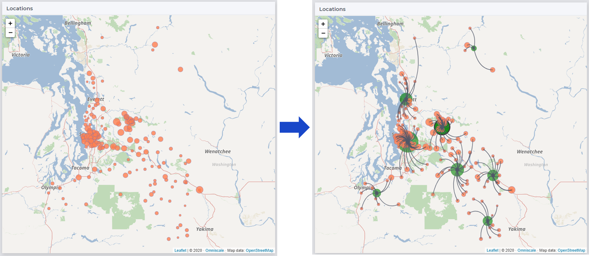
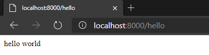
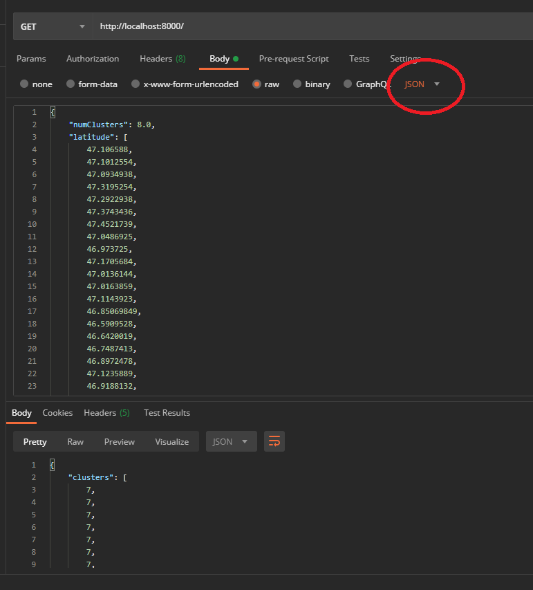
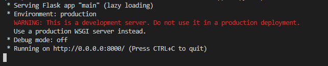

.. warning:: 
   Please note that the documentation you are currently viewing is for an older version of our technology. 
   While it is still functional, we recommend upgrading to our latest and more efficient option to take advantage of all the improvements we've made.
   
Integrate AIMMS with Python
============================================

.. meta::
   :description: Integrating (data science) models built in Python with your AIMMS applications
   :keywords: python, integration, data science, machine learning, connectivity

This article is part of a series of examples on how to connect AIMMS with models built in Python or R. 
If you have not already, read :doc:`Connecting AIMMS with Data Science Models <../494/494-overview-aimms-ds-models>` before continuing. 

In this article, we will show how to integrate an AIMMS app with a KMeans clustering model built in Python using `scikit-learn <https://scikit-learn.org/stable/modules/clustering.html#k-means>`_.
The clustering model is used to identify centroids/centers of gravity in the network of nodes as shown below. 

|

You can read more about how participants used clustering algorithms and MIP to solve a supply chain problem on our community: `AIMMS MOPTA 2020 Results <https://community.aimms.com/what-s-new-at-aimms-26/team-np-die-hard-from-university-of-edinburgh-wins-the-12th-aimms-mopta-optimization-modeling-competition-712>`_.

Example and Prerequisites
----------------------------

The example AIMMS project and Python modules we will refer to in this article can be downloaded :download:`from here<model/pyExample.zip>`.
The download contains:

    #. **aimmsModel**: The AIMMS project folder which is initialized with geographical nodes around the Greater Seattle area. 
    #. **app**: The Python work directory which contains the KMeans model along with modules required for deploying the model as a web service using Flask.
    #. **requirements.txt**: The list of Python packages required.
    #. **Dockerfile**: A docker file you can use to create an image (more later). 

.. _installation:

Installing Prerequisites
"""""""""""""""""""""""""""
In addition to the prerequisites outlined in :ref:`scripting-tools`, you will need to install the below for this example. 

#. The example project is developed using AIMMS version 4.82.6, so we recommend you use at least that version. `Download AIMMS Developer <https://www.aimms.com/support/downloads/#aimms-dev-download>`_. 
#. The Python modules in the example are developed in `Python 3.8 <https://www.python.org/downloads/release/python-386/>`_.

    .. tip:: 
        It is usually recommended to create a virtual environment so that your local Python installation is not changed. 
        
        Use ``py -3 -m venv env`` to start a virtual environment. `Read more on Python Docs <https://docs.python.org/3/library/venv.html>`_

#. This example requires the packages ``scikit-learn`` and ``Flask`` as outlined in the file ``requirements.txt``. You can install these packages by using the command line prompt::
    
    pip install -r requirements.txt --user

The Python Model
--------------------

``app/kmeansClust.py`` has the function ``mykMeans`` which takes in the number of clusters ``numClusters`` and latitude-longitude data ``coordData`` and fits a 
`KMeans model <https://scikit-learn.org/stable/modules/generated/sklearn.cluster.KMeans.html#sklearn.cluster.KMeans>`_. 
A sample input file is provided in ``app/input.json``. Note that only some rows are displayed below.

.. literalinclude:: model/pyExample/app/input.json
    :language: JSON
    :lines: 1-5, 166-169, 330-333

``app/dataio.py`` contains functions which prepare the data for consumption by ``myKmeans`` and our AIMMS project. 
For example, ``dataFromCluster`` retrieves data from the input.JSON and simply transforms the ``latitude`` and ``longitude`` arrays into an array of tuples.

In ``app/main.py``, we use the Flask package to expose different Python functions as APIs.

.. literalinclude:: model/pyExample/app/main.py
    :language: python
    :linenos:
    :emphasize-lines: 15

In this example, we have two APIs differentiated by the first argument of ``@app.route`` calls. 

#. ``/hello`` will return "hello world". A simple test case. 
#. ``/`` will run the input JSON file through the ``myKmeans`` function and return the output as a JSON file. 

Running Locally 
""""""""""""""""""

If you run the ``app/main.py`` in terminal (using ``python main.py``), Flask will start a local web server. 
You can test this server by typing in the URL ``http://localhost:8000/hello`` in your browser. 

|

Now, testing the clustering function/API in a browser is not as straightforward as this one requires input data in the JSON format (as highlighted in line 15 in the above code-block).
We will use the Postman app to call this API by pasting the contents of ``input.json`` in the Body attribute as shown below. 
It will return the output of ``mykMeans`` as a JSON object.

.. note:: The clustering method in ``main.py`` has been updated to use "POST" instead of "GET" as displayed in the below screenshot.

|

Make sure to set the attributes in the Body tab as highlighted in the image. 

The AIMMS Model
------------------

The AIMMS project ``aimmsModel`` has the identifiers ``pLatitude(iLoc)``, ``pLongitude(iLoc)`` and ``pNumClusters`` which we need export in a format similar to ``input.json``. 

Data I/O
""""""""""""
``prWriteJSON`` creates the input file as the Python model expects and ``prReadJSON`` reads the result file into AIMMS. 

.. code-block:: aimms
    :linenos:

    spOutFile := "input.json";
    spMapName := "outMap";
    spMapFile := "apiCalls//outMap.xml";

    dex::AddMapping(spMapName , spMapFile);

    dex::WriteToFile(
	    dataFile    : spOutFile , 
	    mappingName : spMapName , 
	    pretty      :  1);

.. note:: It is not necessary that the `pretty` argument for ``dex::WriteToFile`` is set to 1 but it helps with readability of the json file, which is particularly helpful during development.

``prWriteJSON`` uses the mapping file ``aimmsModel/apiCalls/outMap.xml`` to create this ``input.json`` file. 

.. literalinclude:: model/pyExample/aimmsModel/apiCalls/outMap.xml
    :language: xml
    :lines: 1-6
    :linenos:
    :emphasize-lines: 3-5

``ObjectMapping`` initializes a key-value tree inside which ``ValueMapping`` is the first node which holds the scalar parameter ``pNumClusters``. To write out indexed AIMMS identifiers, we can use the ``ArrayMapping`` like in line 4 which writes out ``pLatitude`` as an array value to the key ``latitude``.

Similarly, ``prReadJSON`` will use the mapping file ``aimmsModel/apiCalls/inMap.xml`` to load the output of ``mykMeans`` into AIMMS identifiers ``pCluster(iLoc)``, ``pCenLat(iCentroid)`` and ``pCenLon(iCentroid)``.

.. literalinclude:: model/pyExample/aimmsModel/apiCalls/inMap.xml
    :language: xml
    :lines: 1-8
    :linenos:
    :emphasize-lines: 4, 7

Note the difference between the first mapping (for ``pCluster``) and the remaining two. ``iterative-existing=1`` is added to the map of ``pCluster`` because the elements ``iLoc`` already exist in our project, whereas for the other two - we are letting the DataExchange library create new elements in the set ``sCentroids``.
Read more in `AIMMS Docs <https://documentation.aimms.com/dataexchange/mapping.html#the-iterative-binds-to-attribute>`_.

Calling the API
"""""""""""""""""""

Now we simply use the HTTP library functions to make a GET call to the API created in the previous section as shown in procedure ``prCallAPI``.

.. code-block:: aimms
    :linenos:
    :emphasize-lines: 8-11
    :lineno-start: 2

    !starting request
    web::request_create(requestId : spReqID );
    web::request_setURL(spReqID, spURL);
    web::request_setMethod(spReqID, "POST");
    !as we want to send data in a file. Set 2nd argument to 'None' if you only need to pass a scalar value
    web::request_setRequestBody(spReqID, 'File', spOutFile);
    !as we want to send a json file and default expectation is a txt file
    web::request_getHeaders(spReqID, spRequestHeaders);
    spRequestHeaders['Content-Type'] := "application/json";
    web::request_setHeaders(spReqID, spRequestHeaders);
    web::request_setResponseBody(spReqID, 'File', spInFile);

The highlighted lines 9-12 are equivalent to setting the body attributes in the Postman app. 
Make sure that the URL in ``spURL`` includes the appropriate ``http://`` or ``https://`` prefix. 

Deployment
-------------

When the ``app/main.py`` file is run in terminal, a warning is displayed. 

|

The app server running on http://localhost:8000 or http://0.0.0.0/8000 is available on your local machine and to your AIMMS Developer instance but what about apps deployed to AIMMS PRO On-Premise or AIMMS Cloud? 

However, that is **not a viable option** if you are using AIMMS Cloud. 

Some deployment options relevant to Flask are discussed on `their project website <https://flask.palletsprojects.com/en/1.1.x/deploying/>`_.

We will however discuss deploying this web app using Docker, which is in fact similar to (or uses the same principles) some of the options discussed in the above link. 

.. literalinclude:: model/pyExample/Dockerfile
    :language: docker
    :linenos:
    :emphasize-lines: 7-8, 11-12

The image built using this Dockerfile uses `Tiangolo's nginx server <https://github.com/tiangolo/uwsgi-nginx-flask-docker/blob/master/docker-images/python3.8.dockerfile>`_ as a base and it comes with Python 3.8 already installed. 
Lines 7-8 copy the Python modules we developed onto the base image and lines 11-12 install the packages required from the ``requirements.txt`` file. 
The Dockerfile is basically automating the installation of prerequisites as outlined in :ref:`installation`.

The below command line prompts will build a Docker image of the name ``imageName:latest`` and start a container. 
Most text editors or IDEs (such as VS Code or PyCharm) have a Docker plugin now.
Read more about these options in `Docker Docs <https://docs.docker.com/engine/reference/commandline/build/>`_.

.. code-block:: none

    docker build --pull --rm -f "Dockerfile" -t imageName:latest "."

    docker run -d -p 8000:8000 --name "containerName" imageName

Now, we can use the same URLs ``http://localhost:8000/`` or ``http://localhost:8000/hello`` to access the Flask APIs, the only difference being they are hosted on Docker Desktop instead of Flask's development server. Once you deploy this Docker image, your API will be available globally.

