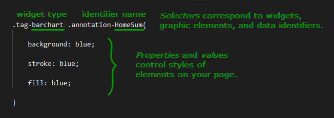
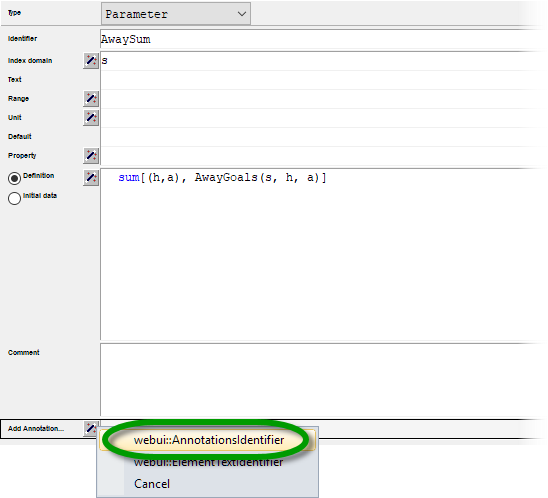
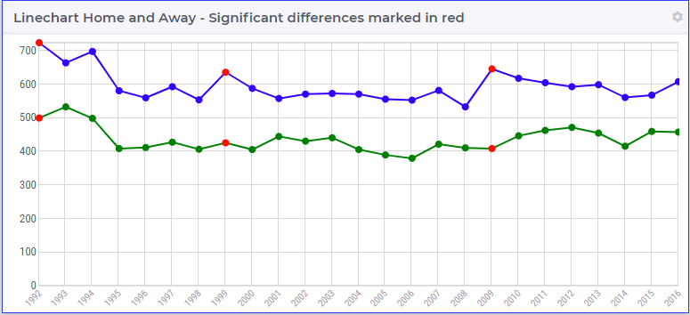

.. BEGIN CONTENT

Change Widget Styles with CSS
===================================
.. meta::
   :description: How to change colors with CSS in AIMMS WebUI widgets.
   :keywords: css, widget, webui, color, line, chart
   
.. todo:: Clarify difference between AIMMS set elements and HTML elements.

This article uses the `Line Chart <https://documentation.aimms.com/webui/line-chart-widget.html>`_ as an example to show how CSS styling can be applied to WebUI widgets.

In AIMMS WebUI, you can customize the appearance of elements using CSS. The general format for naming and styling elements in CSS is shown in the example below.

|

Use as many of the selectors (such as ``.tag-barchart`` or ``.annotation-HomeSum``) as needed to specify when to apply the rule in the declaration (between curly brackets). 

Using more selectors makes the rule more specific. Using fewer selectors makes the rule more general.

Styling to Highlight Information
--------------------------------

First the question: why would we want to add styling? Consider the following image of two lines in a line chart. 

.. image:: images/Linechart-no-styling.png
    :align: center 

|

I don't know about you, but I have to look twice to see that the lines have a different color. So to make it easier for the viewer of such charts, I may want to add styling to highlight differences.

.. image:: images/Linechart-identifier-styling.png
    :align: center 

|

This is achieved using the following css code:

.. code-block:: none
    :linenos:

    .tag-linechart[data-widget\.uri="Linechart_HomeAway_IdentifierStyling"] path.annotation-p_HomeSum{
            stroke: blue;
    }

    .tag-linechart[data-widget\.uri="Linechart_HomeAway_IdentifierStyling"] circle.annotation-p_HomeSum{
            stroke: blue;
            fill: blue;
    }

    .tag-linechart[data-widget\.uri="Linechart_HomeAway_IdentifierStyling"] path.annotation-p_AwaySum{
            stroke: green;
    }

    .tag-linechart[data-widget\.uri="Linechart_HomeAway_IdentifierStyling"] circle.annotation-p_AwaySum{
            stroke: green;
            fill: green;
    }

Line 1, the first selector, consists of the following portions:

#. ``.tag-linechart`` The widget type

#. ``[data-widget\.uri="Linechart_HomeAway_IdentifierStyling"]`` The identification of the individual widget.

#. ``path`` This is the element type that is styled in the line chart. The other element type is the ``circle``.

#. ``.annotation-p_HomeSum`` This selects element within the line chart that are used to display the identifier ``p_HomeSum``. 

Styling Options for Linecharts
------------------------------

The tables below reference some of the CSS selectors and properties that apply to Line Chart Widgets.

+-----------------------------------------------------+-------------------------------------------------+
|CSS Selector                                         | Widget/Element Description                      |
+=====================================================+=================================================+
| ``.tag-linechart``                                  | defines the widget type (line chart)            |
+-----------------------------------------------------+-------------------------------------------------+
| ``.tag-linechart[data-widget\.uri="<widgetname>"]`` | defines a widget by name                        |
+-----------------------------------------------------+-------------------------------------------------+
| ``.circle``                                         | defines the element (data points)               |
+-----------------------------------------------------+-------------------------------------------------+
| ``.path``                                           | defines the element (lines between data points) |
+-----------------------------------------------------+-------------------------------------------------+
| ``.annotation-<identifiername>``                    | defines an identifier represented in the widget |
+-----------------------------------------------------+-------------------------------------------------+

You'll also need to know the *properties* that can be controlled to customize the appearance of elements.

+-------------------------------------------+-----------------------------------------------+
|CSS Property                               | Element Description                           |
+===========================================+===============================================+
| ``background: <color>``                   | controls the background color of lines/points |
+-------------------------------------------+-----------------------------------------------+
| ``stroke: <color>``                       | controls the stroke color of lines/points     |
+-------------------------------------------+-----------------------------------------------+
| ``fill: <color>``                         | controls the fill color of lines/points       |
+-------------------------------------------+-----------------------------------------------+
| ``stroke-width: <line width in pixels>``  | controls the line thickness                   |
+-------------------------------------------+-----------------------------------------------+
| ``stroke-dasharray:                       | makes a dashed line                           |
| <dash length in pixels>``                 | controls dash length                          |
|                                           | (only applies to lines in a line chart)       |
+-------------------------------------------+-----------------------------------------------+

Identifying Elements
----------------------

You need to know the *selectors* that the CSS file uses to identify particular widgets and elements in your WebUI page. 

A quick way to discover this is to right-click the widget in your web browser and click *Inspect*. You will see the source HTML code and CSS rules related to this element. This can help you to edit or write new rules in the CSS for particular elements. For instance, on a circle, you may get:

.. image:: images/AnnotatinInfoCircle.png
    :align: center 

|

Identifying circles by identifier, does not allow us to select a sub selection of circles.  
To facilitate this, AIMMS provides the option to add annotations to identifiers displayed in the WebUI.   

Let's continue our example, by asking ourselves in which seasons there was a significant, say more than 200, difference between home and away goals.

#. Add a string parameter (``yourAnnotation``) to your declaration with the desired annotation name (``whatever``) for its definition. 

We can model this by the string parameter: 

.. code-block:: aimms

    StringParameter sp_SignificantDiff {
        IndexDomain: i_Season;
        Definition: {
            if abs( p_AwaySum(i_Season) - p_HomeSum(i_Season) ) > 200 then
                "SignificantDiff"
            else
                ""
            endif
        }
    }
    
#. Then, in the attribute form of the identifier, add an annotation with ``webui::AnnotationsIdentifier`` and reference the string parameter you created. 

You'll also need to assign *annotations* to data identifiers you want to style in the CSS.

    
.. code-block:: aimms

    Parameter p_AwaySum {
        IndexDomain: i_Season;
        Comment: "Yearly sum of goals playing away";
        webui::AnnotationsIdentifier: sp_SignificantDiff;
    }

#. Reference the element in your style sheet, with a selector (``.annotation-whatever``). 

.. code-block:: none
    :linenos:

    .tag-linechart[data-widget\.uri="Linechart_HomeAway_ElementStyling"] circle.annotation-p_HomeSum.annotation-SignificantDiff{
            stroke: red;
            fill: red;
    }

    .tag-linechart[data-widget\.uri="Linechart_HomeAway_ElementStyling"] circle.annotation-p_AwaySum.annotation-SignificantDiff{
            stroke: red;
            fill: red;
    }

|

    :download:`AIMMS project download of the above example <downloads/LineChartWidgetStyling.zip>` 

    :download:`AIMMS project download for cell coloring in a table <downloads/CellColoring.zip>` 

.. seealso::

    * `Widget Options <https://documentation.aimms.com/webui/widget-options.html>`_
    * `Line Chart Widget <https://documentation.aimms.com/webui/line-chart-widget.html>`_
    * `CSS Styling <https://documentation.aimms.com/webui/css-styling.html>`_
    * `Data-Dependent Styling <https://documentation.aimms.com/webui/css-styling.html#data-dependent-styling>`_

.. END CONTENT

