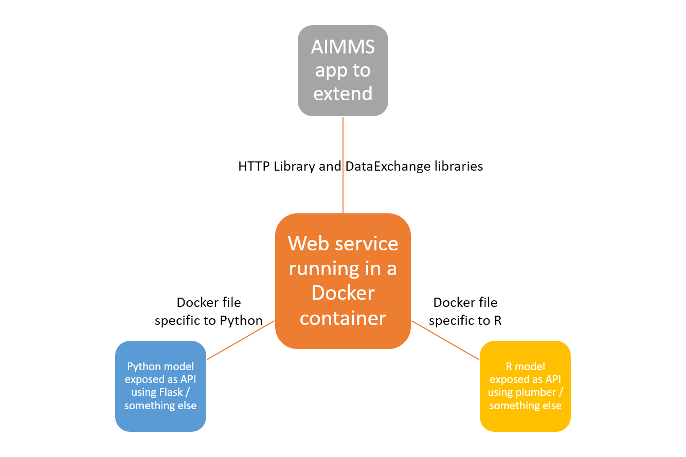

How to Integrate AIMMS with Models Built in Languages like Python or R
==================================================================================

.. meta::
   :description: Integrating (data science) models built in Python with your AIMMS applications
   :keywords: python, integration, data science, machine learning, connectivity

The usage of both optimization and machine learning algorithms in decision support applications is growing steadily. One example is to use a forecasting model to predict the expected demand and provide that as an input to a MIP model. 
Python and R are two of the most popular languages used in the data science community for developing algorithms like predictive models, clustering models etc. 
AIMMS is optimized for the development of apps based on MIP models and in this article, we will show you how to empower your AIMMS apps with machine learning models built in these other languages. This will let you leverage the availability of libraries like `scikit-learn <https://scikit-learn.org/stable/index.html>`_, `NumPy <https://numpy.org/>`_, `Tidyverse R packages for data science <https://www.tidyverse.org/>`_ and others in AIMMS as well. 

Overview
-----------

:doc:`The HTTP Library section </C_Developer/Sub_Connectivity/sub_http/index>` contains examples like :doc:`Call Google Maps API <../296/296-obtaining-geographic-data-through-the-google-api>` which show how to call web services in AIMMS. 
We will use the same principles to extend an AIMMS app with models built in Python or R by exposing those models as web services. 

We will publish a series of how-to articles explaining how AIMMS apps can be extended with models built in Python or R. 
While our examples will be limited to these two languages at this moment of time, we believe the same principles can be extended to most other languages used by the data science community (such as Julia). 
There are many libraries/packages available in both Python and R to deploy models as web services. The choice of libraries/packages used by our team is arbitrary. 

.. note:: These articles are not intended as a tutorial/endorsement for using any particular package or software tool. We show just one of many ways of creating web services in Python/R. Choose an architecture that best fits your needs and/or the skill set available in your team.

A diagram of the architecture we will use in our examples is shown below. 

The different steps in this process are as below:

#. Develop the model in Python/R as usual.
#. Expose the model as a web service (eg. a REST API) which takes in input data from the client and returns the model results. `Flask in Python <https://flask.palletsprojects.com/en/1.1.x/>`_ and `Plumber in R <https://www.rplumber.io/>`_ are example libraries that could be used for this purpose. 
#. Use the `DataExchange library <https://documentation.aimms.com/dataexchange/index.html>`_ to construct AIMMS procedures which read and write JSON files (or CSV/XML) compatible with the model built in Step 1. 
#. Use the `HTTP library <https://documentation.aimms.com/httpclient/index.html>`_ functions to call the API built in Step 2 from AIMMS. This step will use the AIMMS procedures in Step 3 to prepare the data for the API and retrieve the results back into AIMMS.
#. (Optional) If there are numerous use cases, it could be helpful to maintain a library of functions in Python/R/AIMMS to facilitate the data transformations. 

By following the above steps, you can have your Python/R model available as a local web service running on your computer. 
.. There are many ways to deploy this to have global access, using Docker is one of them and will be discussed further below. 

.. _scripting-tools:

Development Tools
---------------------

#. `Postman <https://www.postman.com/downloads/>`_ is a useful tool to have while working with APIs. It acts an API client letting you easily send REST API requests. You will use this tool to test the API.
#. `Docker Desktop <https://www.docker.com/products/docker-desktop>`_ is a tool for building and running containerized applications. You will use this tool to deploy your API by building a docker image. 

Deployment
--------------

When creating an API using libraries like Flask or Plumber, the API will be running on your local machine and can be accessed at an address like - ``http://localhost:8000/``. 
You can access this URL in your browser or in Postman, AIMMS or any other application acting as an API client.  

If your AIMMS PRO server is also running on the same machine, the API can be still be accessed using the same URLs. However, it is very uncommon that a model developer is using a machine that hosts the AIMMS PRO server for development as well. 
In addition to that, this is **not a** viable option if your AIMMS app is published on AIMMS Cloud. 
To make this possible, you will need to deploy the API as well so that is accessible through a global URL instead of just a local one. 

One way of such deployment is to containerize the API using Docker. 
A benefit of using docker is that once you have a Docker image, you can use it to run/deploy the API in multiple ways. 

#. Run locally using Docker Desktop
#. Deploy on-premise with `Kubernetes <https://www.docker.com/products/kubernetes>`_
#. Deploy on Microsoft Azure as an `App Service / Web App <https://docs.microsoft.com/en-us/azure/devops/pipelines/apps/cd/deploy-docker-webapp?view=azure-devops&tabs=python>`_
   or other cloud offerings like `AWS ECS <https://aws.amazon.com/getting-started/hands-on/deploy-docker-containers/>`_ and `Google Cloud <https://cloud.google.com/compute/docs/containers/deploying-containers>`_. 

The image also contains all the dependencies of your Python/R model, so any computer with Docker Desktop installed can run it. 
We decided to explore the usage of Docker in our examples to take advantage of this reproducibility and flexibility. 

Examples
------------

#. Using scikit-learn's KMeans clustering in an AIMMS app to find centers of gravity in a demand network: :doc:`Connecting AIMMS with Python <../487/487-aimms-with-python>`.
#. Create a Sankey Diagram using R to visualize network flows in an AIMMS app: *coming soon*

