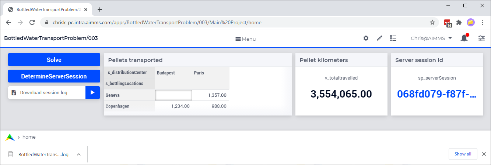

Download Server Session Log
=============================

This article explains how to obtain the session log file of a solver session ran on an AIMMS PRO On-Premise.

.. note:: 

    The AIMMS log files are created by AIMMS staff and designed to be interpreted by AIMMS staff. 
    The meaning of log entries may not be obvious. 
    An error or warning message in the log file does NOT necessarily indicate a problem in the application. 

Running Example
-----------------

The AIMMS project that contains the example can be :download:`downloaded here <model/downloadBottledWater.zip>`.

This example contains a small transport problem as an example: transporting pallets of bottled water.

Operating the Example
----------------------

After publishing the application, you can in sequence:

1.  Solve the mathematical program.

2.  Determine the session id of the solver session just ran.

    In the example supplied, the session id of the last solver session ran is obtained via:

    .. code-block:: aimms
        :linenos:

        sp_serverSession := pro::session::CurrentSession();

    The procedure ``pro::sessionmanager::ListSessionSinceDate`` also provides a set of session id's.

3.  Download the session log. As the WebUI data session is running locally on the host of the AIMMS PRO server, it has access to this session log file.

|

Explaning the Download Code
--------------------------------

AIMMS PRO On-Premise stores the session logs in the folder ``%AIMMSPRO_DATADIR%\Log\Sessions``.
The session names are part of the names of the log file. 

Perhaps interesting is that using AIMMS PRO 2.34 and newer, session logs are named such that it is clear from the session name:

#.  the application

#.  the type of session (solver, data, verify)

#.  the moment started

The above is sufficient to write code to copy the session log first in the project folder, and then to download it to you download folder. 
This code detailed in the next section, and in the last section it is explained how to integrate in your own application. 

.. tip:: As an admin you can trigger the elaborate naming of session log files by pressing the buttons ``Restore all to defaults`` and ``Save settings`` in the tab ``Configuration > Log Management`` of the AIMMS PRO portal.

As a first step, the complete filename of the session log is determined.

.. code-block:: aimms
    :linenos:

    EnvironmentGetString(
        Key   :  "AIMMSPRO_DATADIR", 
        Value :  sp_proDataDir);
    sp_sessionLogDir := sp_proDataDir + "\\Log\\Sessions";
    
    DirectoryGetFiles(
        directory       :  sp_sessionLogDir, 
        filter          :  "*.log", 
        filenames       :  sp_filenames(i_fileNumber), 
        recursive       :  0);

    ep_logFileNo := first( i_fileNumber | findString(sp_filenames(i_fileNumber), sp_serverSession ) );
    if ep_logFileNo then
        sp_baseSessionLogFilename := sp_filenames(ep_logFileNo) ;
        sp_originalSessionLogfileLocation := sp_sessionLogDir + "\\" + sp_baseSessionLogFilename ;
    else
        sp_originalSessionLogfileLocation := "" ;
        raise warning "session log file for " + sp_serverSession + " not found." ;
    endif ;

Remarks on the above code:

* Line 1-4: Obtain the session log folder.

* line 6-10: Get a list of all session log files.

* Line 12: Determine the log file that contains the session id as part of its name.

* Line 14,15: Construct full path of the log file for the session at hand.

As a second step, copy the file to the project folder, then in the download template.

.. code-block:: aimms
    :linenos:

    pr_getSessionLogFile(sp_serverSession, sp_baseSessionLogfilename, sp_originalSessionLogfileLocation);
    fileLocation := sp_baseSessionLogfilename ;
    FileCopy( sp_originalSessionLogfileLocation, fileLocation );

    sp_FileProcessSpecificFileName := webui::GetIOFilePath(FileLocation);
    if fileLocation <> sp_FileProcessSpecificFileName then
        fileCopy( fileLocation, sp_FileProcessSpecificFileName );
    endif ;

    StatusCode := webui::ReturnStatusCode('CREATED');
    StatusDescription := "Nice.";

Remarks on the above code:

* Line 1: obtain the filename of the solver session log from the session id (see the first step discussed above).

* Line 3: Copy the session log file to the project folder

* Line 7: Copy the session log file to the process specific temporary folder. This is the folder where files are downloaded from.

Integration in your own Application
-----------------------------------

The code explained and demoed above is contained in a separate section named: ``Download server session log`` of download offered above.
See the article `"Export Code to Another Project" <https://how-to.aimms.com/Articles/145/145-import-export-section.html>`_ for copying the code to your project.
Once you've copied the code, you need to add the following widgets:

#.  button to obtain the session id, 

#.  download button to actually download the session log file.

