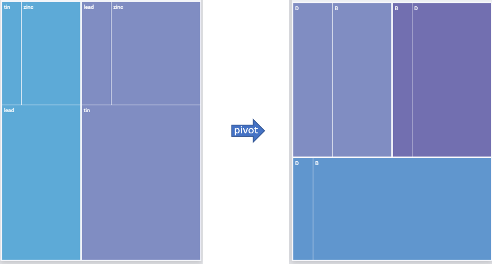
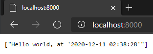

Integrate AIMMS with R
============================================

.. meta::
   :description: Integrating (data science) models built in R with your AIMMS applications
   :keywords: r, integration, data science, machine learning, connectivity, tidyverse, rstats, sankey

.. |sankeyHTML| replace:: :download:`View interactive version here<sankey.html>`

.. |blendingProblem| replace:: :doc:`Blending problem <../454/454-ChemicalEngineering-blendingproblem>`

This article is part of a series of examples on how to connect AIMMS with models built in Python or R. 
We recommend you read both :doc:`Connecting AIMMS with Data Science Models <../494/494-overview-aimms-ds-models>` and :doc:`How to connect AIMMS with Python <../487/487-aimms-with-python>` before continuing. 

In this article, we will show how to extend an AIMMS app with a R model that generates a Sankey diagram using the `networkd3 <https://www.rdocumentation.org/packages/networkD3/versions/0.4>`_ package. The R model is exposed as a REST API using the `Plumber package <https://www.rplumber.io/index.html>`_.

Example 
------------

We will use an implementation of the |blendingProblem|, a classic application of linear programming.
The objective is to find what composition of alloys should be blended together to make a final alloy with the required properties, minimizing cost. 
The model outputs the % composition of the final alloy - x% of Alloy A, y% of Alloy B, and so on. 
For example, using the provided data - a 60% Alloy B and 40% Alloy D mixture is the optimal way to create an alloy with 30% lead, 30% zinc, and 40% tin.

This breakdown can already be visualized in AIMMS WebUI using the `treemap widget <https://documentation.aimms.com/webui/tree-map-widget.html>`_. 

    
    Colors represent (a) alloys in the left image and (b) elements in the right image.

We can also visualize the same data in a `Sankey diagram <https://en.wikipedia.org/wiki/Sankey_diagram>`_, which are typically used to visualize flows in multi-level networks. 
A `sankey widget` is not available in AIMMS and, instead of building a custom widget - one could use R (or Python) to generate the sankey diagram as an image. 
This example shows that in addition to running machine learning models, data processing and transformations, R / Python can also be used to generate visualizations for your AIMMS WebUI application.

.. figure:: sankey.png
    :scale: 70
    :align: center

    |sankeyHTML|

The example AIMMS and R projects we will refer to in this article can be downloaded :download:`from here<rExample.zip>`.
The download contains:

    #. `blendingModel`: The AIMMS project folder which is an implementation of the |blendingProblem|.
    #. `sankeyPlot`: The R project which contains three .R scripts, a `renv.lock` file, and a `test.json` file. (more later)
    #. `Dockerfile`: The docker file to containerize this R project. 

.. _rInstallation:

Installing prerequisites
"""""""""""""""""""""""""""
In addition to the prerequisites outlined in :ref:`scripting-tools`, you will need to install the below for this example. 

#. The example project is developed using AIMMS version 4.76.8, so we recommend you use at least that version. `Download AIMMS Developer <https://www.aimms.com/support/downloads/#aimms-dev-download>`_. 
#. AIMMS `HTTP Client Library <https://documentation.aimms.com/httpclient/index.html>`_: version 1.1.0.6 or above. 
#. The R project in the example is developed in `R 4.0.3 <https://cran.r-project.org/bin/windows/base/>`_.
#. ``renv`` package to install the dependencies captured in the ``renv.lock`` file. `Read more <https://rstudio.github.io/renv/index.html>`_.
    
    .. code-block:: r

        #install renv
        install.packages("renv")

        #restore packages
        renv::restore()

    Running the ``renv::restore()`` command once will install all the packages required for this code to run. 

    Using the `renv package` is one way to use virtual environments while working with R - to share reproducible projects and to not change the packages already on your computer. 

The R project
--------------------

The R project folder `sankeyPlot` contains three .R scripts - `model.R`, `api.R`, and `run_api.R`.

`model.R` contains functions which take in a JSON file (in the required format) and return a sankey diagram in HTML and PNG formats, using the ``networkD3::sankeyNetwork`` function. 
`sankeyNetwork <https://www.rdocumentation.org/packages/networkD3/versions/0.4/topics/sankeyNetwork>`_ requires two data frames as input - Links and Nodes, as shown below. 
The ``group`` attribute of Nodes is optional but is used to control the coloring of the nodes but it is required that the ``source`` and ``target`` values in Links, and ``node`` in Nodes are 0 indexed integers.

.. figure:: sankeyNetwork.png
    :align: center
    :Scale: 50

    Input data frames for the ``sankeyNetwork`` function.

A sample input file is provided in `sankeyPlot/test.json`. We use ``jsonlite::fromJSON()`` to import data from this file into R.
So, running ``mySankey("test.json")`` will create the above sankey diagram (displayed in the `Viewer` pane of RStudio). ``hSankey("test.json")`` will return a .html file and ``iSankey("test.json")`` will return a .png file. 

In `api.R`, we decorate different functions with special comments to expose them as API endpoints using the `plumber package <https://www.rplumber.io/index.html>`_. 

.. literalinclude:: rExample/sankeyPlot/api.R
    :language: r
    :linenos:
    :lines: 7-16
    :lineno-start: 7
    :emphasize-lines: 4-5, 9

Lines 11 and 15 are required to specify that the response of this API is a PNG image file. 

In this example, we have three APIs differentiated by the name following the ``#* @get`` comments in lines: 1, 10, 19. Here we define all three endpoints as GET but plumber also supports other API endpoints like POST, PUT, etc. Read more on `plumber's documentation <https://www.rplumber.io/articles/routing-and-input.html>`_.

#. ``/`` will return "hello world at _time" where _time is replaced by system time. A simple case to test the status of the API server. 
#. ``/sankey`` will run the input JSON file through the ``iSankey`` function and return the output as a PNG image.
#. ``/sankeyHTML`` will run the input JSON file through the ``hSankey`` function and return the output as a HTML file. 

In `run_api.py`, we use the ``plumber::plumb`` function to run (or plumb) the API server built  in `api.R`. The port and host address are specified in line 4.

.. literalinclude:: rExample/sankeyPlot/run_api.R
    :language: r
    :linenos:
    :emphasize-lines: 4

Running locally 
""""""""""""""""""

If you run the `run_api.R` file using ``source("run_api.R")``, a local API server will be started.  
You can test this server by typing in the URL ``http://localhost:8000`` in your browser. 

We will use the Postman application to test the other two APIs which need a JSON body as input. Paste the contents of `test.json` in the Body attribute as shown below. 

It will return the output in the bottom tab, as a PNG file or raw html code, depending on which API you call. 

.. image:: postman.png
    :align: center
    :scale: 80

Make sure to set the attributes in the Body tab as `raw, JSON`. 
If you click on `Send and Download` instead of `Send`, Postman will let you download the response file. 

The AIMMS project
------------------

The AIMMS project `blendingModel` has the input data and math model identifiers in declarations ``inputData`` and ``mathModel`` respectively. 

Preparing data
""""""""""""""""""
``v_alloyPurchased(i_alloy)`` contains the % composition of the final alloy. 
We need to use this identifier to prepare the input for the sankey API. 

Section ``sankeyChart`` contains the declarations which hold the input data for the API. ``pr_createNodesFlows`` populates the set ``s_nodes`` and the identifiers indexed on this set - ``p_flows``, ``sp_nodeNames``, ``sp_nodeGroup``. 

Data I/O
""""""""""""
``prWriteJSON`` creates the input file as the R model expects, using the 
the mapping file `blendingModel/mappings/outMap.xml`. we export two dictionaries - nodes, and links and an array for the unit parameter ``up_percent``.

.. literalinclude:: rExample/blendingModel/mappings/outMap.xml
    :language: xml
    :linenos:
    :emphasize-lines: 5-6, 12-14, 17

As ``p_flows`` has two indices, it has two ``binds-to`` arguments (lines 12-13) whereas ``sp_nodeGroup`` and ``sp_nodeNames`` have the same one index, they get a single ``binds-to`` argument (line 5). 

Calling the API
"""""""""""""""""""

Now we simply use the HTTP library functions to make a GET call to the APIs created in the previous section. ``pr_healthCheck`` to check the status of the API and ``pr_iSankey`` to call the ``/sankey`` endpoint.

As the ``/sankey`` endpoint returns a PNG image, we do not need to read any data into AIMMS. Instead, we move the response file to the ``MainProject//WebUI//resources//images`` folder to be used by the `Image widget <https://documentation.aimms.com/webui/image-widget.html>`_, using :any:`FileMove`.

.. code-block:: aimms
    :linenos:
    :emphasize-lines: 4
    :lineno-start: 28

    pr_responseCheck;
    if p_responseCode = 200 then
        sp_image := "sankey.png";
        FileMove(sp_inFile, sp_path, 1);
    endif;

Deployment
-------------

Running the `run_api.R` script starts an API server on the local/development machine, on http://localhost:8000 or http://0.0.0.0/8000. 
These URLs will not be accessible to apps published on AIMMS PRO or AIMMS Cloud. 

`Hosting Plumber <https://www.rplumber.io/articles/hosting.html>`_ discusses some deployment options. As we did with the Flask APIs in :doc:`How to connect AIMMS with Python <../487/487-aimms-with-python>`, we will use Docker to deploy the Plumber APIs as well.

.. literalinclude:: rExample/dockerfile
    :language: docker
    :linenos:
    :emphasize-lines: 1, 4-8, 13-14, 18

The image built using this dockerfile uses `Rocker's RStudio <https://hub.docker.com/r/rocker/rstudio>`_ as a base. We use the `RStudio` version instead of the base `rocker` as some of the packages used in `model.R` need some dependencies that the base image does not have. 
Similarly, we install other dependencies like ``curl`` and ``libsodium`` in Line 4. Typically, a base docker image that satisfies all our needs can be found on sources like `DockerHub <https://hub.docker.com/>`_ or `GitHub <https://github.com>`_. If not, we will have to build our own custom dockerfile like in this case. 

Lines 7 and 8 install R packages ``remotes`` and ``renv``, only difference being in Line 8, we install a specific version of the package from the developer's repository instead of from CRAN. 

You can install all the required packages using either of these methods, but we use the ``renv::restore()`` as we did during development in Line 13. 

Line 18 will run the ``run_api.R`` script when a container built on this image is started. 

The below command line prompts will build a Docker image of the name `imageName:latest` and start a container. 
Building an image from this file takes up to 10 minutes, bulk of the time being spent in installing the R packages. 

.. code-block:: none

    docker build --pull --rm -f "Dockerfile" -t imageName:latest "."

    docker run -d -p 8000:8000 --name "containerName" imageName

This docker image can now be pushed to a container registry on a cloud service provider like AWS or Azure, from where the API server can be hosted. 

Further reading
------------------

* `Learn more about Plumber <https://rstudio.com/resources/webinars/expanding-r-horizons-integrating-r-with-plumber-apis/>`_
* `Serving images as response for Plumber API <https://stackoverflow.com/questions/50033857/serve-arbitrary-image-files-through-plumber?noredirect=1&lq=1>`_
* `Serving HTML files as response for Plumber APIs <https://github.com/rstudio/plumber/blob/master/tests/testthat/files/includes.R>`_

.. spelling::
    
    sankey
    dataframes