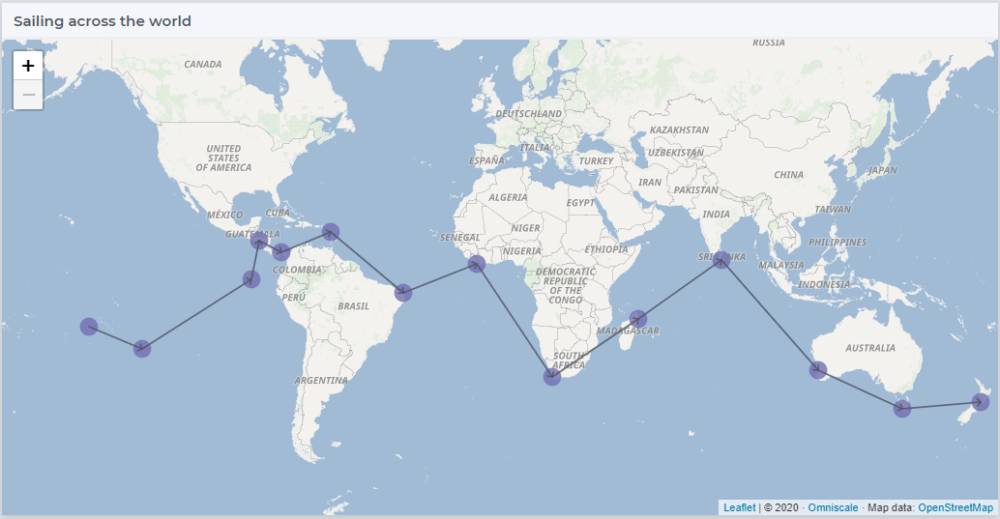
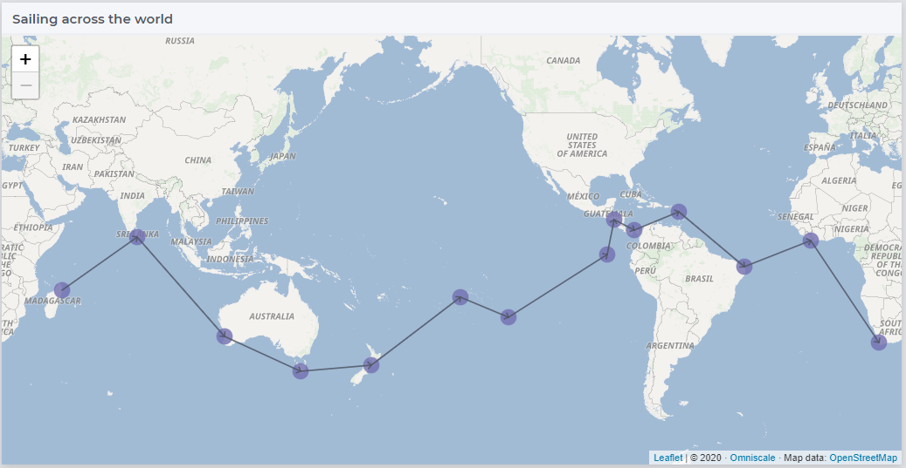
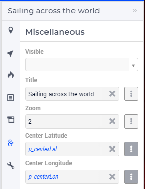

Sailing Across the World
=========================

A route across the world is made up of waypoints and legs between the waypoints.  
These waypoints and legs are represented by nodes and arcs in the map widget.

In this short article, a sailing route around the globe is shown using the 
`AIMMS WebUI Map widget <https://documentation.aimms.com/webui/map-widget.html>`_
The route taken is a given collection of waypoints, with latitudes and longitudes.

To view this route from any point across the equator, the map widget can be scrolled horizontally. 

Please open this :download:`AIMMS project <model/Sailing.zip>` and scroll horizontally to see the effect.

The project opens with the following screenshot:

|

After scrolling roughly 180 degrees, focusing on the other side of the planet, the route looks as follows:

|

Design
------------

As the map widget is scrolled horizontally, the waypoints may fall off the map at one end.
To make them appear at the other end, the longitude of waypoints are adapted, 
such that they are always on the visible part of the map widget. 
The longitudes of the visible part of the map widget are assumed to be in the range [center longitude - 180, center longitude + 180].

As the longitudes of the waypoints are adapted, there are two waypoints near the left and right edge of the map widget. 
As the route is circular, these two waypoints are connected.
Conceptually, however, this connection is behind the map, and might as well not be shown.
This is why the arcs presented are controlled by an adaptation of the legs given, 
such that a leg from almost the left edge of the map widget to the right edge of the map widget is not shown. 

Implementation
--------------------

To pass the perspective of the map widget to the model, the center of latitude and longitude is obtained as follows:

Based on the given longitudes in ``p_lon``, the adapted longitudes can be defined as follows:

.. code-block:: aimms
    :linenos:

    Parameter p_adaptedLon {
        IndexDomain: i_loc;
        Definition: {
            if p_lon(i_loc) < ( p_centerLon - 180 ) then 
                p_lon(i_loc) + 360
            elseif p_lon(i_loc) > ( p_centerLon + 180 ) then
                p_lon(i_loc) - 360
            else
                p_lon(i_loc)
            endif
        }
    }

In the above, if the given longitude is more than 180 away from the center, we correct (modulo 360).
The longitude of the nodes in the map widget is now specified as ``p_adaptedLon``.

Once we have the adapted longitudes, we implement not to draw the arcs whereby the adapted longitudes are very apart as follows:

.. code-block:: aimms
    :linenos:

    Parameter p_adaptedConnections {
        IndexDomain: (i_locFrom,i_locTo);
        Definition: {
            p_connections(i_locFrom, i_locTo) $ 
                (abs(p_adaptedLon(i_locFrom)-p_adaptedLon(i_locTo))<250)
        }
    }

The arcs in the map widget are now specified as ``p_adaptedConnections``.
