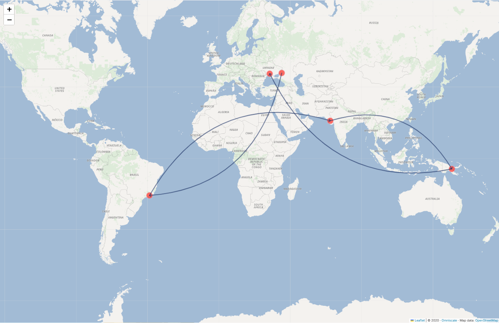
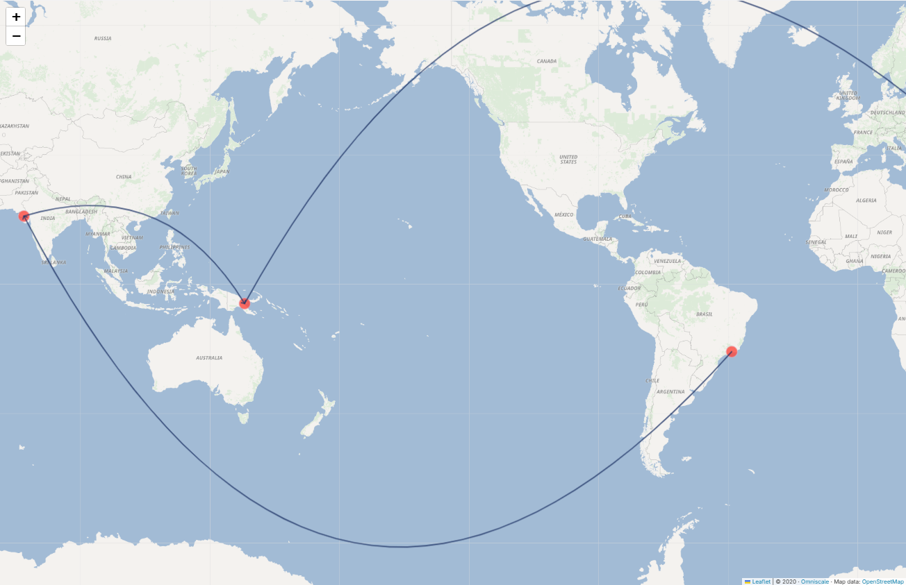
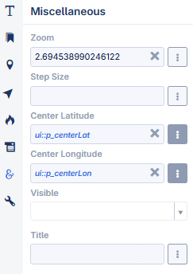

Sailing Across the World
==========================

.. meta::
   :description: Demonstrates how to handle longitude wraparound on the AIMMS WebUI Map widget for global maritime routes by adapting waypoint coordinates and hiding backside arcs.
   :keywords: WebUI, Map widget, maritime routing, longitude wraparound, waypoints, arc visibility, vessel scheduling, global route, dynamic routing

A global maritime route consists of multiple waypoints (nodes) and legs (arcs). 
When visualizing these routes in a map interface, handling the "seam" of the world map, where longitudes transition from 180° to -180°, is a common challenge.

This article demonstrates how to create a seamless sailing route using the `AIMMS WebUI Map widget <https://documentation.aimms.com/webui/map-widget.html>`_, 
ensuring that waypoints and connections remain visible and logically connected even as you scroll across the globe.

Please refer to the :doc:`Vessel Scheduling example <../590/590-vessel-scheduling>` example to follow along with this article.

Visualizing the Route
---------------------

To provide a continuous experience, the map widget allows horizontal scrolling across the equator. 
Open Vessel Scheduling example, load the ``503-article`` case, and navigate to the "Visualizations" page.

The initial view focuses on one side of the hemisphere:

|

After scrolling approximately 180 degrees to focus on the opposite side of the planet, the route dynamically adjusts to stay within the viewport:

|

Design Strategy
---------------

As the user scrolls horizontally, waypoints might "fall off" one edge of the map. 
To keep them visible, we must adapt their longitude values so they stay within the current viewing range: ``[center longitude - 180, center longitude + 180]``.

However, adapting longitudes creates a secondary issue: since the route is circular, 
a connection between a waypoint at the far left edge and one at the far right edge would result in a long, 
distracting line stretching across the entire map. To prevent this, we implement logic to hide arcs that span too large a longitudinal distance (the "backside" of the map).

Implementation
--------------

To synchronize the model with the UI, we first capture the map's current perspective (center latitude and longitude):

|

Step 1 - Adapting Waypoint Longitudes
^^^^^^^^^^^^^^^^^^^^^^^^^^^^^^^^^^^^^^^^^^^

Based on the original coordinates in ``p_longitude``, we define ``p_def_adapLongitude`` to shift points by 360° whenever they fall outside the current viewport range.

.. code-block:: aimms
    :linenos:

    Parameter p_def_adapLongitude {
        IndexDomain: i_loc;
        Definition: {
            if p_longitude(i_loc) < ( p_centerLon - 180 ) then
                p_longitude(i_loc) + 360
            elseif p_longitude(i_loc) > ( p_centerLon + 180 ) then
                p_longitude(i_loc) - 360
            else
                p_longitude(i_loc)
            endif
        }
    }

In the Map widget, the longitude property for your nodes should now point to ``p_def_adapLongitude``.

Step 2 - Controlling Arc Visibility
^^^^^^^^^^^^^^^^^^^^^^^^^^^^^^^^^^^^^^^^^

To avoid drawing "wrap-around" lines that shouldn't be visible, we filter the connections. If the distance between two adapted longitudes exceeds 250°, the arc is hidden.

.. code-block:: aimms
    :linenos:

    Parameter p_def_adapVisibleArc {
        IndexDomain: (i_loc_from, i_loc_to);
        Definition: {
            p_def_visibleArc(i_loc_from, i_loc_to) $ 
                (abs(p_def_adapLongitude(i_loc_from) - p_def_adapLongitude(i_loc_to)) < 250)
        }
    }

Finally, specify ``p_def_adapVisibleArc`` as the data source for the arcs in your Map widget.

.. seealso::

   - `AIMMS WebUI Map widget documentation <https://documentation.aimms.com/webui/map-widget.html>`_
   - :doc:`Vessel Scheduling example <../590/590-vessel-scheduling>`

.. spelling:word-list::

    waypoint