.. include:: local-css.css

.. _ch:tut:building_the_model_1:

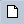

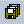

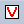

.. |identifier-button| image:: ./Figs/Bmp/identifier-button.bmp

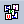

Building the Model
====================

Starting a new project
------------------------

.. rubric:: Getting AIMMS

All current versions of AIMMS are provided as an installation free software. Instead of creating a 
directory in the *Program Files* and a dedicated launch icon, an execution file for the AIMMS 
versions that you have downloaded and run is stored in your local user directory. You can download the latest version of AIMMS from the `download section on our website <https://www.aimms.com/support/downloads/#aimms-dev-download>`__

.. rubric:: The AIMMS Launcher

The AIMMS Launcher is a useful tool which enables you to easily run, manage, and navigate through all of the AIMMS versions on your computer. 
The AIMMS Launcher automatically creates a launch icon on your desktop to easily access and launch any version of AIMMS that you have available on your computer. 
The AIMMS Launcher is also available on `the download section of our website <https://www.aimms.com/support/downloads/#aimms-other-download>`__.

.. rubric:: Starting AIMMS

To run AIMMS you simply double click on the AIMMS Launcher icon on your desktop and select the preferred AIMMS version to run from the list and press the **Launch** button. 
Next, you will see the AIMMS splash screen. Once AIMMS has started, the splash screen will disappear and the AIMMS window will open.

.. rubric:: Creating a new project from within AIMMS

Press the **New Project** button |new-project-button| ,
which is located in the leftmost position on the AIMMS toolbar.
The dialog box shown in :numref:`fg:tut:new_project_1` will then
appear, requiring you to take the following actions:

- specify `Beer Transport` as the project name, and
- press the wizard button |wizard-button| to select the folder for your AIMMS projects if the default folder :file:`.../Documents/AIMMS Projects/Beer Transport` is not desired,
- change Default UI from 'WebUI' to 'WinUI'. Uncheck the options 'Include WebUI Library' and 'Include Pro Library', and
- press the **OK** button.

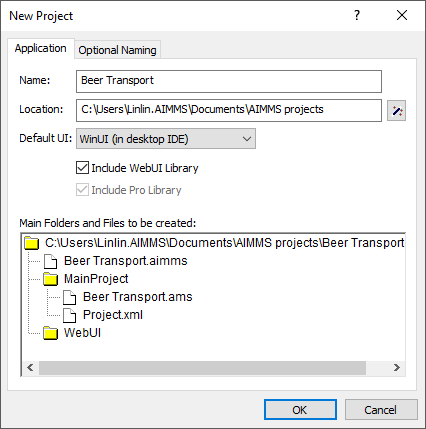
    
   The **New Project** wizard

Next, the AIMMS **Model Explorer** and the AIMMS **Page Manager** will be automatically opened. We will look at the AIMMS
**Model Explorer** first.

The Model Explorer
------------------------

.. rubric:: Initial model tree

When opened for the first time, the AIMMS **Model Explorer** will
display the initial model tree shown in
:numref:`fg:tut:initial_model_tree`. In this initial model tree you will see

- a single `declaration section` where you can store the declarations used in your model,
- the predefined procedure ``MainInitialization``, which is not relevant for this tutorial,
- the predefined procedure ``MainExecution``, where you will put the execution statement necessary to solve the mathematical program, and
- the predefined procedure ``MainTermination``, which is again not relevant for this tutorial.

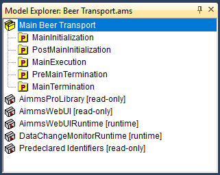
   
   The initial model tree

.. seealso::
  
  For more information on ``MainInitialization`` and ``MainExecution`` predefined procedures, you may investigate :doc:`lr:data-communication-components/data-initialization-verification-and-control/model-initialization-and-termination`
   
Entering sets and indices
--------------------------

.. rubric:: Opening the declaration section

The declaration of model identifiers requires you to first `open`
the declaration section. You can do this either by clicking the
|plus-icon| icon or by double-clicking on the scroll icon
|declaration-section|. Note that double-clicking on the
name of the declaration section instead of on its icon will open the
attribute form of the declaration section and will therefore, at
this point, not lead to the desired result. After opening the
declaration section the standard identifier buttons
|new-identifier-buttons| on the toolbar will be enabled.

.. rubric:: Creating the set `Plants`

To create a set of plants you should take the following actions:

- press the **Set** button |set-button| to create a new set identifier in the model tree,
- specify `Plants` as the name of the set, and
- press the ``Enter`` key to register the name.

.. rubric:: Opening its attribute form

Next, you need to declare the index :math:`p` as an attribute of the set
`Plants`. You can open the attribute form by double-clicking on the
node `Plants` in the model tree. The resulting initial attribute
form of the set `Plants` is shown in
:numref:`fg:tut:initial_attribute_form`.

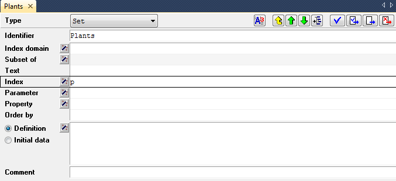
   
   The initial attribute form of the set `Plants`

.. rubric:: Declaring the index :math:`p`

To declare the index :math:`p` as an attribute of the set `Plants`,
execute the following sequence of actions:

- move the mouse cursor to the `Index` attribute field, and click in the (empty) edit field,
- enter the letter ``p``, and
- complete the attribute form by pressing the **Check, Commit and Close** button |check-commit-close-button|.

.. rubric:: Creating the set `Customers`

Next, create the set `Customers` with associated index :math:`c` in exactly
the same way as you created the set 'Plants' with index domain :math:`p`.
:numref:`fg:tut:intermediate_model_tree_1` contains the resulting
model tree.

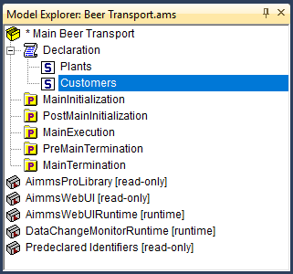

   An intermediate model tree

.. rubric:: Saving your changes

The asterisk on the left of the project name indicates that
additions to your project have not yet been saved to disk. To save
your work, please press the **Save Project** button
|save-project| on the toolbar.

Entering parameters and variables
-------------------------------------

.. rubric:: Domain specification

In this section you will declare the parameters and variables that are
needed in your model. The sets `Plants` and `Customers` and their
associated indices will be used to specify the index domain for the
parameters and variables.

.. rubric:: Creating the parameter `Supply`

The declaration of a parameter is similar to the declaration of a
set.  To enter the parameter `Supply(p)`, you should execute the
following actions:

- press the parameter button |parameter-button| on the toolbar to create a new parameter in the model tree,
- specify `Supply(p)` as the name of the parameter, and
- press the ``Enter`` key to register the name.

Note that parentheses are used to add the index domain :math:`p` to the
identifier `Supply`.

.. rubric:: Creating the parameter `Demand`

The parameter 'Demand(c)' can be added in the same way.  Should you
make a mistake in entering the information, then you can always
re-edit a name field by a single mouse click within the
field.

.. rubric:: Creating the parameter `UnitTransportCost`

The last model parameter `UnitTransportCost` is a two-dimensional
parameter with index domain :math:`(p,c)`. After entering
`UnitTransportCost(p,c)`, the resulting model tree should be the
same as in :numref:`fg:tut:intermediate_model_tree_2`.

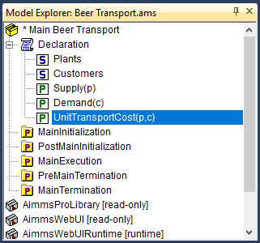

   An intermediate model tree

.. rubric:: Creating the variable `Transport`

Declaring a variable is similar to declaring a parameter.

- press the variable button |variable-button| on the toolbar to create a new variable in the model tree,
- specify `Transport(p,c)` as the name of the variable, and
- press the ``Enter`` key to register the variable.

.. rubric:: Specifying range attribute

After opening the attribute form of the variable by double-clicking on
the node `Transport` in the model tree, press the wizard button
|wizard-button| in front of the `Range` attribute field. The
resulting dialog box provides the opportunity to specify the range of
values that the variable `Transport` is allowed to take. In this case,
select the `Standard Range`, then select `nonnegative`, and finally
press the **OK** button (see :numref:`fg:tut:range_wizard`).

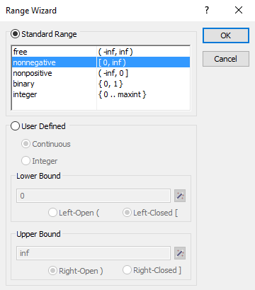
   
   The AIMMS range wizard

.. rubric:: Creating the variable `TotalTransportCost`

It should be clear by now how to create the variable
`TotalTransportCost`. This variable will be used to specify the
objective function. After entering its name, open the attribute
form. There is no need to specify the range attribute, since the
default range `free` will suffice. You are now ready to enter the
following definition of this particular variable:

.. code::

  sum[ (p,c), UnitTransportCost(p,c) * Transport(p,c) ]

.. rubric:: Specifying definition attribute

Simply enter the above definition in the `Definition` attribute
field.  You could type the entire sentence yourself, but you
can also let AIMMS do some of the typing for you.  Considering
the parameter `UnitTransportCost(p,c)`, the following
two support features are quite useful.

- Type the letter ``u`` or ``U``, and press the ``Ctrl`` + ``Spacebar`` combination for automatic name completion.
- Another option available to you is to drag the name `UnitTransportCost(p,c)` from the model tree to the edit field of the `Definition` attribute.

The attribute form should now have the same content as shown in
:numref:`fg:tut:variable_attribute_form`. By pressing the
**Check, Commit and Close** button |check-commit-close-button|,
you can verify whether AIMMS will accept the definition you entered.

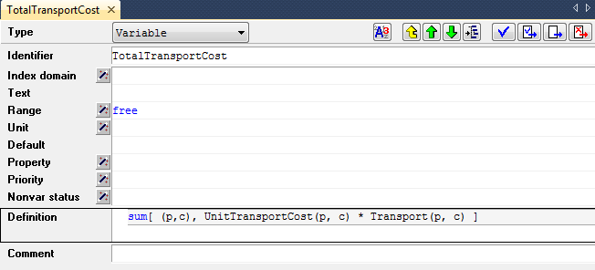

   The completed attribute form for the variable `TotalTransportCost`

Entering constraints and the mathematical program
---------------------------------------------------------

.. rubric:: The supply and demand constraints

Creating the supply and demand constraints, each with their own
definition, requires the same actions as creating a variable with a
definition (as you just completed). The only difference is that you
must use the |constraint-button| button instead of the
|variable-button| button. The following two forms should be
the result of your efforts.

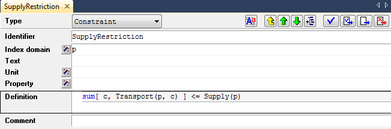

   The completed attribute form for the constraint `SupplyRestriction`

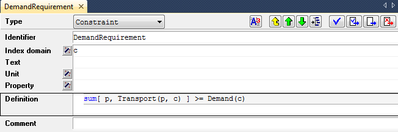

   The completed attribute form for the constraint `DemandRequirement`

.. rubric:: Creating the mathematical program

A mathematical program, unlike sets, parameters, variables and
constraints, does not have a special button on the toolbar. By
using the identifier button |identifier-button|, you obtain
access to all the other types of AIMMS identifiers. After pressing this
button, select the `Mathematical Program` entry alongside the
|mathprog-icon| icon, press the **OK** button, and enter
`LeastCostTransportPlan` as the name of the mathematical program.

.. rubric:: Specifying its attributes

The complete the attribute form of the mathematical program as
illustrated in :numref:`fg:tut:mathprog_attribute_form`. Among
the attributes, AIMMS has automatically filled **Direction**,
**Constraints**, **Variables** and **Type** attributes with default
values and there is no need to change them for this project. You
only need to fill the **Objective** attribute.

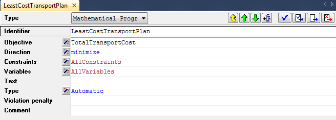

   The completed attribute form of the mathematical program

.. rubric:: Selecting the objective

The **Objective** attribute wizard requires you to select a scalar
variable. In the identifier selection wizard (see
:numref:`fg:tut:objective_wizard`), simply select the scalar variable
`TotalTransportCost`, and press the **Finish** button.

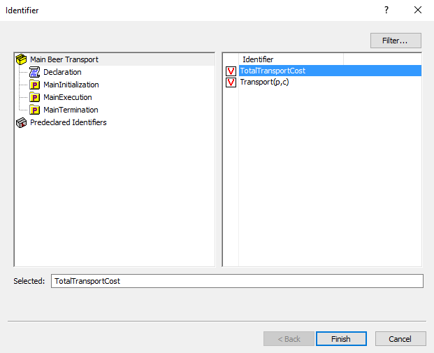

   The identifier selection wizard

Viewing the identifiers
--------------------------------

.. rubric:: Checking your model

You have now entered and declared all model identifiers. The
resulting model tree is shown in
:numref:`fg:tut:intermediate_model_tree_3`. By pressing the
``F5`` key you can instantly check the validity of your model. You
will only receive a message in the event of an error. Once
the validity of your model has been verified, you should save your
work by pressing the **Save Project** button
|save-project|.

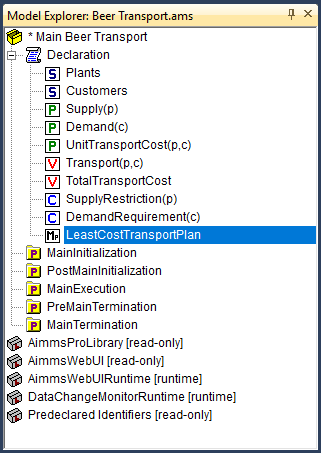

   The final model tree

Even though the Model Explorer is a convenient medium with which to
build and inspect your model, AIMMS provides two other ways to view
your model.

.. rubric:: View text model

If you would like to see a text representation of the model,
you can do the following:

- select node(s) in AIMMS **Model Explorer**,
- go to the **View** - **Text Representation** menu and execute the **Selected Part(s)** command (see :numref:`fg:tut:view-text-model`).

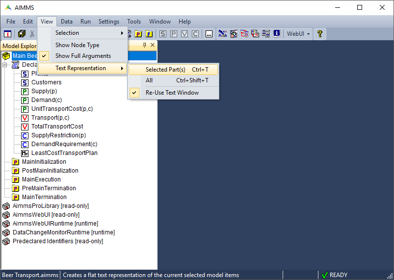

   View text model

The text model provides a simple overview of selected identifiers.
For instance, :numref:`fg:tut:Text-model` shows the text model
when the root node **Main Beer Transport** is selected.

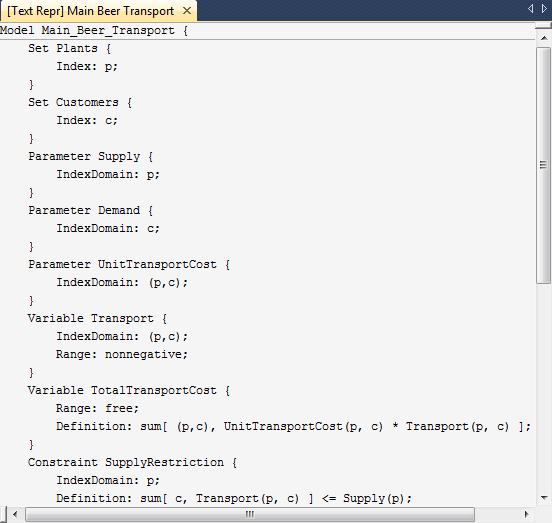

   text model

.. rubric:: Identifier overviews

Another way to inspect the model is by AIMMS **Identifier Selector**. This allows you to view several identifiers with similar
properties at the same time. In this tutorial you will encounter one
such example of a predefined view, namely all identifiers with a
definition (see :numref:`fg:tut:view-window`). AIMMS allows
you to make your own views as you desire.

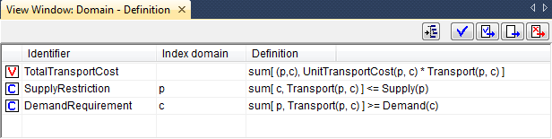

   View window with identifier definitions

.. rubric:: Creating a view

You can create a view window by executing the following steps:

  - press the **Identifier Selector** button |identifier-selector-button| on the toolbar,
  - select the `Identifiers with Definition` node, and
  - use the right mouse and select the **Open With...** command from the pop up menu (see :numref:`fg:tut:identifier_selector`).

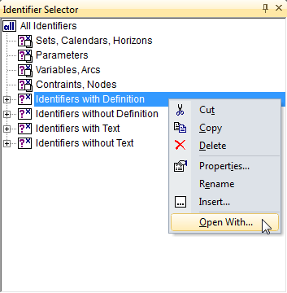

   Identifier Selector window

For the selected identifiers the view can be constructed as follows:

  - select the `Domain - Definition` entry from the **View Manager** window (see :numref:`fg:tut:view_manager`), and
  - press the **Open** button to obtain the overall view.

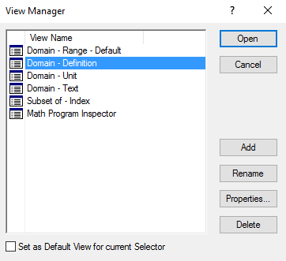
   
   The View Manager window
