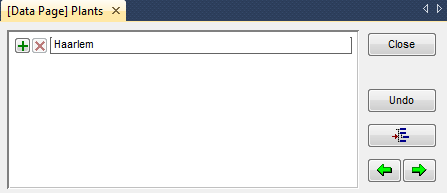
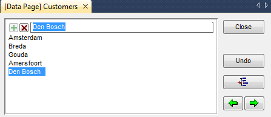
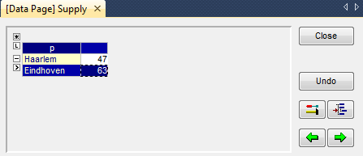
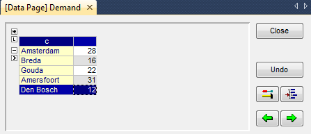
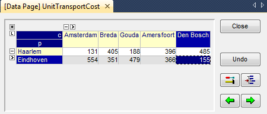
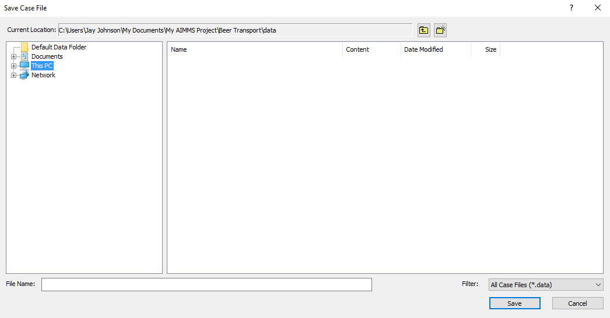
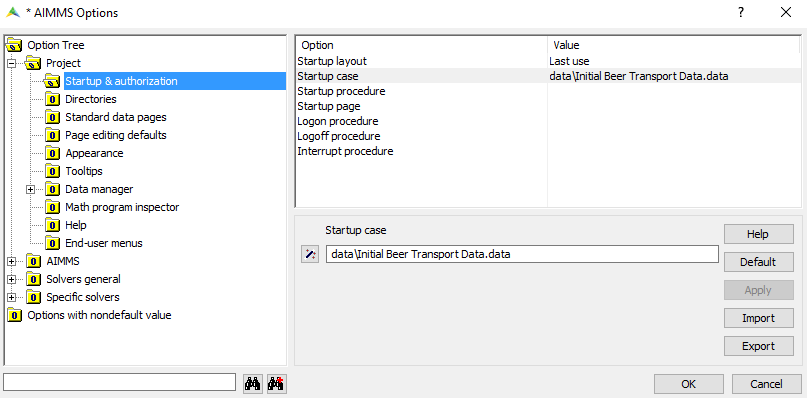
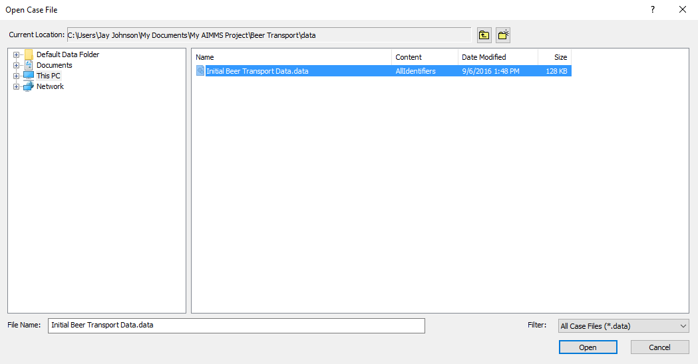

.. _ch:tut:entering_the_data_1:

Entering and Saving the Data
==================================

Entering set data
-----------------

.. rubric:: Manual data entry

Since this tutorial only contains little data, you are asked to enter it
manually. (In the tutorial for professionals, data is imported from a
database.) In this section you will encounter a standard data entry
facility. Each identifier has an associated data page that you can use
both to view data and to enter data.

.. rubric:: Elements of the set `Plants`

To enter the two elements of the set `Plants`, you should execute the
following actions:

- open the attribute form of the set `Plants`,

- press the **Data** button |data-page-button|,

- move the mouse pointer to the data page as shown in :ref:`fg:tut:data_page_plants`, and click in the empty edit field at the top of the data page,

- enter `Haarlem` as the first element of the set,

- press the ``Enter`` key to register this element,

- enter `Eindhoven` as the second element of the set,

- press the ``Enter`` key to register this element, and

- close the data page by clicking button (the data changes are immediately committed).

   
   Data page for the set `Plants`

.. rubric:: Changing element names

To change the name of an element, just, select the element, press the
delete button and enter the modified name in the same way as described
above.

.. rubric:: Elements of the set `Customers`

The elements of the set `Customers` are entered in exactly the same way
as for the set `Plants`. The five elements are listed in :ref:`fg:tut:data_page_customers`.
Note that the last element `Den Bosch` contains a blank character.

   
   Data page for the set `Customers`

Entering parameter data
----------------------------

.. rubric:: Empty tables

The data page of each indexed parameter is automatically filled with the
elements of the corresponding sets. All that is left for you to do, is
to enter the nonzero data values.

.. rubric:: Supply data

In order to enter the data for the parameter `Supply`, you should
execute the following actions (which are similar to the ones described
in the previous section):

#. open the attribute form of the parameter `Supply`,

#. press the **Data** button |data-page-button|,

#. move the mouse pointer to the first data field and click,

#. enter the number 47,

#. press the ``Enter`` key to register the first value,

#. enter the number 63,

#. press the ``Enter`` key to register the second value, and

#. close the data page by pressing **Close** button.

:numref:`fg:tut:data_page_supply` shows the completed data page of the parameter `Supply`.

   
   Data page for the set `Supply`

.. rubric:: Demand data

The data values for the parameter `Demand` are entered in exactly the
same way as for the parameter `Supply`. The five data values are listed
in :numref:`fg:tut:data_page_demand`.

   
   Data page for the set `Demand`

.. rubric:: Cost data

The parameter `UnitTransportCost` is two-dimensional, and requires you
to complete a table. The completed data page for this parameter is shown
in :numref:`fg:tut:data_page_transport_cost`.

   
   Data page for the set `UnitTransportCost`

Saving your data
----------------

.. rubric:: Case management

AIMMS has the option to store the data values of all identifiers in what
is referred to as a `case`. There are facilities both to save cases and
to load cases.

.. rubric:: Saving a case

In order to save the data that you just entered in a new case named
`Initial Beer Transport Data`, you need to execute the following steps:

- go to the **Data** menu and execute the **Save Case** command,

- in the **Save Case** dialog box (see :numref:`fg:tut:save_case_dialog`) enter the name `Initial Beer Transport Data` in the `Name` field (without the quotes), and

- press the **Save** button to save your data.

   
   Save Case dialog box

.. rubric:: Loading a case as the startup case

If a project in AIMMS is closed and subsequently reopened, you may want
to reload your data. You may even want AIMMS to load a specific case
automatically each time your project is started. This can be
accomplished (without programming) using the AIMMS **Options** dialog
box illustrated in :numref:`fg:tut:options_dialog`.

- go to the **Settings** menu and execute the **Project Options** command,

- select the **Project** - **Startup & Authorization** folder in the option tree,

- click on the Option **Startup Case** in the right-most window,

- press the wizard button,

- select the case `Initial Beer Transport Data`,

- press the **OK** button on the **Select Case** dialog box,

- press the **Apply** button on the AIMMS **Options** dialog box, and

- finish by pressing the **OK** button.

   
   Options dialog box

.. rubric:: Saving your project

It is a good habit to save your work regularly. The option settings
above are also saved when you save the entire project. You can save the
project by pressing the **Save Project** button . Note that saving a
project does not mean that the data is also saved. Saving data requires
you to save a case.

.. rubric:: Loading a case manually

At any time during an AIMMS session you can load a case manually as
follows:

- go to the **Data** menu, select the **Load Case** submenu and execute the **As Active...** command,

- select the desired case name in the **Load Case** dialog box (see :numref:`fg:tut:load_case_dialog`), and

- press the **Load** button.

   
   Load case dialog box

