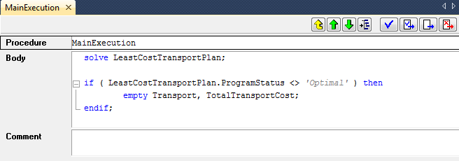
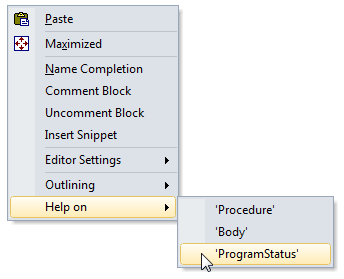
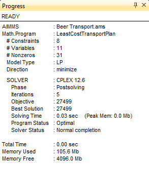
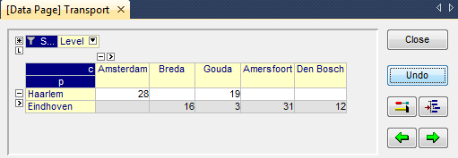

.. include:: local-css.css

.. _ch:tut:solving_the_model_1:

Solving the Model
=================

Computing the solution
----------------------

.. rubric:: Procedures for action

Thus far, you have entered all the identifiers, their attributes and
their data. You will also need to build at least one procedure in order
to be able to instruct AIMMS to take action. In this tutorial, you will
enter two statements inside the body of the existing (empty) procedure
``MainExecution``: one to solve the mathematical program, and the other to
set the solution to zero when the mathematical program is not optimal.

   
   The attribute form of ``MainExecution``

.. rubric:: Building a procedure

The procedure ``MainExecution`` can be completed as follows:

- press the key to open the **Model Explorer**,

- select the ``MainExecution`` procedure and open it by double-clicking ,

- enter the two statements in the body attribute as illustrated in :numref:`fg:tut:main_execution`, or copy the below code
    
    .. code::
      
      solve LeastCostTransportPlan;
      
      if ( LeastCostTransportPlan.ProgramStatus <> 'Optimal' ) then
              empty Transport, TotalTransportCost;
      endif;

- press the **Check, Commit and Close** button to register the changes.

Should AIMMS report errors, simply check your input and make the
necessary corrections.

.. seealso::
  
  More docs on :doc:`suffices/mathematical-program-suffices/programstatus`, :any:`if`, :ref:`empty`

.. rubric:: Right-mouse for help

To obtain information about specific AIMMS keywords, you can use the
right-mouse pop up menu to open the AIMMS documentation on the
appropriate page with a single click. For instance, you can obtain help
on the `ProgramStatus` keyword as follows:

- position the cursor over the `ProgramStatus` keyword,

- right-click the mouse and select the `ProgramStatus` entry in the `Help` submenu (see :numref:`fg:tut:right_mouse_help`).

   
   A right-mouse popup menu

.. seealso::
    
    :doc:`fr:suffices/mathematical-program-suffices/programstatus`

.. rubric:: Running the procedure

The procedure MainExecution is special in that there is a dedicated key, ``F5``
, to execute this procedure. For all other procedures you can use the
right mouse button to select the **Run Procedure** command.

.. rubric:: Watching execution progress

By pressing the ``CTRL`` and ``P`` keys simultaneously, AIMMS displays a progress
window with selected information on the progress it has made (or is
making) during an execution phase. :numref:`fg:tut:progress_window` shows the progress window
you should expect to see.

   
   The AIMMS progress window

.. rubric:: Results in data pages

You have already encountered data pages while entering the elements of
sets and the numeric values of parameters. Once AIMMS has computed the
values of the variable `Transport`, these values become immediately
available on the corresponding data page. Just go to this variable in
the model tree, and click on it. Then use the right mouse to select the
**Data...** command to open the data page. This will open a pivot
table with Transport data.

   
   Data page displaying the solution for the variable `Transport`
   

Congrats!
-------------------

You have computed and solved your first optimization model with AIMMS. Congrats ! 

You are now able to use the very basics of AIMMS software.

Continue to learn on the `AIMMS Academy <http://academy.aimms.com/>`__, and enroll to a `more advanced course <https://academy.aimms.com/course/view.php?id=45>`__. 
This course will dig deeper in modeling using AIMMS, building a Web User Interface and communicating with an excel file or a database.

See you there ! 😁

.. spelling::
    
    popup