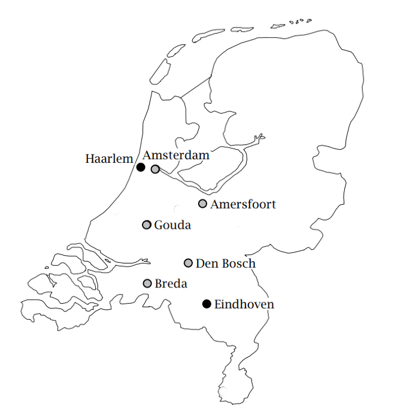

.. include:: local-css.css

.. _ch:tut:what_to_expect_1:

What to Expect
==============

In this chapter you will find a brief overview of the tasks to be
performed, a compact statement of the underlying model to be built, and
a glimpse of the output you will produce.

Scope of one-hour tutorial
--------------------------

.. rubric:: Summarizing your work

Once you have read the short problem description and the associated
mathematical model statement, you will be asked to complete a series of
tasks that make up this one-hour tutorial, namely:

-  create a new project in AIMMS,

-  enter all identifier declarations,

-  enter the data manually,

-  save your data in a case,

-  build a small procedure,

-  build a single page with

   -  header text,

   -  a standard table and two bar charts with input data,

   -  a composite table and a stacked bar chart with output data,

   -  a button to execute the procedure, and

   -  a scalar object with the optimal value,

-  perform a what-if run.

Problem description and model statement
---------------------------------------

.. rubric:: Problem description

Truckloads of beer are to be shipped from two plants to five customers
during a particular period of time. Both the available supply at each
plant and the required demand by each customer (measured in terms of
truckloads) are known. The cost associated with moving one truck load
from a plant to a customer is also provided. The objective is to make a
least-cost plan for moving the beer such that the demand is met and
shipments do not exceed the available supply from each brewery.

.. rubric:: Data overview

The following table provides the data for the problem described in the
previous paragraph.

.. _tb:tut:input_data:

.. table:: Input data for beer transport problem

  +----------------+----------------------------------------------------+--------+
  |      Customers |             Unit Transport Cost                    | Supply |
  |                +-----------+-------+-------+------------+-----------+        |
  | Plants         | Amsterdam | Breda | Gouda | Amersfoort | Den Bosch |        |
  +----------------+-----------+-------+-------+------------+-----------+--------+
  | Haarlem        | 131       | 405   | 188   | 396        | 485       | 47     |
  +----------------+-----------+-------+-------+------------+-----------+--------+
  | Eindhoven      | 554       | 351   | 479   | 366        | 155       | 63     |
  +----------------+-----------+-------+-------+------------+-----------+--------+
  | Demand         | 28        | 16    | 22    | 31         | 12        |        |
  +----------------+-----------+-------+-------+------------+-----------+--------+

.. rubric:: Identifier declarations

The following declarations list the identifiers that are part of the
mathematical program to be built.

.. math::

   \begin{align}
   & \textbf{Indices:} \\
   &&& \text{$p$} & & \text{plants} \\
   &&& \text{$c$} & & \text{customers} \\[0.5pc]
   & \textbf{Parameters:} \\
   &&& \text{$S_p$} & & \text{supply at plant $p$} \\
   &&& \text{$D_c$} & & \text{demand by customer $c$}  \\
   &&& \text{$U_{pc}$} & & \text{unit transport cost from $p$ to $c$} \\[0.5pc]
   & \textbf{Variables:} \\
   &&& \text{$x_{pc}$} & & \text{transport from $p$ to $c$} \\
   &&& \text{$z$} & & \text{total transport cost} \\[0.5pc]
   \end{align}

   The Netherlands

.. rubric:: Model summary

The mathematical model summary below captures the least-cost plan to
transport beer such that the demand is met and shipments do not exceed
available supply.

.. math::

   \begin{align}
   z = \sum_{pc} U_{pc} x_{pc} &  & &  \\
   \end{align}

.. math::

   \begin{align}
   \sum_c x_{pc} & \leq S_p & & \forall p \\
   \sum_p x_{pc} & \geq D_c & & \forall c \\
   x_{pc} & \geq 0 & & \forall (p,c) \\
   \end{align}

.. rubric:: Using explicit names

Even though the above notation with one-letter symbols is typical of
small mathematical optimization models, it will not be used to represent
the model in AIMMS. Instead, explicit names will be used throughout to
avoid any unnecessary translation symbols. The number of symbols needed
to describe practical applications is generally large, and a clear
naming convention supports the understanding and maintenance of large
models.

.. comment:

  A preview of your output
  ------------------------

  .. rubric:: A single page

  :ref:`fg:tut:input_output_page_1` is a page that contains both input and output data associated
  with the beer transport model. In :ref:`ch:tut:building_a_page_1` you will be asked to
  construct this page using the point-and-click facilities available in
  AIMMS.

  .. figure:: ./Figs/Bmp/input-output-page.bmp 
     :alt: An input-output page
     :name: fg:tut:input_output_page_1
     
     An input-output page
