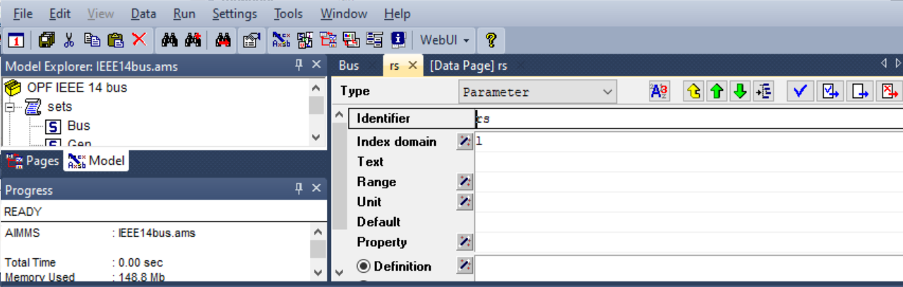
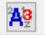
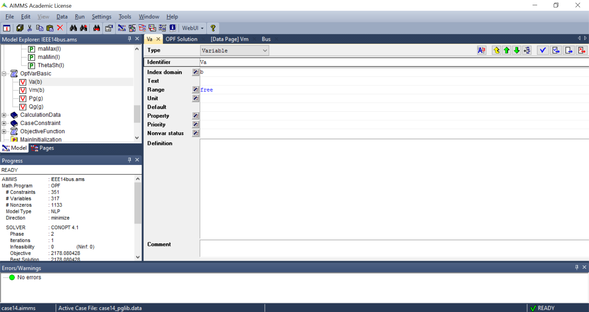
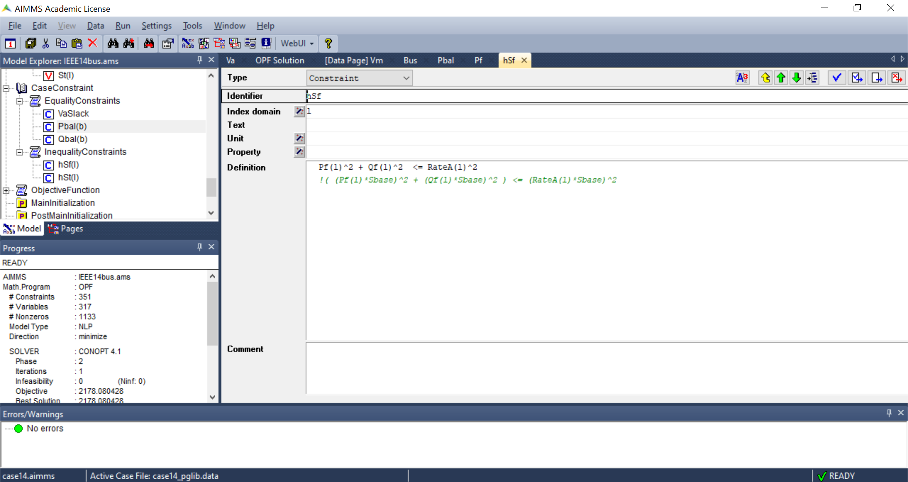

Optimal Power Flow (OPF)
=============================

In this example, we will see how the problem of Optimal Power Flow (OPF) in a power system can be implemented and solved in AIMMS. In the following, we will first review the OPF problem, and then we will see its implementation in AIMMS.

.. note:: For more information about the OPF problem modelling and data format used here, see authors' publication [1] and/or MATPOWER's documentation [2].

OPF problem
--------------------------
OPF is one of the most important problems to be solved in power systems. Essentially, the goal in OPF is to minimise an objective function (normally the total generation cost) while considering constraints of the power system. In the following, first the OPF formulation is explained, and then its implementation in AIMMS is described.

OPF Formulation
--------------------

OPF is an optimisation problem. The objective function, as mentioned above, is normally the total cost of generation, and can be defined as below:

.. math::
	f(x)= \displaystyle\sum_{i=1}^{ng} f_c (P^{\{ i\}}_g) 
        :label: objective  

where :math:`ng` is the number of generators, :math:`f_c` is the cost for each generator and :math:`x` is the vector of the optimisation variables, which are bus powers and voltages:

.. math::
	x={[P_g, Q_g, V_a, V_m]}^T 
        :label: x  
	
The following constraints are defined for the standard AC OPF problem formulation: 

.. math:: 
	S_{bus}(x)+S_d-S_g=0  
        :label: PowerBalance 
	
where

.. math:: 
	S_{bus}(X)=[V][I_{bus}^{*}]=[V]({Y}_{bus}^{*})V^{*}  
        :label: con_s 

.. math:: 
	({P_f}^{\{ i\}}(x))^2+{\left({Q_f}^{\lbrace i\rbrace}(x)\right)}^2 \leq {\left({S}^{\lbrace i\rbrace}_{{L}}\right)}^2 
        :label: con_Pf 

.. math::
	{\left({P_t}^{\lbrace i\rbrace}(x)\right)}^2+{\left({Q_t}^{\lbrace i\rbrace}(x)\right)}^2 \leq {\left({S}^{\lbrace i\rbrace}_{{L}}\right)}^2 
        :label: con_Pt 

* Equation :eq:`PowerBalance` corresponds to the nodal Active and Reactive power balances for each node in the system. 

* Equation :eq:`con_s` is the definition of the nodal complex power from which nodal Active and Reactive power injections at each node can be calculated. 

* Equations :eq:`con_Pf` and :eq:`con_Pt` are the allowable total power carrying capacity limit of transmission lines. 
	

The optimisation problem can therefore be written as below:

.. math::
	\min f(x)	\\

Which is subject to satisfying constraints :eq:`PowerBalance`, :eq:`con_Pf`, and :eq:`con_Pt`.

Also, note that we have using Matpower's Branch Model [2] for modelling the network branches. Figure below shows the branch model, where the branch parameters are marked on the diagram. :math:`rs` and :math:`xs` are the series resistance and reactance, respectively. The total charging susceptance :math:`bc` together with these series elements forms the standard :math:`\pi` transmission line model. The transformer tap ratio has a magnitude :math:`m_a` and phase shift angle *theta_sh*.

.. image:: figures/branch_model.png
    :align: center

	
OPF Implementation in AIMMS
-------------------------------	
OPF implementation for the IEEE 14-bus system can be downloaded from :download:`here <OPF.zip>`.

.. note:: 
	We request that works that use this project cite the paper below:
	
	Alvarez-Bustos, A., Kazemtabrizi, B., Shahbazi, M. and Acha-Daza, E., 2021. Universal branch model for the solution of optimal power flows in hybrid AC/DC grids. International Journal of Electrical Power & Energy Systems, 126, p.106543.
	
	doi: 10.1016/j.ijepes.2020.106543

The project consists of different parts, which are explained below:

**1- Sets:** we have buses, generators and branches in our power system. These are defined and shown using *sets*. For example, the set of all buses in the IEEE 14-bus system is defined as shown in the figure below. Buses here are numbered from B1 to B14. An index ``b`` is defined to represent this set. Similarly, an index ``l`` refers to all branches (lines) in our system.

.. image:: figures/set1.png
    :align: center
	
Similarly, the set of all generator buses (G1-G5) and branches (L01-L20) are defined as sets.
You can see that the generation costs are also defined as a set of three values (CC1-CC3), which represent the three coefficients in the quadratic equation for generation cost:

.. math::
	f_c (P^{\{ i\}}_g)= 	CC1_i {(P^{\{ i\}}_g)}^2 + CC2_i{(P^{\{ i\}}_g)} +CC3_i
	
**2- Case data:** The information about the system can be added here. For example, for adding :math:`r_s` values of branch data, a new parameter rs is added and the index domain is defined as ``l`` which is previously defined as the index for branches (in Sets). Figure below shows has this can be done:

	
Now if you click on "Current data" (|current_data_icon|), the :math:`r_s` values can be easily added as shown below. Note that because we have defined the domain for :math:`r_s` as ``l``, therefore AIMMS automatically asks for rs values for all branches in our system.

 .. image:: figures/rs_data.png
    :align: center

**3- Variables:** The next step is to define the variables, and their limits. The main variables in our optimisation problem are :math:`x ={[P_g, Q_g, V_a, V_m]}^T`. These are defined as shown in the figure below. Note that AIMMS makes it very easy to define the variables over the right domain. For example, as we have one :math:`V_a` and one :math:`V_m` for each bus, we have set the ``index domain`` for these variables as ``b``, which is the index for the Set `Bus`. Similarly, :math:`P_g` and :math:`Q_g` are defined over the domain `Gen`.

	
We have also defined other auxiliary variables that we will need later on in our project. Examples are variables that we will need to be checked in our constraints. First, the branch variables (real and imaginary parts of the :math:`[2\times2]` model's admittance matrix for each branch) are calculated, and these are then used to determine the power injection variables (active and reactive powers at the two ends of each branch). Note that it is of course possible to write the complex equations for the power injection variables directly, however, breaking the problem down and linking the auxiliary variables makes implementation and debugging much easier. 

.. For the complete formulation of the power flow problem, you can either check MATPOWER's manual, or authors' paper [1].

**4- Constraints:** Defining the constraints is very straightforward. As an example, the figure below shows how the inequality constraints of eq. (4) can be implemented. Again it is worth noting that by setting the index domain correctly, we have applied the inequality power constraint to all the branches in our system.

	
**5- The objective function:** the objective function is defined in the ``mathematical program`` named as *OPF*. The objective is to minimise the varialbe *GenCost* which is defined to calculate the total generation cost of the system.

.. image:: figures/objective_function.png
    :align: center
	
**6- Initialisation and Main Execution:** The problem is initialised and then solved here.

**7- Pages:** AIMMS also makes it easy to design a GUI for interating with the optimisation problem. For details of how this can be done, refer to the relevant AIMMS tutorials. Here, as shown in figure below, the opf_solution_page is designed to show the solution variables.

.. image:: figures/opf_solution_page.png
    :align: center

 
References
============
[1] Alvarez-Bustos, A., Kazemtabrizi, B., Shahbazi, M. and Acha-Daza, E., 2021. Universal branch model for the solution of optimal power flows in hybrid AC/DC grids. International Journal of Electrical Power & Energy Systems, 126, p.106543.
doi: 10.1016/j.ijepes.2020.106543

[2] R. D. Zimmerman, C. E. Murillo-Sanchez. MATPOWER User's Manual, Version 7.1. 2020.
[Online]. Available: https://matpower.org/docs/MATPOWER-manual-7.1.pdf
doi: 10.5281/zenodo.4074122