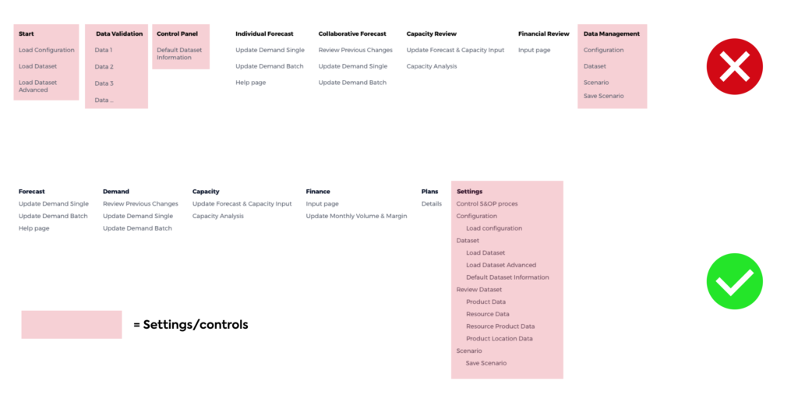

.. raw:: html
  
  

App structure
===============

This section contains recommendations for structuring AIMMS applications.

Separate functional and supportive pages
--------------------------------------------

Move control tasks (configuration, data, application support) together and out of the way of the user. 
These are prerequisites for using the app, but don’t deliver value to the user directly.

User flow
-----------

.. image:: images/UserFlow.gif

Avoid dead ends in the user flow. Always give users a next step. For example, when a configuration is successfully loaded, 
show a link to the load data page so users can easily continue on their way.

Note that apps can have multiple types of users, and therefore also several user flows.

Above: *notification after loading the configuration, inviting users to continue to the Data page.*

Industry practices
---------------------

Industry professionals often have their processes in place. If the app structure follows this, it fits their daily routine more easily. 
For example, an S&OP app menu follows the steps that are industry standard (Gartner): (Home), Forecast, Demand, Capacity, Finance, Plans (Settings).

Page hierarchy
-----------------

Pages in AIMMS follow a hiearchical structure, with Top pages and Child pages. 
Top pages are on a different level than Child pages and are perceived differently by users. 
Therefore, the type of information they contain should be different.

A Top page may contain a high-level overview with links to further detail on Child pages. 
Or, when no higher level data is available or logical, a Top page may show navigation for information on the Child pages.

.. image:: images/forecast_V2-768x342.png

Less is more
--------------

Less is more: sometimes multiple pages can be combined into one page. 
For example, a “load data” page and a “manage data” page can be merged into one page by adding one column. 
Menus should be concise and help the user quickly find the right page.

.. image:: images/less-is-more-768x348.png

*Previously two pages, now only one: load and delete data on the same page.*

Wording: keep it simple and clear
--------------------------------------

.. image:: images/AppWording.png

Names of Top Pages should be simple. Use a single word whenever possible: “Review”, “Analytics”, “Demand”, “Forecast”. This helps users to not feel overwhelmed.

Happy path
---------------

.. image:: images/HappyPath-1024x508.png

Guide users on the “Happy Path”: the route in the app that leads towards a successful outcome.

Buttons that help the user on this path should be more prominent. 
For example: an “OK” or “Go” button is solid, while a “Cancel” button that leads users away from the Happy Path is transparent with an outline.

