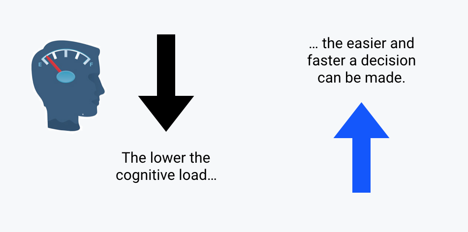
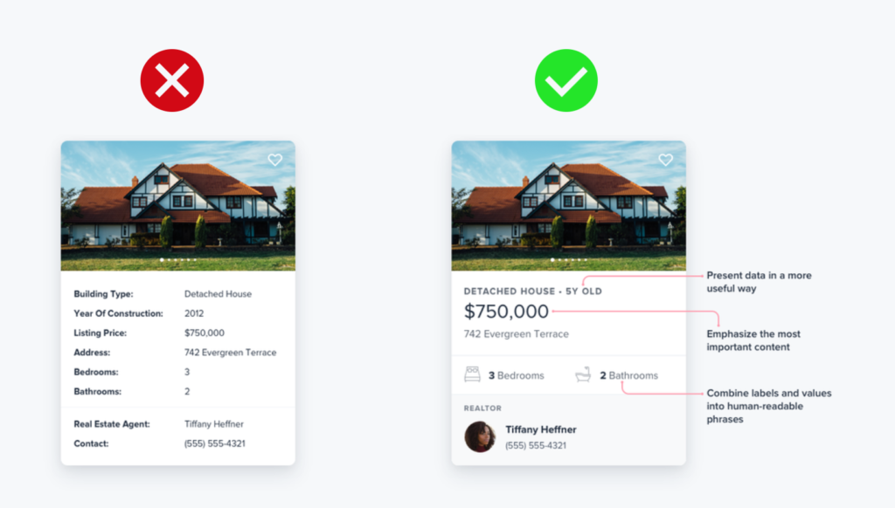
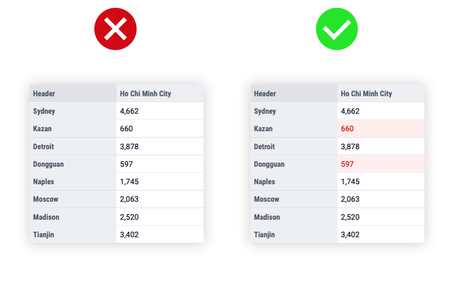
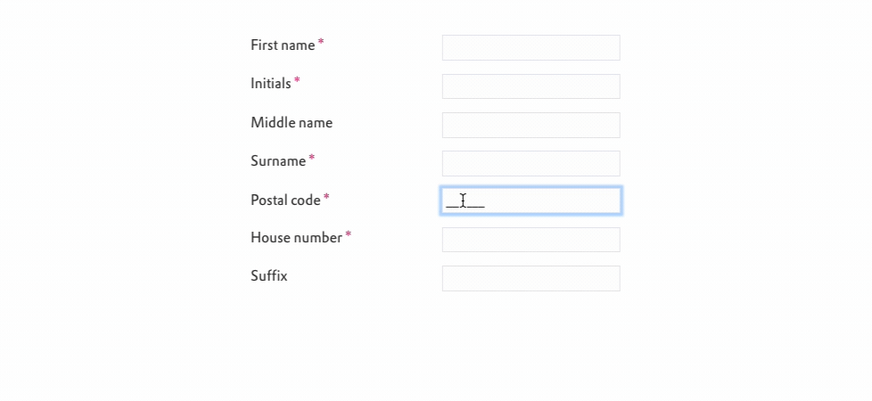

.. raw:: html
  
  

Basic principles
==================

Below you find general recommendations for creating a better User Experience in your apps. They are related to the :doc:`/Articles/511/key-principles`.

Analyze your users
--------------------

One of the first and most important steps for making any app is to research your users.

- Who are the users?
- Is there one type of user or multiple types?
- What is/are their job(s)?
- Is it an individual or collaborative app?
- How tech savvy are the users?
 

Based on what you know about them, next find out their specific goals while using the app.

- What question does the app solve for users?
- Does every kind of user have the same question, or are there more?
- What steps are needed before the app delivers results?
- Does every user take the same steps, or is there more than user journey?
 

Understanding your users and their goals is essential to making a high quality app. User Experience isn’t only about usability; it’s about feelings. 
A well-crafted design makes us feel good about using the app.

Minimize cognitive load
---------------------------

Cognitive load refers to the amount of brain power required to use the app. The human brain has a limited amount of processing power. 
When an app provides too much information at once, it can overwhelm the user and make them abandon the task

“Think outside the database”
------------------------------

An app does not need to match the available data one-for-one. Look for the overlap between what data is available and what is most valuable for users.

Not all data is useful to users all the time. In fact, too much data can distract and slow users down towards their end goal. On the other hand, data that can provide value for user should be easily available.

For example, weather information for every sales location worldwide can help Sales Managers in making their sales forecast and is a valuable addition to the app.

Image credit: `Steve Schoger <https://twitter.com/steveschoger/status/997125312411570176>`_.

Level of detail
-----------------

Often, users just want to see if a certain business process is within parameters. 
When everything is in order, no more details are needed. 
However, when something is out of the ordinary a user might want to see more details.

To enable this, it is valuable to make various levels of detail possible. 
Sometimes all a user wants is a high-level overview of how something is going.

Offload tasks
----------------

Look for anything in the design that requires user effort (entering data, making a decision, etc.), and look for alternatives. 
For instance, in some cases you can reuse previously entered data instead of asking the user to enter it again, or use available information to set a smart default.

Example above: when filling the postal code, the site automatically fills the street name, making life easier for the user.

