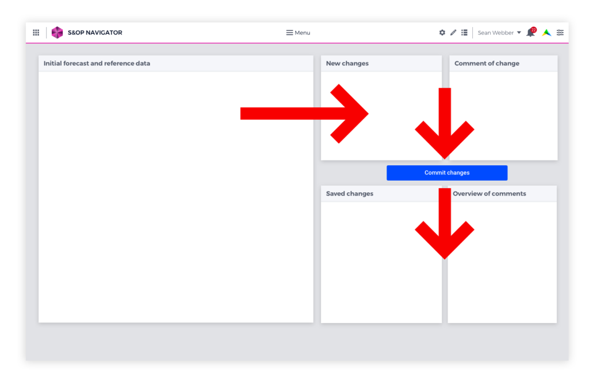
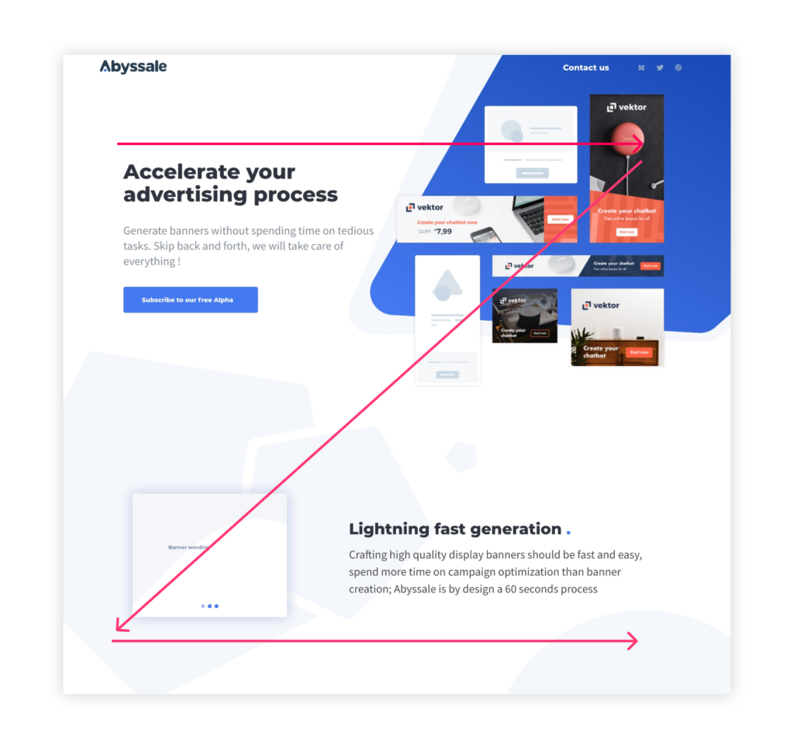

Best Practices in your Application
===================================

Button Positioning
---------------------

The convention for button positions in WebUI is to place the **Primary Button** in the bottom right corner and the **Secondary Button** to the left of it.

- **Primary Buttons:** are used for the “happy path”: an action that brings the user closer to their goal. Examples are “Accept”, “Ok” or “Continue”. Therefore, ideally only one of these buttons is visible at a time.

.. image:: images/PrimaryButton.png
  :align: center
  :width: 400px

- **Secondary Buttons:** are used for less desirable actions, that do not bring the user forward. Examples are “Cancel”, “Disagree” or “Back”.

.. image:: images/SecondaryButton.png
  :align: center
  :width: 400px

Following this convention ensures a constant experience. Users can predict the purpose of the button based on its position, and spend less time thinking about where to click.

.. image:: images/ButtonPositioning-1024x675.png
  :align: center

|

User Flow
-----------

Avoid dead ends in the user flow. Always give users a next step. For example, when a configuration is successfully loaded, 
show a link to the load data page so users can easily continue on their way.

Note that apps can have multiple types of users, and therefore also several user flows.

.. image:: images/UserFlow.gif
  :align: center

.. raw:: html
  
  
<i>Notification after loading the configuration, inviting users to continue to the Data page.</i>

Page Structure
-----------------

Here are some recommendations on the layout and structure of pages within apps.

Deliver value on the homepage
~~~~~~~~~~~~~~~~~~~~~~~~~~~~~~

.. image:: images/homepage-1024x647.png
  :align: center

First impressions count! The homepage is essential in delivering value to users.

Here are some suggestions on making great homepages:

- Show the key results of the app at-a-glance (for example, a map, chart, or KPI). This information can be high-level with links to more details on other pages.
- Show actions required from the user. For example, on the S&OP app users are asked to fill in their forecast data before a certain date. On the homepage of this app users see the current status of the process and if and when action is required from them.
- Tailor different homepages to different user groups. When an app has multiple users or user groups, it can be valuable to create different versions of the homepage tailored to their needs. For example, a Sales Director sees a homepage focused on sales data and a CFO sees a homepage with an emphasis on financial information.

A picture is worth a thousand words: visual impact is important
~~~~~~~~~~~~~~~~~~~~~~~~~~~~~~~~~~~~~~~~~~~~~~~~~~~~~~~~~~~~~~~~~
.. image:: images/Homepage-1024x774.png
  :align: center

Visual impact helps in creating a positive user experience. 
Maps are a great example: whenever location is core to an app, maps can be a powerful visual means to improve user experience. 
Infographics or charts related to the app can also serve this purpose.

Page flow
~~~~~~~~~~~~~~~

User flows often follow a similar pattern: data goes in, is processed, and produces results.

Layout can reflect this pattern: widgets about input on top, processing in the middle, output at the bottom.

Visual hierarchy
~~~~~~~~~~~~~~~~~~~~

Users, whose language uses the Latin alphabet, read from left to right and top to bottom. This pattern goes for scanning layouts as well. In general, users scan a page from top left to bottom right.

Let’s say you have a table with numbers, a button and a chart visualizing the table. The most logical layout would be chart top left, table top right, button underneath the table.

Source: `Abyssale <https://www.abyssale.com/>`_

Happy Path
---------------

.. image:: images/HappyPath-1024x508.png
  :align: center
  :width: 500px

|

Guide users on the “Happy Path”: the route in the app that leads towards a successful outcome.

Buttons that help the user on this path should be more prominent. 
For example: an “OK” or “Go” button is solid, while a “Cancel” button that leads users away from the Happy Path is transparent with an outline.

Page Hierarchy
-----------------

Pages in AIMMS follow a hierarchical structure, with Top pages and Child pages. 
Top pages are on a different level than Child pages and are perceived differently by users. 
Therefore, the type of information they contain should be different.

A Top page may contain a high-level overview with links to further detail on Child pages. 
Or, when no higher level data is available or logical, a Top page may show navigation for information on the Child pages.

.. image:: images/forecast_V2-768x342.png
  :align: center
  :width: 400px

Less is More
--------------

Less is more: sometimes multiple pages can be combined into one page. 
For example, a “load data” page and a “manage data” page can be merged into one page by adding one column. 
Menus should be concise and help the user quickly find the right page.

.. image:: images/less-is-more-768x348.png
  :align: center

.. raw:: html
  
  
<i>Previously two pages, now only one: load and delete data on the same page.</i>

