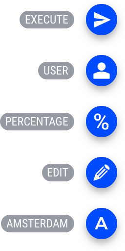

.. raw:: html
  
  

Icons and symbols
======================

Icon set
---------

Most icons in the AIMMS interface are based the `IcoMoon ultimate pack <https://icomoon.io/#preview-ultimate>`_.

In total, 1600 icons are available in this set. For details, see the `Icomoon website <https://icomoon.io/>`_.

Icons action button
--------------------

Secondary Actions in the `Action Menu <https://documentation.aimms.com/webui/page-settings.html#page-actions>`_ make use of an icon. 
For each button, developers have a choice of an icon from Icomoon. 
When no icon is selected, the first character of the label is used (e.g. ‘A’ when the label is Amsterdam).

For all icons available in the Icomoon ultimate pack, see `the complete list <https://icomoon.io/preview-ultimate.html>`__.
