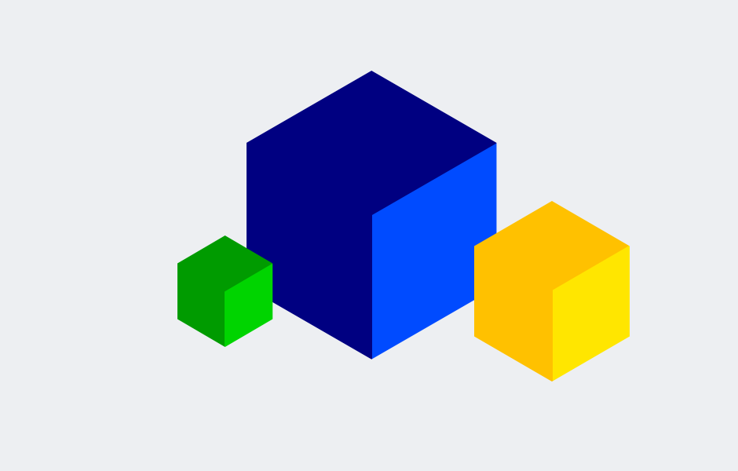
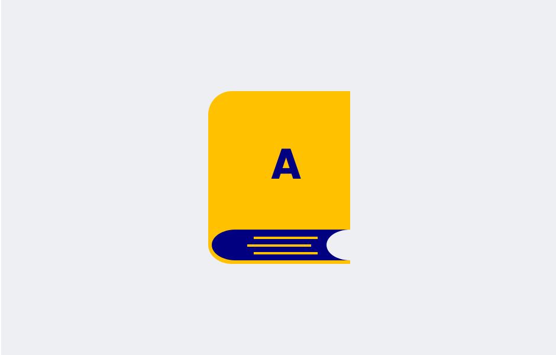
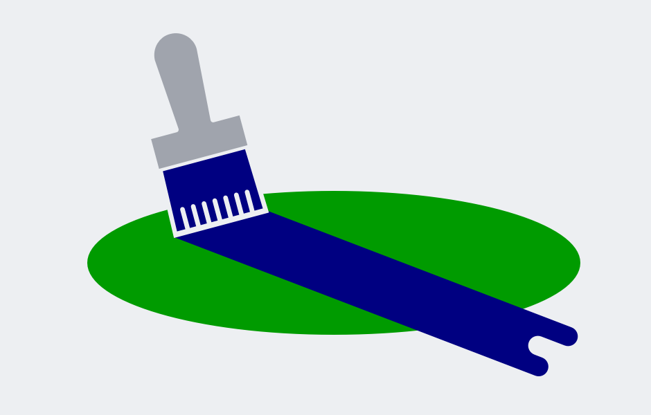
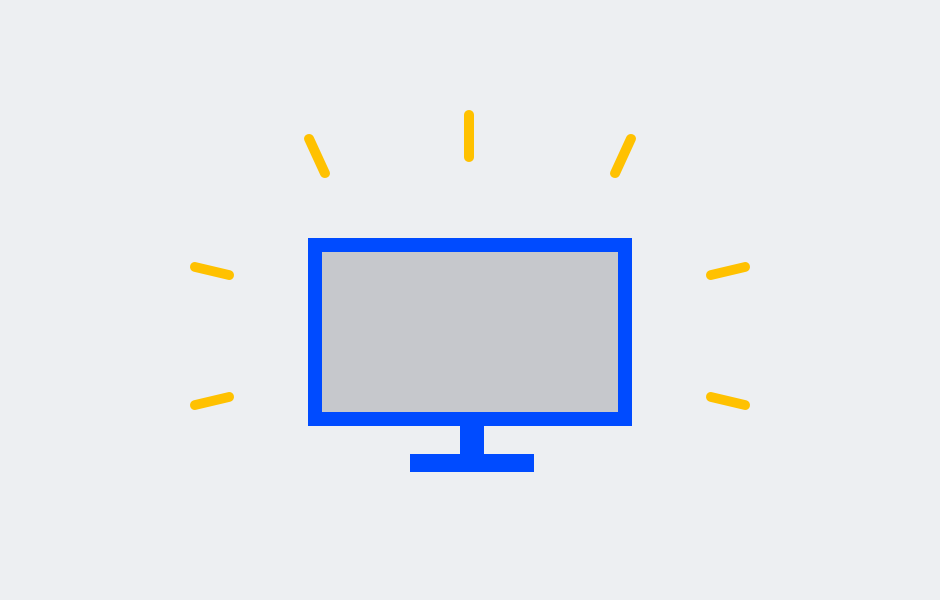

AIMMS Design System
=====================

Welcome to the AIMMS Design System. We developed a visual and interactive UI that brings clarity and consistency to the AIMMS WebUI. 
In this design system you will find principles, guidelines and components to build web applications with great User Experience (UX) on the AIMMS platform. 
This is a living document that will be updated as we continue to develop AIMMS WebUI.

.. raw:: html
    
    

        

            <a class="box_home_page" href="introduction.html">
                
                <h1>Introduction</h1>
                
How we use UX design principles to improve user happiness.

            </a>
            <a class="box_home_page" href="style.html">
                
                <h1>Style</h1>
                
The foundation for the user interface of applications.

            </a>
            <a class="box_home_page" href="best-practices.html">
                
                <h1>Best Practices</h1>
                
Helpful do’s and don’ts for creating a good user experience.

            </a>
        

    

    
-----------------------------------------------------------

.. toctree::
   :maxdepth: 1
   :titlesonly:
   :hidden:

   user-insights
   using-buttons
   interaction-principles
   best-practices