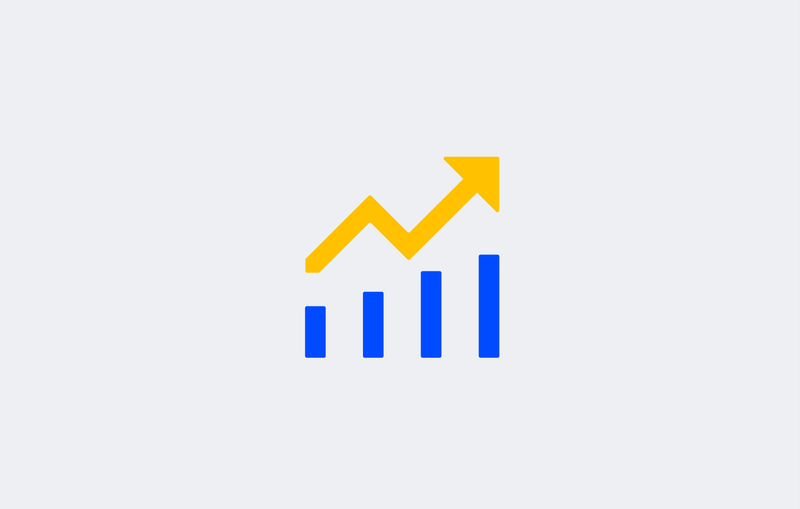
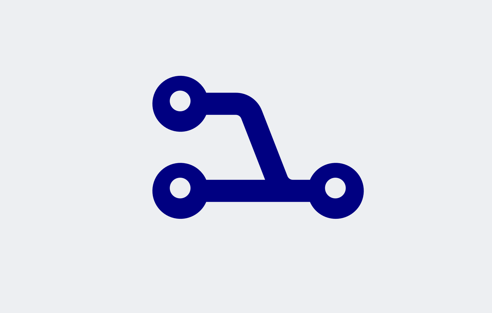

.. raw:: html
  
  

Key principles
================

We have defined three guiding principles that will help us in making the right choices for developing the new UX.

Democratizing Prescriptive Analytics
---------------------------------------

Good applications democratize prescriptive analytics. 
AIMMS wants to make it easier to use prescriptive analytics applications. 
Rather than offering all options, we focus on curating options that deliver the most value to users. 
When users are confronted with too many options, they do not feel in control.

Time to value: it’s not the journey, it’s the destination
-----------------------------------------------------------

For a supply chain professional, using an AIMMS app is not a goal in itself but a means to an end. 
Where app developers might deal with questions about the data structure, configuration and technical 
steps towards correct results, users are focused on the question "*How do I solve this business problem?*". 
In a sense, it’s the destination that counts and not the journey.

Users are looking for insights quickly and without hassle. Reducing the time it takes to go from starting 
to the app to receiving valuable results from an app lowers the barrier to using it and improves customer 
happiness. To achieve this, the developer should aim to create applications that feel *manageable*, are *easy 
to use*, and deliver *value quickly*. Otherwise, using the application feels like a burden instead of an asset. 

Consider the process of configuring an app and loading data: these are essential steps, but do not deliver 
value to users in and of itself. Developers who take extra care to make this process as clear as possible 
will therefore minimize the time to value for their users.

For example, if a user loads an app and the last loaded configuration and dataset is loaded automatically, 
the user has something useful right away.

Taming the Chaos
-----------------------

A supply chain can be highly complex and exerts a lot of organizational pressure. 
Good applications can help ease this when they present the user with a clear and focused interface. 
Applications should minimize complexity, and maximize predictability. An application should tame the chaos.

This means a clear hierarchy of information, clear navigation from page to page, 
and objects that deliver the result a user expects. Options are minimized, and information is presented only as needed. 
All unnecessary elements are left out, and only predictable and valuable elements remain. A user must always know what to expect when using an app.