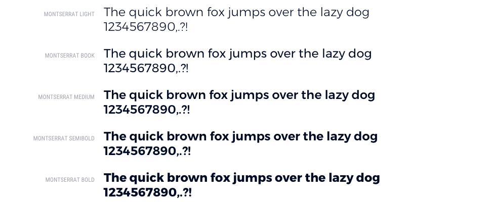
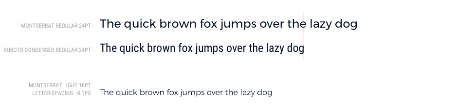
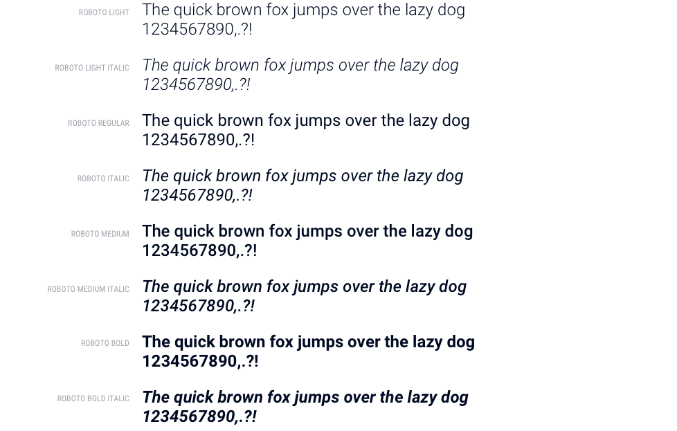

.. raw:: html
  
  

Typography
==============

Typefaces
----------

.. image:: images/Logo.png

The AIMMS logo uses the typeface Avenir. This is a geometric sans-serif designed by Adrian Frutiger in 1988. 
It is the inspiration for much of the style of the interface, for example the sharp corners of widgets. 
In the interface we use `Montserrat <https://fonts.google.com/specimen/Montserrat>`_, which is similar to Avenir but optimized for web.

Montserrat is a typeface with a lot of character, but not the best for small sizes on screen, because it is quite wide, has sharp corners and a low x-height. 
It is therefore used for the menu, titles and anything that can be considered branding. 
In case it is important for developers to use a client’s house-style, only replacing Montserrat is usually sufficient.

For smaller sizes and displaying information we use the typefaces Roboto and Roboto Condensed by Google. 
This family is optimized for display on screens, for example because of its high x-height and round shapes. 
The condensed version uses very little horizontal space, while remaining legible. 
This makes it ideally suitable for elements like tables and graphs, because more information can be displayed in a small area.

`Roboto Condensed <https://fonts.google.com/specimen/Roboto+Condensed>`_ is one of the most narrow typefaces around. It uses very little real estate to display a lot of information. This makes it ideally suitable for elements like tables, graphs and labels.

When space is less of a concern, we use the normal version of `Roboto <https://fonts.google.com/specimen/Roboto>`_.

