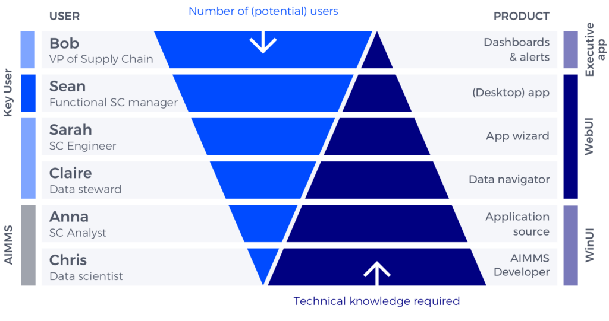

.. raw:: html
  
  

User insights
===============

Product vs. Users pyramid
---------------------------

The Product vs. Users pyramid helps us understand who we are working for, and which product is targeted at which user group.

The following descriptions are fictional users that represent a certain group of AIMMS users. 
In this example, the use case is Supply Chain management in the context of AIMMS SC Navigator and the 
professionals that use it, but the same can apply to other industries with different personas.

Each user group has different needs and skills. Keeping these users in mind helps to decide how to design features that solve those users’ problems.

There is a spectrum from generalization/ease of use to high specialization/technical complexity.

  
  
Bob: VP of Supply Chain
------------------------

As VP of the Supply Chain, Bob is a key user of the application. As a directive user, he will make the decision on how the applications will be used. Thus he is more interested in actionable results.

- Decision maker
- Not interested in details, but in (actionable) scenarios
- Balances the pros and cons
- He is often on the road, so mobile access is a must
- Often gets his information from Sean

Sean: Functional Supply Chain Manager
------------------------------------------

Sean is the key user of the application: he will spend the most time using it, and relies on it to share and deliver his results. Sean therefore wants an application that is focused on results.

- Key User, spends the most time in the application of all users
- Not interested in the technical specs of the software, but on the value it delivers
- Has to share insights with stakeholders
- High pressure on delivering results
- Depends on people from other departments to get the right data

Sarah: Supply Chain Engineer
----------------------------------

Sarah is our most technical user: she configures the app, and thus relies on the application’s ability to be tweaked and customized to particular behavior.

- More technically oriented than Sean
- Configures the app for Sean
- Sarah sets up the application (configuration)
- While configuring the application, data requirements are created. Sarah sends this to Claire.

Claire: Data Steward
------------------------

Claire is not an integral part of the supply chain management. However, since she will supply Sarah with all data, she is still an important user and stakeholder, who relies on the application’s ability to handle data.

- Not a primary user, nonetheless an important stakeholder
- Often from another department, most likely IT
- Gathers the data based on Sarah’s request
- Claire is our way into IT and data integration, therefore a key stakeholder

Anna: Supply Chain Analyst
------------------------------

Anna – a supply chain analyst and developer – works internally with AIMMS and is not an end user.

- Developer – for SC Navigator, she is affiliated to AIMMS, not the client
- Not a primary user, and not an immediate focus

Chris: Data scientist
--------------------------

As a data scientist, Chris works internally with AIMMS and is not an end user.

- Developer – for SC Navigator, she is affiliated to AIMMS, not the client
- Not a primary user, and not an immediate focus