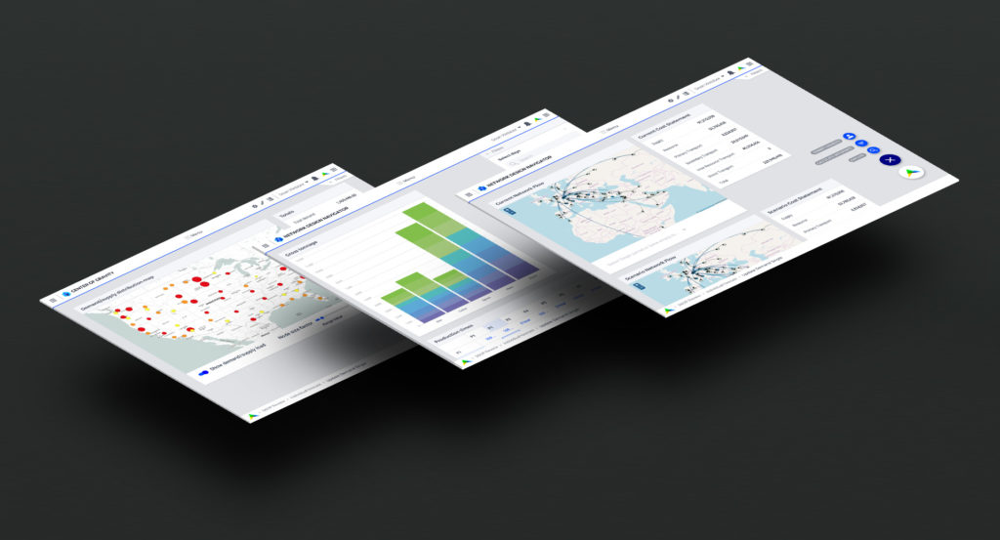
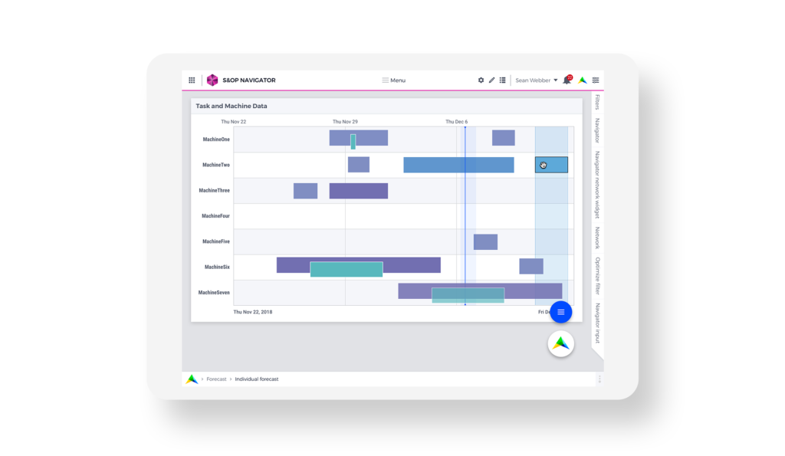

.. raw:: html
  
  

Visual style
=======================

The AIMMS visual style
-------------------------

The AIMMS logo has transparant layers and sharp edges. This serves as the inspiration for the visual style of the interface, 
like the sharp corners of widgets and the use of overlapping grey surfaces.

Customizing the visual style
----------------------------------

When customizing an application to the visual identity of a customer, we advise to start with three things:

1. Change the logo in the header bar.
2. Swap the font Montserrat (used in headings etc.) for the typeface of the customer.
3. Change the color of the line separating the header and the canvas to a customer’s brand color.

Optionally, change the primary color (AIMMS Blue, #004BFF) to a customer’s brand color. 
Use `this tool to check the color contrast <https://contrast-ratio.com/>`__ 
to be sure that the color is dark enough to function as a background for white text.

In most cases, the default AIMMS color palette will be sufficient to create an application. 
If you wish to create your own custom color palette, we recommend this article on `creating palettes for interfaces <https://refactoringui.com/previews/building-your-color-palette/>`__.
