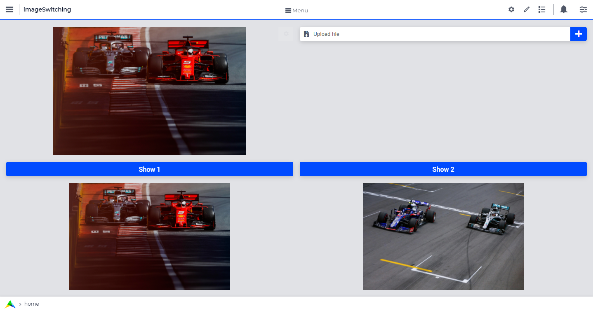

Refreshing an Image Widget Without Changing the File Name
=========================================================

In versions earlier than 4.77, a widget on a page would be refreshed if new assignments or definition updates were applied to any of the identifiers used in the widget, *even if the actual values of those identifiers were not actually changed*. With the performance improvement from version 4.77, a widget will *only* be refreshed if the data of the identifiers in the widget *has actually changed*.

This improvement will prevent many unnecessary refreshes of widgets directly showing the data of such identifiers. 
However, with the image widget, this improvement will cause a problem when the contents of an image file has changed and the same image filename is assigned to the identifier holding the image name of the image widget. 
In the old situation, because of the re-assignment of the same value, this would trigger a refresh of the widget, causing the new content of the image file to be displayed. 
With the improvement, the widget will not be refreshed, as the image file name remains identical.

Old Way to Trigger a Refresh
--------------------------------

The below code is probably how you would trigger a refresh of the image widget when the image changed, which will not work in version from 4.77 onwards.

.. code-block:: aimms 
    :linenos:

    sp_temp := sp_displayImage;
    sp_displayImage := "" ;
    sp_displayImage := sp_temp ;

where ``sp_displayImage`` is the string parameter used in the image widget and ``sp_temp`` is a string parameter to temporarily hold the value of ``sp_displayImage``.

New Way to Trigger a Refresh
------------------------------------

There are two ways to address this problem:

#. Change the name of the image file every time its contents changes (but you potentially will have to manage the removal of old files that are no longer used if you are running the WebUI app for a long time)
#. Add a query parameter to the file name assigned to the identifier feeding the image widget, for example ``ImageName.jpg?id=ImageId``, where ``ImageId`` changes each time the image is updated. This will cause a refresh of the image widget, causing the new content of the image to be downloaded.

  The below code is one way you can achieve that:

  .. code-block:: aimms 
      :linenos:
          
      sp_displayImage := FormatString("ImageName.jpg?id=%n", p_imageId); 
      p_imageId += 1;

  where ``sp_displayImage`` is the string parameter used in the image widget and ``p_imageId`` is a parameter. Each time the image is updated, for example using an upload widget to replace ``ImageName.jpg`` on disk with a new image, the widget automatically gets updated. The above mentioned code is called in the upload procedure.

Example Download
----------------

Please open this :download:`AIMMS project <model/ImageSwitching.zip>` to view the example.

|

Applying the Query Parameter to Switch Between Images
-----------------------------------------------------------

If you are switching between a set of maybe two or three images, you could use defined query parameters for each image. This prevents downloading the image each time the image is updated.

For example, if you update the image widget with either an image of "OK" or "ERROR", you can use ``sp_displayImage := "ImageName.jpg?id=OK";`` and ``sp_displayImage := "ImageName.jpg?id=ERROR";`` for the respective images, after you've updated ``ImageName.jpg`` with the appropriate OK or ERROR image. 

The code of the ``pr_showOK`` procedure would look like the following:

.. code-block:: aimms 

    Procedure pr_showOK {
      Body: {  
        !copies image OK.jpg from root to the images folder and overwrites display.jpg 
        sp_image := "OK.jpg";
        FileCopy(sp_image, "MainProject\\WebUI\\resources\\images\\display.jpg", 1); 
        sp_display := formatstring("display.jpg?id=OK");
      }
    }  

.. seealso::
  
  * `Image Widget <https://documentation.aimms.com/webui/image-widget.html>`_ documentation.
