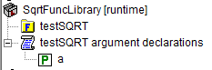
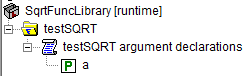
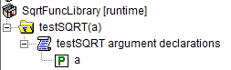

Runtime functions with arguments
==================================

The model editor functions that form the basis of runtime libraries operate on elements of :aimms:set:`AllIdentifiers`; 
these function create, modify, and delete corresponding global identifiers in the model.
To create local identifiers, including procedure and function arguments, first create a global declaration section, 
and, when finished, move the declaration section below the procedure or function being created.

For instance, to create a variant of Sqrt, first 

#.  create the function, including specifications for body and argument,  

#.  create a declaration section with a parameter ``a``.  The parameter ``a`` gets property input.

The model explorer for the runtime library now looks as follows.

After a call to ``me::move`` to move the declaration section below the function, the runtime library in model explorer looks as follows:

Finally, after calling the AIMMS compiler using ``me::compile``, the runtime library in model explorer looks as follows:

    
Note that the model explorer now shows the argument of the function.

Subsequently, we can use the ``APPLY`` operator to call the function created.

You can download :download:`AIMMS 4.79 project <model/rtlfnc.zip>`

