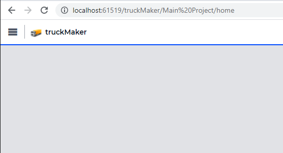

:orphan:

Adding a Logo to an AIMMS WebUI App Using AIMMS 4.84 and Older
==============================================================

This short article illustrates adding a logo to an AIMMS WebUI application.

The Eample Provided
---------------------

Please download :download:`The AIMMS 4.81 sample application <model/bespokeApp.zip>` to experiment with the example.
The top bar of this app looks as follows (snapshot taken with a browser zoom of 200%):

|

To achieve this, the following two files:

#.  ``Placeholder logo@2x.png``

#.  ``icon.css``

have been added to the folder ``<project>\MainProject\WebUI\resources\css``.

The Example Explained
----------------------

The contents of the ``icon.css`` are presented below and then discussed.

.. code-block:: css
    :linenos:
    :emphasize-lines: 7

    .theme-aimms header h1 .pages .app-name {
        margin-top:7px; /* this fixes the vertical alignment of the app name with the icon */
    }

    .theme-aimms header h1 .pages .app-name::before {
        content: '';
        background: url("Placeholder logo@2x.png") no-repeat center/contain;
        float: left;
        width: 124px;
        height: 28px;
        margin-left: 0px;
        margin-right: 7px;
        transform: translateY(-5px);
    }

Some remarks about the above code, in case you want to adopt and adapt the above ``.css`` file for your application:

#.  Lines 1-3: This code is needed such that the app name is nicely aligned vertically with the logo.

#.  On line 7: you can fill in the name of the image of your logo. 
    A few examples of acceptable file formats are ``.png``, ``.jpg``, ``.gif``, ``.svg``, and ``.webp``.
    
    The phrase "center/contain" will ensure that your icon always adjusts to fit within the width/height you set on lines 9 and 10, while maintaining the correct aspect ratio.

#.  Lines 9,10 define the size of the area on the screen in which to place the logo. 

    For instance, halving the width results in:

    .. image:: images/halving-width.png
        :align: center

    As you can see, the aspect ratio of the image is kept.

    In the example, the dimension of the image is 354 x 80. 
    Therefore, by using height 28 and width 354 / ( 80 / 28 ) = 124, the image is completely filling the area allotted.

#.  Line 11 specifies the space between the Menu-icon and the app-logo.  Increasing that to 80px looks as follows:

    .. image:: images/increasing-margin-left.png
        :align: center

#.  Line 12 specifies the space between the logo and the app-name.  Increasing that to 87px looks as follows:

    .. image:: images/increasing-margin-right.png
        :align: center

#.  Line 13: Examples of the numerous transformations supported by the `transform property <https://www.w3schools.com/cssref/css3_pr_transform.asp>`_ are rotating, scaling, and moving. 

Tips on Tweaking
-----------------

#.  It goes without saying that you should replace ``Placeholder logo@2x.png`` by an image file containing the logo of choice. 

    It is advised to keep the size of the image file small; after all, the image will be part of .aimmspacks and every user will have to download the image upon first time opening of the application.

#.  In AIMMS Developer you can tweak the file ``icon.css`` and then refresh the browser page to see the result without having to restart the project.

#.  You may want to use different browser zooms, for instance 100% and 200%, to evaluate the result.

#.  Lines 2, 10, and 13 all have to do with vertical alignment. We suggest you:

    *   First, select a height (line 10) and a corresponding width (line 9) to determine how large the area is on which you want to present your logo.
        To select the width you probably want to use: <image-width>/(<image-height>/<selected-height>) to create an area which your logo optimally fills.

    *   Second, move the icon up or down using the ``transform > translate`` attribute as illustrated on line 13.

Logo Attribution
------------------

The placeholder logo used in this article was created by Paul Wolfs from Total Design (http://www.totaldesign.com).

